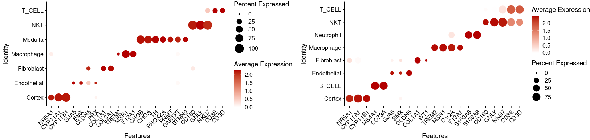
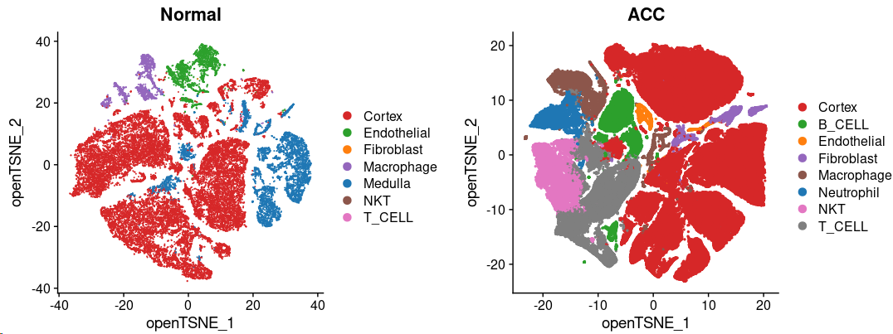
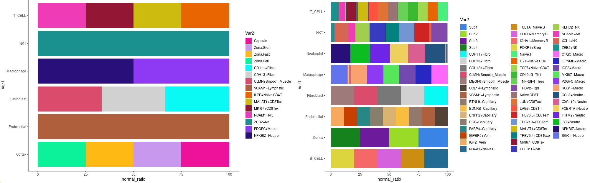
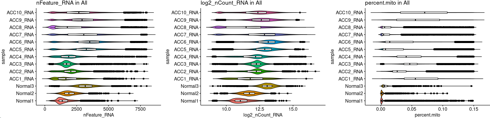
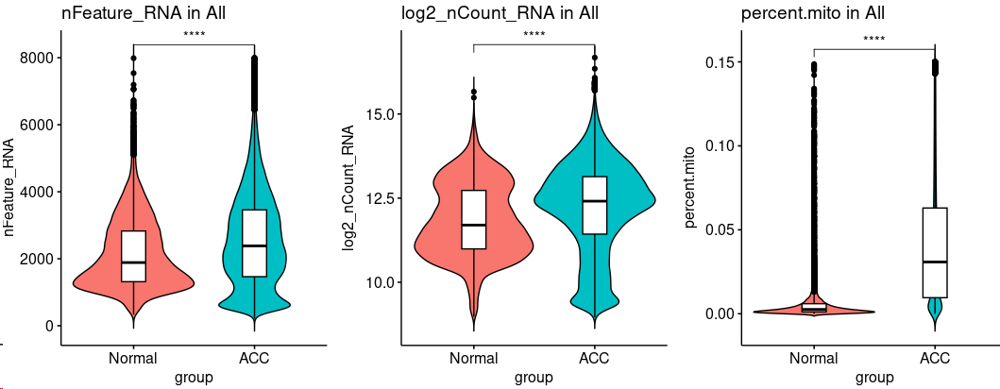
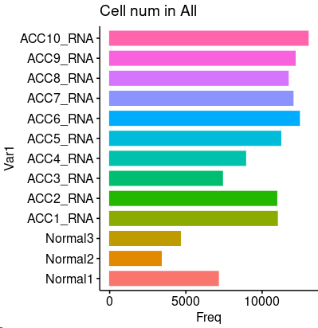

## 1. scRNA-seq Analysis of Normal Adrenal and ACC Landscape.

Scripts for analyzing single-cell RNA sequencing data to compare the cellular landscapes of normal adrenal glands and ACC tumors.

~~~R
suppressPackageStartupMessages({
    library(dplyr)
    library(Seurat)
    library(Matrix)
    library(proxy)
    library(gplots)
    library(Rtsne)
    library(densityClust)
    library(irlba)
    library(monocle)
    library(plyr)
    library(DOSE)
    library(clusterProfiler)
    library(topGO)
    library(pathview)
    library(AnnotationDbi)
    library(cowplot)
    library(ggplot2)
    library(velocyto.R)
    library(trqwe)
    library(Rsamtools)
    library(GenomicFeatures)
    library(GenomicAlignments)
    library(BiocParallel)
    library(pheatmap)
    library(RColorBrewer)
    library(PoiClaClu)
    library(org.Mm.eg.db)
    library(org.Hs.eg.db)
    library(DESeq2)
    library(data.table)
    library(stringr)
    library(iTALK)
    library(nichenetr)
    library(tidyr)
    library(GenomicRanges)
    library(viridis)
    library(chromVAR)
    library(ggpubr)
    library(corrplot)
    library(SingleCellExperiment)
    library(scater)
    library(flexmix)
    library(splines)
    library(biomaRt)
    library(miQC)
    library(scales)
    library(BuenColors)
    library(PCAtools)
    library(Seurat)
    library(SeuratData)
    library(SeuratWrappers)
    library(flexmix)
    library(ggalluvial)
})
source("/mnt/d/xiangyu.ubuntu/code/log-summery/MyBestFunction_scRNA.R.v4.R")
library(future)
library(future.apply)
options(future.globals.maxSize = 100 * 1024^3)
plan("multicore", workers = 30)
plan()

Normal.all_seurat <- mcreadRDS("/mnt/d/xiangyu.ubuntu/projects/ACC_res/RDS.all/RDS.final/scRNA.Normal.adrenal.seurat.rds", mc.cores = 20)
ACC.all_seurat <- mcreadRDS("/mnt/d/xiangyu.ubuntu/projects/ACC_res/RDS.all/RDS.final/scRNA.ACC.seurat.rds", mc.cores = 20)
Cortex <- c("NR5A1","CYP11A1","CYP11B1")
T_CELL <- c("CD3E","CD3D")
B_CELL <- c("MS4A1","CD79A")
Macrophage <- c("TREM2","MSR1", "TREM2","F13A1")
Neutrophil <- c("S100A8","S100A9")
Erythroid <- c("HBB","HBA2")
ACC_Sig <- c("SYN1","CGA","MLANA","INHBA","MKI67","PAX8","SF1","EMA","IGF2")
Medulla <- c("CHGB","CHGA","TH","PHOX2A","PNMT","CARTPT","STMN2")
Endothelial <- c("GJA5", "BMX","CLDN5","PRX")
NK <- c("CD160","GNLY", "NKG7")
Fibroblast <- c("COL1A1","COL3A1")
Erythroid <- c("HBB","HBA2")
Normal.all_seurat$Cell_annotation[Normal.all_seurat$Cell_annotation=="B_CELL"] <- "T_CELL"
Normal.all_seurat$Cell_annotation <- factor(Normal.all_seurat$Cell_annotation,levels=c("Cortex","Endothelial","Fibroblast","Macrophage","Medulla","NKT","T_CELL"))
p1 <- DotPlot(Normal.all_seurat, features = unique(c(Cortex,Endothelial,Fibroblast,Macrophage,Medulla,NK,T_CELL)), cols=c("#ffffff", "#B30000"),scale = TRUE,col.min = 0,col.max = 5,group.by="Cell_annotation") + RotatedAxis()+scale_size(range = c(1, 8))

Cortex <- c("NR5A1","CYP11A1","CYP11B1")
T_CELL <- c("CD3E","CD3D")
B_CELL <- c("MS4A1","CD79A")
Macrophage <- c("TREM2","MSR1","C1QA", "TREM2","F13A1")
Neutrophil <- c("S100A8","S100A9")
Erythroid <- c("HBB","HBA2")
ACC_Sig <- c("SYN1","CGA","MLANA","INHBA","MKI67","PAX8","SF1","EMA","IGF2")
Medulla <- c("CHGB","CHGA","TH","PHOX2A","PNMT","CARTPT","STMN2")
Endothelial <- c("GJA5", "BMX","CLDN5")
NK <- c("CD160","GNLY", "NKG7")
Fibroblast <- c("COL1A1","WT1")
Erythroid <- c("HBB","HBA2")
ACC.all_seurat$Cell_annotation[ACC.all_seurat$Cell_annotation=="Medulla"] <- "Cortex"
ACC.all_seurat$Cell_annotation <- factor(ACC.all_seurat$Cell_annotation,levels=c("Cortex","B_CELL","Endothelial","Fibroblast","Macrophage","Neutrophil","NKT","T_CELL"))
p2 <- DotPlot(ACC.all_seurat, features = unique(c(Cortex,B_CELL,Endothelial,Fibroblast,Macrophage,Neutrophil,NK,T_CELL)), cols=c("#ffffff", "#B30000"),scale = TRUE,col.min = 0,col.max = 5,group.by="Cell_annotation") + RotatedAxis()+scale_size(range = c(1, 8))
plot <- plot_grid(p1,p2)
~~~

~~~R
library(paletteer)
library(ggsci)
pal <- jdb_palette("corona")
cor <- length(levels(Normal.all_seurat$Cell_annotation))
pal.Nor <- pal[c(2:(cor-2),1,(cor-1):cor)]
names(pal.Nor) <- levels(Normal.all_seurat$Cell_annotation)
p1 <- DimPlot(object = Normal.all_seurat, reduction = "openTSNE",repel=FALSE,label=FALSE,group.by="Cell_annotation",cols= pal.Nor)+labs(title="Normal")
cor <- length(levels(ACC.all_seurat$Cell_annotation))
pal.ACC <- pal[c(2:(cor-2),1,(cor-1):cor)]
names(pal.ACC) <- levels(ACC.all_seurat$Cell_annotation)
p2 <- DimPlot(object = ACC.all_seurat, reduction = "openTSNE",repel=FALSE,label=FALSE,group.by="Cell_annotation",cols= pal.ACC,pt.size=.5,raster=FALSE)+labs(title="ACC")
plot <- plot_grid(p1,p2)
~~~

~~~R
ALL_MERGE_used.v2 <- mcreadRDS("/mnt/d/xiangyu.ubuntu/projects/ACC_res/RDS.all/RDS.final/scRNA.ACC.and.Normal.adrenal.merge.seurat.rds", mc.cores = 20)
Sel_CellType <- c("Capsule","Zona.Glom","Zona.Fasc","Zona.Reti",
  "Sub1","Sub2","Sub3","Sub4","Sub5",
  "CDH11+Fibro","CDH13+Fibro","COL1A1+Fibro", "CLMN+Smooth_Muscle","MEGF6+Smooth_Muscle",
  "CCL14+Lymphatic","VCAM1+Lymphatic","BTNL9+Capillary","EDNRB+Capillary","ENPP2+Capillary","PGF+Capillary","FABP4+Capillary","IGFBP5+Vein","IGF2+Vein",
  "NR4A1+Naïve.B","TCL1A+Naïve.B","COCH+Memory.B","IGHA1+Memory.B","FOXP1+Breg",
  "Naive.T","IL7R+Naive.CD4T","TCF7+Naive.CD4T","CD40LG+Th1","TNFRSF4+Treg","TRDV2+Tgd",
  "Naive.CD8T","JUN+CD8Tact","LAG3+CD8Tm","TRBV6.5+CD8Tem","TRBV19+CD8Tem","MALAT1+CD8Tex","TRBV6.4+CD8Texp","MKI67+CD8Tex",
  "FCER1G+NK","KLRC2+NK","NCAM1+NK","XCL1+NK","ZEB2+NK",
  "C1QC+Macro","GPNMB+Macro","IGF2+Macro","MKI67+Macro","PDGFC+Macro","RGS1+Macro",
  "CCL3+Neutro","CXCL10+Neutro","FCER1A+Neutro","IFITM2+Neutro","LYZ+Neutro","NFKBIZ+Neutro","SGK1+Neutro")
col_sel <- hue_pal()(length(as.character(Sel_CellType)))
col <- col_sel[1:length(as.character(Sel_CellType))]
names(col) <- as.character(Sel_CellType)
col =  c("#ed1299","#C798EE","#FEB915","#0cf29a","#3A84E6","#99db27","#6D1A9C","#15821E","#09f9f5","#D1D1D1","#787878","#DB4C6C","#9E7A7A","#554236","#AF5F3C","#93796C","#F9BD3F","#DAB370","#877F6C","#268785","#c93f00", "#f7aa5d", "#246b93", "#cc8e12", "#d561dd", "#F56867", "#ddd53e","#4aef7b", "#e86502", "#9ed84e", "#39ba30", "#6ad157", "#8249aa", "#997273", "#e07233", "#ff523f","#ce2523", "#7495D3", "#cebb10", "#03827f", "#931635", "#373bbf", "#a1ce4c", "#ef3bb6", "#d66551","#1a918f", "#ff66fc", "#2927c4", "#7149af" ,"#57e559" ,"#8e3af4" ,"#f9a270" ,"#22547f", "#db5e92","#edd05e", "#6f25e8", "#0dbc21", "#280f7a", "#6373ed", "#5b910f" ,"#7b34c1" ,"#59BE86","#d80fc1")
col <- col[1:length(Sel_CellType)]
names(col) <- Sel_CellType
All_sum <- FetchData(object = ALL_MERGE_used.v2, vars = c("sample","group","Cell_annotation","v2_Cell_annotation"),slot="data")
All_sum.nor <- subset(All_sum,group=="Normal")
aa <- as.data.frame(table(All_sum.nor$Cell_annotation,All_sum.nor$v2_Cell_annotation))
aa_all <- c()
for (i in unique(aa$Var2)){
  group_sel <- subset(aa,Var2==i)
  group_sel$sum_number <- sum(group_sel$Freq)
  aa_all <- rbind(aa_all,group_sel)
}
all_group_normalised<- c()
for (i in unique(aa_all$Var1)){
  tmp_group <- subset(aa_all,Var1==i)
  tmp_group$cluster_all <- (tmp_group$Freq/tmp_group$sum_number)
  tmp_group$normal_ratio <- (tmp_group$cluster_all/sum(tmp_group$cluster_all))*100
  tmp_group$normal_ratio <- round(tmp_group$normal_ratio,2)
  all_group_normalised <- rbind(all_group_normalised,tmp_group)
}
all_group_normalised <- all_group_normalised[order(all_group_normalised$Var2,all_group_normalised$normal_ratio,decreasing=TRUE),]
all_group_normalised <- subset(all_group_normalised,Var1!="Medulla")
all_group_normalised$Var2 <- factor(all_group_normalised$Var2,levels=Sel_CellType)
p1 <- ggplot(data=all_group_normalised, aes(x=Var1, y=normal_ratio, fill=Var2)) +
  geom_bar(stat="identity") + coord_flip()+theme_classic()+scale_fill_manual(values = col)
All_sum.ACC <- subset(All_sum,group=="ACC")
aa <- as.data.frame(table(All_sum.ACC$Cell_annotation,All_sum.ACC$v2_Cell_annotation))
aa_all <- c()
for (i in unique(aa$Var2)){
  group_sel <- subset(aa,Var2==i)
  group_sel$sum_number <- sum(group_sel$Freq)
  aa_all <- rbind(aa_all,group_sel)
}
all_group_normalised<- c()
for (i in unique(aa_all$Var1)){
  tmp_group <- subset(aa_all,Var1==i)
  tmp_group$cluster_all <- (tmp_group$Freq/tmp_group$sum_number)
  tmp_group$normal_ratio <- (tmp_group$cluster_all/sum(tmp_group$cluster_all))*100
  tmp_group$normal_ratio <- round(tmp_group$normal_ratio,2)
  all_group_normalised <- rbind(all_group_normalised,tmp_group)
}
all_group_normalised <- all_group_normalised[order(all_group_normalised$Var2,all_group_normalised$normal_ratio,decreasing=TRUE),]
all_group_normalised <- subset(all_group_normalised,Var1!="Medulla")
all_group_normalised$Var2 <- factor(all_group_normalised$Var2,levels=Sel_CellType)
p2 <- ggplot(data=all_group_normalised, aes(x=Var1, y=normal_ratio, fill=Var2)) +
  geom_bar(stat="identity") + coord_flip()+theme_classic()+scale_fill_manual(values = col)
plot <- plot_grid(p1,p2)
~~~

~~~R
All_sum <- as.data.frame(FetchData(object = ALL_MERGE_used.v2, vars = c("nFeature_RNA","nCount_RNA","percent.mito","sample","group"),slot="data"))
All_sum$log2_nCount_RNA <- log(All_sum$nCount_RNA+1,2)
Sel_g <- c("nFeature_RNA","log2_nCount_RNA","percent.mito")
All_sum$sample <- factor(All_sum$sample,levels=c("Normal1","Normal2","Normal3","ACC1_RNA","ACC2_RNA","ACC3_RNA","ACC4_RNA","ACC5_RNA","ACC6_RNA","ACC7_RNA","ACC8_RNA","ACC9_RNA","ACC10_RNA"))
plot <- list()
for (i in 1:length(Sel_g)){
  plot[[i]] <- ggviolin(All_sum, "sample", Sel_g[i], fill = "sample",legend = "none",rotate=TRUE,
   add = "boxplot", add.params = list(fill = "white"),title=paste0(Sel_g[i]," in All"))
}
plot <- CombinePlots(plot,ncol=3)
~~~

~~~R
All_sum$group <- factor(All_sum$group,levels=c("Normal","ACC"))
plot <- list()
for (i in 1:length(Sel_g)){
  plot[[i]] <- ggviolin(All_sum, "group", Sel_g[i], fill = "group",legend = "none",rotate=FALSE,
   add = "boxplot", add.params = list(fill = "white"),title=paste0(Sel_g[i]," in All"))+ 
  stat_compare_means(comparisons =list(c("Normal","ACC")), label = "p.signif", method = "t.test")
}
plot <- CombinePlots(plot,ncol=3)
~~~

~~~R
sample_num <- as.data.frame(table(All_sum$sample))
plot <- ggbarplot(sample_num, x = "Var1", y = "Freq",
    add = c("mean_se"),legend = "none",rotate=TRUE,
    color = "Var1", fill = "Var1", alpha = 1,title="Cell num in All")
~~~

