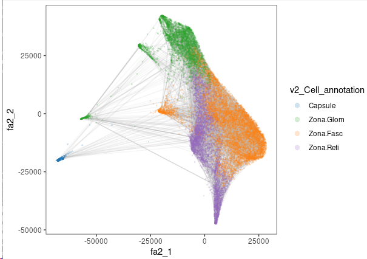
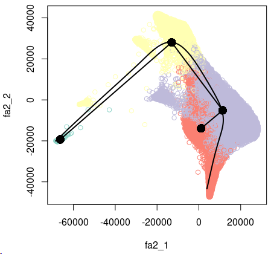
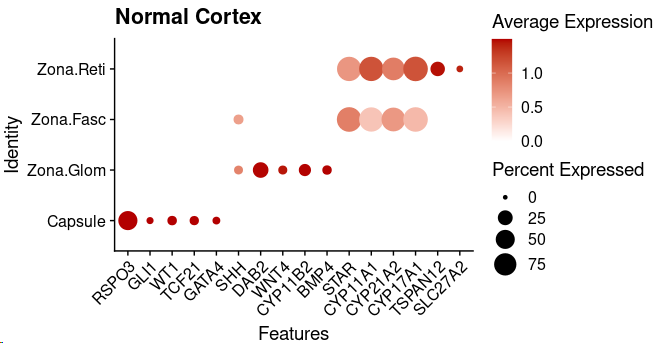
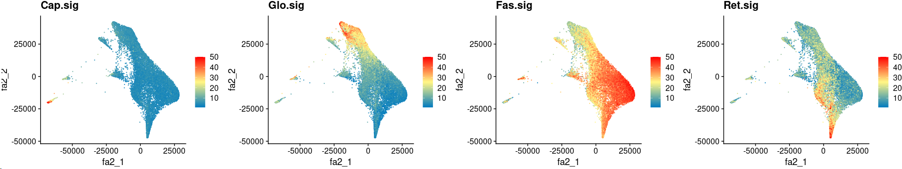
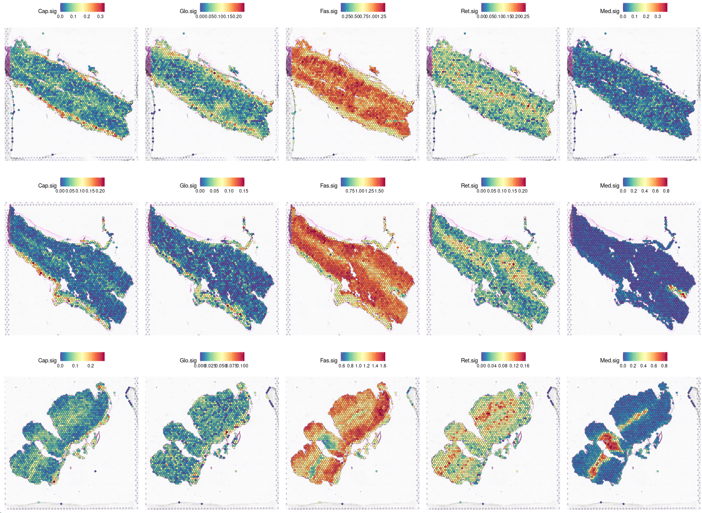
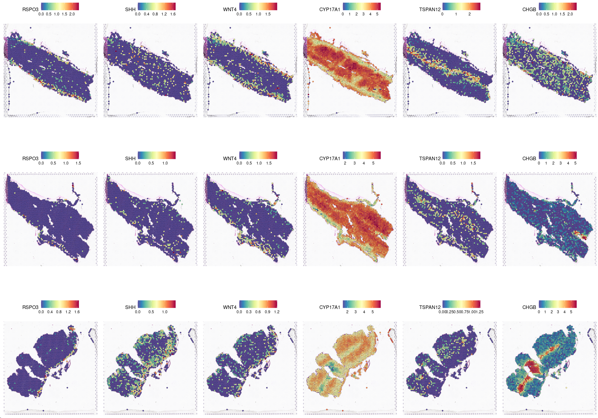
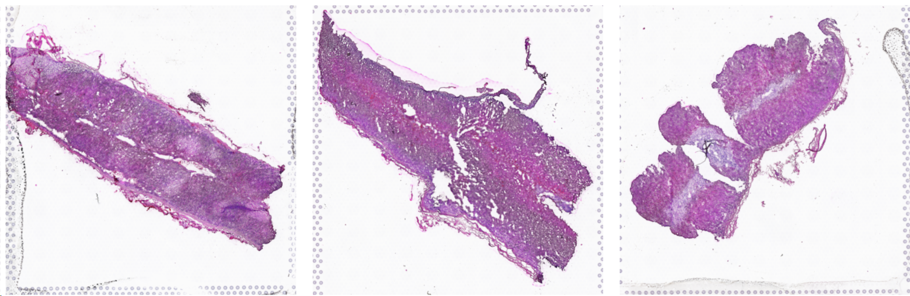
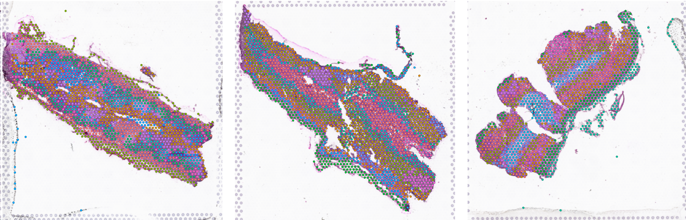
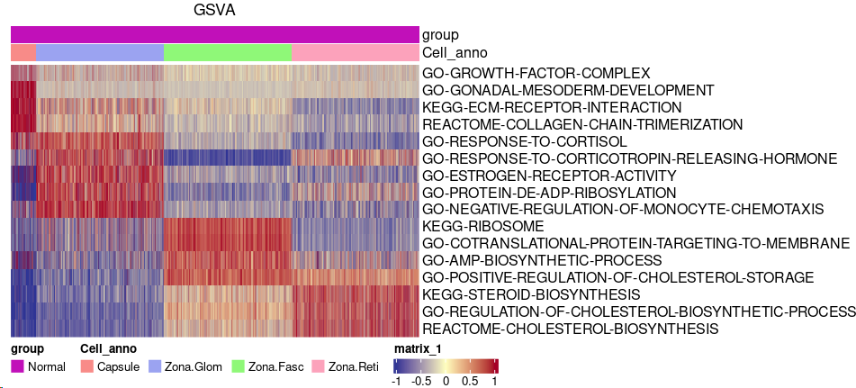

## 2. Developmental Analysis of Normal Adrenal Cortex.

**The development estimation in normal adrenal cortex.** To construct the development of normal adrenal cortex, the slingshot (v.1.4.0) and splatter (v1.10.1) were performed to estimate the trajectory from capsule to zona glomerulosa, zona reticularis, and finally differentiate to zona fasciculata with parameter of approx_points=500. The density algorithm implemented in URD (v1.1.0) was used to calculate the diffusion distributions and edges of diffusion embedding in normal adrenal cortex data. The 15 of sigma was used to quantify the kernel width in diffusion map calculation. The find_dm_k was used to unbiased identify the optimal k nearest neighbors’ parameter in DiffusionMap. The top10 diffusion components were stored into seurat object. And the 5000 edges were taken into visualize outliner distances of cells. 

Computational workflows for investigating the developmental processes in the normal adrenal cortex.

~~~R
Only_Nor.Cortex_harmony <- mcreadRDS("/mnt/d/xiangyu.ubuntu/projects/ACC_res/RDS.all/RDS.final/scRNA.Normal.adrenal.only.Cortex_harmony.rds", mc.cores = 20)
library(URD)
axial <- mcreadRDS("/mnt/d/xiangyu.ubuntu/projects/ACC_res/RDS.all/RDS.final/scRNA.Normal.adrenal.only.Cortex_URD.rds", mc.cores = 20)
transitions.df <- edgesFromDM(axial, cells = colnames(Only_Nor.Cortex_harmony),edges.return = 5000)
data.plot <- as.data.frame(Only_Nor.Cortex_harmony[["fa2"]]@cell.embeddings)
data.plot <- as.data.frame(cbind(data.plot,Only_Nor.Cortex_harmony@meta.data))
transitions.df$x1 <- data.plot[transitions.df$from, "fa2_1"]
transitions.df$x2 <- data.plot[transitions.df$to, "fa2_1"]
transitions.df$y1 <- data.plot[transitions.df$from, "fa2_2"]
transitions.df$y2 <- data.plot[transitions.df$to, "fa2_2"]
transitions.df$alpha <- transitions.df$weight/max(transitions.df$weight) * 0.5
data.plot$v2_Cell_annotation <- factor(data.plot$v2_Cell_annotation,levels=c("Capsule","Zona.Glom","Zona.Fasc","Zona.Reti"))
library(paletteer)
library(ggsci)
pal <- jdb_palette("corona")
pal.nor <- pal[c(1,3:(length(levels(data.plot$v2_Cell_annotation))+1))]
names(pal.nor) <- levels(data.plot$v2_Cell_annotation)
plot <- ggplot(data = data.plot, aes(x = fa2_1,y = fa2_2))+ 
geom_segment(inherit.aes = F,data = transitions.df, aes(x = x1, y = y1, xend = x2,yend = y2, alpha = alpha),color = "grey")+ 
geom_point(aes(color = v2_Cell_annotation),size = 1, alpha = 0.2, stroke = 0)+ theme_bw() + 
theme(panel.grid.minor = element_blank(),panel.grid.major = element_blank(), plot.title = element_text(face = "bold"))+
guides(color = guide_legend(override.aes = list(size = 3)))+ guides(alpha = F)+scale_color_manual(values = pal.nor, guide = "none")
~~~

~~~R
library(slingshot, quietly = TRUE)
library(splatter, quietly = TRUE)
sim <- as.SingleCellExperiment(Only_Nor.Cortex_harmony)
library(RColorBrewer)
colors <- unique(union(brewer.pal(8,'Set3'),brewer.pal(8,'Accent')))
colors <- unique(union(colors,brewer.pal(8,'Set1')))[1:length(unique(colData(sim)$v2_Cell_annotation))]
names(colors) <- unique(colData(sim)$v2_Cell_annotation)
colors <- colors[colData(sim)$v2_Cell_annotation]
names(colors) <- rownames(colData(sim))
sce <- slingshot(sim, clusterLabels = 'v2_Cell_annotation', reducedDim = 'FA2', start.clus = "Capsule",end.clus = "Zona.Reti",approx_points=500)
plot(reducedDims(sce)$FA2[,c(1,2)], col =colors)
lines(SlingshotDataSet(sce), lwd=2, type = 'lineages', col = 'black')
lines(SlingshotDataSet(sce), lwd=2,show.constraints = TRUE)
~~~

~~~R
Capsule <- c("RSPO3","GLI1","WT1","TCF21","GATA4")
Zona.Glom <- c("SHH","DAB2","WNT4","CYP11B2","BMP4")
Zona.Fasc <- c("STAR","CYP11A1","CYP21A2","CYP17A1")
Zona.Reti <- c("TSPAN12","SLC27A2")
Sel_g <- c(Capsule,Zona.Glom,Zona.Fasc,Zona.Reti)
Only_Nor.Cortex_harmony$v2_Cell_annotation <- factor(Only_Nor.Cortex_harmony$v2_Cell_annotation,levels=c("Capsule","Zona.Glom","Zona.Fasc","Zona.Reti"))
plot <- DotPlot(Only_Nor.Cortex_harmony, features = Sel_g, cols=c("#ffffff", "#B30000"),scale = TRUE,col.min = 0,col.max = 5,group.by="v2_Cell_annotation") + RotatedAxis()+ labs(title="Normal Cortex")+scale_size(range = c(1, 8))
~~~

~~~R
plot <- XY_FeaturePlot(object = Only_Nor.Cortex_harmony, features = c("Cap.sig","Glo.sig","Fas.sig","Ret.sig"),pt.size=.1, ncol=4,
    reduction="fa2",label=T,cols = CustomPalette(low ="#007BBF", mid = "#FFF485",high = "#FF0000"))
~~~

~~~R
scSpatial.Normal.adrenal <- mcreadRDS("/mnt/d/xiangyu.ubuntu/projects/ACC_res/RDS.all/RDS.final/scSpatial.Normal.adrenal.seurat.rds", mc.cores = 20)
All_plot <- lapply(1:3,function(x) {
    sel_d <- scSpatial.Normal.adrenal[[x]]
    plot <- SpatialFeaturePlot(sel_d, features = c("Cap.sig","Glo.sig","Fas.sig","Ret.sig","Med.sig"),ncol=5)
    return(plot)
    })
plot <- CombinePlots(All_plot,nrow=3)
~~~

~~~R
All_plot <- lapply(1:3,function(x) {
    sel_d <- scSpatial.Normal.adrenal[[x]]
    plot <- SpatialFeaturePlot(sel_d, features = c("RSPO3","SHH","WNT4","CYP17A1","TSPAN12","CHGB"),ncol=6)
    return(plot)
    })
plot <- CombinePlots(All_plot,nrow=3)
~~~

~~~R
All_plot <- lapply(1:3,function(x) {
    sel_d <- scSpatial.Normal.adrenal[[x]]
    plot <- SpatialDimPlot(sel_d, label=FALSE,group.by="Spatial_snn_res.1",pt.size=0) +NoLegend()
    return(plot)
    })
plot <- CombinePlots(All_plot,nrow=1)
~~~

~~~R
All_plot <- lapply(1:3,function(x) {
    sel_d <- scSpatial.Normal.adrenal[[x]]
    plot <- SpatialDimPlot(sel_d, label=FALSE,group.by="Spatial_snn_res.1",pt.size=1)+NoLegend()
    return(plot)
    })
plot <- CombinePlots(All_plot,nrow=1)
~~~

~~~R
All_gsva_seura <- mcreadRDS("/mnt/d/xiangyu.ubuntu/projects/ACC_res/RDS.all/RDS.final/scRNA.Normal.adrenal.only.Cortex_downsample_exp.rds", mc.cores = 20)
Sel_paths <- c("GO-GROWTH-FACTOR-COMPLEX","GO-GONADAL-MESODERM-DEVELOPMENT","KEGG-ECM-RECEPTOR-INTERACTION","REACTOME-COLLAGEN-CHAIN-TRIMERIZATION",
    "GO-RESPONSE-TO-CORTISOL",
    "GO-RESPONSE-TO-CORTICOTROPIN-RELEASING-HORMONE","GO-CELLULAR-RESPONSE-TO-HEPARIN1","GO-ESTROGEN-RECEPTOR-ACTIVITY","GO-PROTEIN-DE-ADP-RIBOSYLATION","GO-NEGATIVE-REGULATION-OF-MONOCYTE-CHEMOTAXIS",
    "KEGG-RIBOSOME","GO-COTRANSLATIONAL-PROTEIN-TARGETING-TO-MEMBRANE","GO-AMP-BIOSYNTHETIC-PROCESS","GO-POSITIVE-REGULATION-OF-CHOLESTEROL-STORAGE",
    "KEGG-STEROID-BIOSYNTHESIS","GO-REGULATION-OF-CHOLESTEROL-BIOSYNTHETIC-PROCESS","KEGG-STEROID-BIOSYNTHESIS","REACTOME-CHOLESTEROL-BIOSYNTHESIS")
GSVA_data <- as.data.frame(FetchData(object = All_gsva_seura, vars = c(as.character(unique(Sel_paths))),slot="data"))
GSVA_data <- as.data.frame(t(GSVA_data))
GSVA_zscore <- t(apply(GSVA_data, 1, function(x) (x-mean(x))/sd(x)))
GSVA_zscore[GSVA_zscore > 1] <- 1
GSVA_zscore[GSVA_zscore < -1] <- -1
Meta_traj <- as.data.frame(FetchData(object = All_gsva_seura, vars = c("cell_type","group"),slot="data"))
Meta_traj$cell_type <- factor(Meta_traj$cell_type,levels=c("Capsule","Zona.Glom","Zona.Fasc","Zona.Reti"))
Meta_traj <- Meta_traj[order(Meta_traj$cell_type,decreasing=FALSE),]
GSVA_zscore <- GSVA_zscore[,rownames(Meta_traj)]
library(ComplexHeatmap)
library(circlize)
bb <- jdb_palette("brewer_celsius")
col_fun2 = colorRamp2(c(-1, 0, 1), c(bb[1],bb[5],bb[9]))
ANNO_COL = HeatmapAnnotation(group=Meta_traj$group,Cell_anno=Meta_traj$cell_type,
    annotation_legend_param = list(group = list(nrow = 2), Cell_anno = list(nrow = 1)))
GSVA_path <- Heatmap(GSVA_zscore, cluster_rows = FALSE, cluster_columns = FALSE, top_annotation = ANNO_COL, 
    col = col_fun2, show_column_names = FALSE, show_row_names = TRUE,column_title = "GSVA", 
    row_names_max_width = max_text_width(rownames(GSVA_zscore), gp = gpar(fontsize = 5)), width = unit(12, "cm"),
    heatmap_legend_param = list(direction = "horizontal"))
draw(GSVA_path, merge_legend = TRUE,heatmap_legend_side = "bottom", annotation_legend_side = "bottom")
~~~

