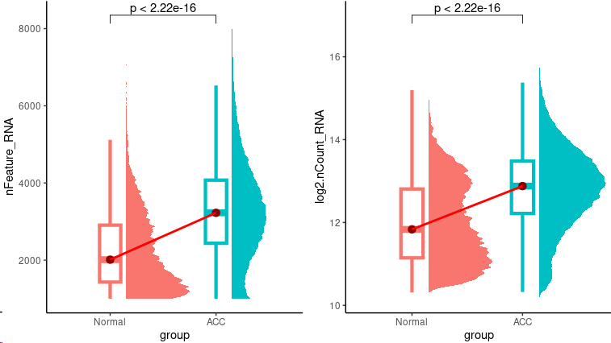

## 3. Identification of 'Confused Cell Identity' in ACC.

**Confused cell identity in ACC.** To identify the lineage status of ACC tumor cells, the signatures of normal adrenal cortex were generated, including 409 genes of capsule, 144 genes of zona glomerulosa, 64 genes of zona reticularis and 85 genes of zona fasciculata. The top 80 gene signatures of adrenal cortex subpopulation were used to descript, visualize and quantify the distributions and levels of confused cell identity in ACC tumor cells by using heatmap and scatter plots generated by ComplexHeatmap (v2.14.0), circlize (v0.4.15) and ggbur (v0.5.0). The signatures scores of capsules, zona glomerulosa, zona reticularis and zona fasciculata were calculated by previously reported methods28. Before the visualization and quantification of CCI scores, each signature was scaled to [-1,1] by standard normalization. Then, the CCI scores were calculated by following way: 

The  means the anyone of the cells. The  mean the scaled signature scores of capsules, zona glomerulosa, zona reticularis and zona fasciculata in  cell. The means the divorce value in  cell. And the  means the CCI scores in  cell.

To interpret the potential up-/down-regulated genes influenced by CCI formation, the pearson correlation coefficients were calculated in ACC tumor cells with downsample of 5,000 cells for speeding up processing. After ordering the genes by correlation coefficients with CCI and scaling values with standard normalization, the GSEA implemented in clusterProfiler (v3.14.3) was used to identify the potential pathways which could be up-/down-regulated by CCI correlated genes. 

Code for analyzing the phenomenon of mixed or confused cell identity within ACC cells.

~~~R
Normal_ACC_merge_seurat <- mcreadRDS("/mnt/d/xiangyu.ubuntu/projects/ACC_res/RDS.all/only_Cortex_seurat_filter.rds", mc.cores = 20)
Sel_g <- c("nCount_RNA","nFeature_RNA")
sel_data <- FetchData(object = Normal_ACC_merge_seurat, vars = c(Sel_g,"new_group","group","Cell_annotation"),slot="data")
sel_data$log2.nCount_RNA <- log(sel_data$nCount_RNA+1,2)
sel_data$group <- factor(sel_data$group,levels=c("Normal","ACC"))
my_pal <- hue_pal()(length(unique(Normal_ACC_merge_seurat$group)))
sel_data <- subset(sel_data,nFeature_RNA > 1000)
p1 <- ggplot(sel_data, aes(x = group, y = nFeature_RNA, color = group, fill = group)) +geom_boxplot(width = .2, fill = "white",size = 1.5, outlier.shape = NA) +
ggdist::stat_halfeye(adjust = .33,width = .67, color = NA,position = position_nudge(x = .15)) +scale_color_manual(values = my_pal, guide = "none") +
scale_fill_manual(values = my_pal, guide = "none")+stat_summary(fun.y = median, geom="point",colour="darkred", size=3) +
stat_summary(fun = median, geom = "line",aes(group = 1),col = "red",size=1)+NoLegend()+theme_classic()+ stat_compare_means(comparisons =list(c("Normal","ACC")), method = "t.test")
p2 <- ggplot(sel_data, aes(x = group, y = log2.nCount_RNA, color = group, fill = group)) +geom_boxplot(width = .2, fill = "white",size = 1.5, outlier.shape = NA) +
ggdist::stat_halfeye(adjust = .33,width = .67, color = NA,position = position_nudge(x = .15)) +scale_color_manual(values = my_pal, guide = "none") +
scale_fill_manual(values = my_pal, guide = "none")+stat_summary(fun.y = median, geom="point",colour="darkred", size=3) +
stat_summary(fun = median, geom = "line",aes(group = 1),col = "red",size=1)+NoLegend()+theme_classic()+ stat_compare_means(comparisons =list(c("Normal","ACC")), method = "t.test")
plot <- plot_grid(p1,p2)
~~~

~~~R
All_gsva_seura <- mcreadRDS("/mnt/d/xiangyu.ubuntu/projects/ACC_res/RDS.all/RDS.final/scRNA.ACC.and.Normal.adrenal.merge.only.Cortex_downsample_exp.rds", mc.cores = 20)
All_normal_sig <- mcreadRDS("/mnt/d/xiangyu.ubuntu/projects/ACC_res/RDS.all/RDS.final/scRNA.Normal.adrenal.only.Cortex_signatures.rds", mc.cores = 20)
table(All_normal_sig$cluster)
All_normal_sig1 <- All_normal_sig %>% group_by(cluster) %>% top_n(n = 80, wt = avg_logFC)
table(All_normal_sig1$cluster)
All_normal_sig1$cluster <- factor(All_normal_sig1$cluster,levels=c("Capsule","Zona.Glom","Zona.Fasc","Zona.Reti"))
All_normal_sig1 <- All_normal_sig1[order(All_normal_sig1$cluster,-(All_normal_sig1$avg_logFC)),]
table(All_normal_sig1$cluster)
NorSig_data <- as.data.frame(FetchData(object = All_gsva_seura, vars = c(as.character(All_normal_sig1$gene)),slot="data"))
NorSig_data <- as.data.frame(t(NorSig_data))
NorSig_zscore <- t(apply(NorSig_data, 1, function(x) (x-mean(x))/sd(x)))
NorSig_zscore[NorSig_zscore > 1] <- 1
NorSig_zscore[NorSig_zscore < -1] <- -1
Meta_traj <- as.data.frame(FetchData(object = All_gsva_seura, vars = c("cell_type","sample"),slot="data"))
Meta_traj$cell_type <- factor(Meta_traj$cell_type,levels=c("Capsule","Zona.Glom","Zona.Fasc","Zona.Reti","ACC"))
Meta_traj$cells <- rownames(Meta_traj)
Meta_traj <- Meta_traj[order(Meta_traj$cell_type),]
Meta_traj$group <- Meta_traj$sample
Meta_traj$group[!Meta_traj$group%in% "Normal"] <- "ACC"
Meta_traj$group <- factor(Meta_traj$group,levels=c("Normal","ACC"))
NorSig_zscore1 <- NorSig_zscore[,rownames(Meta_traj)]
Normal_names <- subset(Meta_traj,group=="Normal")
ACC_names <- subset(Meta_traj,group=="ACC")
library(ComplexHeatmap)
library(circlize)
Capsule <- c("RSPO3","GLI1","WT1","TCF21","GATA4")
Zona.Glom <- c("SHH","DAB2","WNT4","CYP11B2","BMP4")
Zona.Fasc <- c("STAR","CYP11A1","CYP21A2","CYP17A1")
Zona.Reti <- c("TSPAN12","SLC27A2")
mark_gene <- c(Capsule,Zona.Glom,Zona.Fasc,Zona.Reti)
both_gene <- intersect(rownames(NorSig_zscore1[,rownames(Normal_names)]),mark_gene)
gene_pos <- which(rownames(NorSig_zscore1[,rownames(Normal_names)]) %in% both_gene)
selected_gene <- rownames(NorSig_zscore1[,rownames(Normal_names)])[gene_pos]
row_anno <-  rowAnnotation(mark_gene = anno_mark(at = gene_pos, labels = selected_gene))
bb <- jdb_palette("brewer_celsius")
col_fun2 = colorRamp2(c(-1, 0, 1), c(bb[1],bb[5],bb[9]))
ANNO_COL1 = HeatmapAnnotation(Cell_anno=Normal_names$cell_type,sample=Normal_names$sample,
    annotation_legend_param = list(Cell_anno = list(nrow = 1),sample = list(nrow = 2)))
NorSig_PATH1 <- Heatmap(NorSig_zscore1[,rownames(Normal_names)], cluster_rows = FALSE, cluster_columns = FALSE, top_annotation = ANNO_COL1, 
    col = col_fun2, show_column_names = FALSE, show_row_names = FALSE,column_title = "NorSig", 
    row_names_max_width = max_text_width(rownames(NorSig_zscore1), gp = gpar(fontsize = 8)), 
    heatmap_legend_param = list(direction = "horizontal"), width = unit(8, "cm"))
ANNO_COL2 = HeatmapAnnotation(Cell_anno=ACC_names$cell_type,sample=ACC_names$sample,
    annotation_legend_param = list(Cell_anno = list(nrow = 1),sample = list(nrow = 2)))
NorSig_PATH2 <- Heatmap(NorSig_zscore1[,rownames(ACC_names)], cluster_rows = FALSE, cluster_columns = FALSE, top_annotation = ANNO_COL2, 
    col = col_fun2, show_column_names = FALSE, show_row_names = FALSE,column_title = "NorSig", right_annotation = row_anno,
    row_names_max_width = max_text_width(rownames(NorSig_zscore1), gp = gpar(fontsize = 8)), 
    heatmap_legend_param = list(direction = "horizontal"), width = unit(16, "cm"))
draw(NorSig_PATH1+NorSig_PATH2, merge_legend = TRUE,heatmap_legend_side = "bottom", annotation_legend_side = "bottom")
~~~

~~~R
Normal_ACC_merge_seurat1 <- mcreadRDS("/mnt/d/xiangyu.ubuntu/projects/ACC_res/RDS.all/RDS.final/scRNA.ACC.and.Normal.adrenal.merge.only.Cortex.rds", mc.cores = 20)
All_normal_sig <- mcreadRDS("/mnt/d/xiangyu.ubuntu/projects/ACC_res/RDS.all/RDS.final/scRNA.Normal.adrenal.only.Cortex_signatures.rds", mc.cores = 20)
All_normal_sig1 <- All_normal_sig %>% group_by(cluster) %>% top_n(n = 80, wt = avg_logFC)
Fas.sig <- intersect(subset(All_normal_sig,cluster=="Zona.Fasc")$gene,rownames(Normal_ACC_merge_seurat1))
speci_raw <- FetchData(object = Normal_ACC_merge_seurat1, vars = Fas.sig,slot="data")
Normal_ACC_merge_seurat1[["Fas.sig"]] <- (rowSums(speci_raw))/length(Fas.sig)
Ret.sig <- intersect(subset(All_normal_sig,cluster=="Zona.Reti")$gene,rownames(Normal_ACC_merge_seurat1))
speci_raw <- FetchData(object = Normal_ACC_merge_seurat1, vars = Ret.sig,slot="data")
Normal_ACC_merge_seurat1[["Ret.sig"]] <- (rowSums(speci_raw))/length(Ret.sig)
Glo.sig <- intersect(subset(All_normal_sig,cluster=="Zona.Glom")$gene,rownames(Normal_ACC_merge_seurat1))
speci_raw <- FetchData(object = Normal_ACC_merge_seurat1, vars = Glo.sig,slot="data")
Normal_ACC_merge_seurat1[["Glo.sig"]] <- (rowSums(speci_raw))/length(Glo.sig)
Cap.sig <- intersect(subset(All_normal_sig,cluster=="Capsule")$gene,rownames(Normal_ACC_merge_seurat1))
speci_raw <- FetchData(object = Normal_ACC_merge_seurat1, vars = Cap.sig,slot="data")
Normal_ACC_merge_seurat1[["Cap.sig"]] <- (rowSums(speci_raw))/length(Cap.sig)
All_sum <- as.data.frame(FetchData(object = Normal_ACC_merge_seurat1, vars = c("sample","cell_type","Lineage.Plasticity.Score3","Fas.sig","Ret.sig","Glo.sig","Cap.sig","Ret.vs.Glo","Cap.vs.Fas"),slot="data"))
All_sum$Fas.sig <- (All_sum$Fas.sig-min(All_sum$Fas.sig))/(max(All_sum$Fas.sig)-min(All_sum$Fas.sig))
All_sum$Ret.sig <- (All_sum$Ret.sig-min(All_sum$Ret.sig))/(max(All_sum$Ret.sig)-min(All_sum$Ret.sig))
All_sum$Glo.sig <- (All_sum$Glo.sig-min(All_sum$Glo.sig))/(max(All_sum$Glo.sig)-min(All_sum$Glo.sig))
All_sum$Cap.sig <- (All_sum$Cap.sig-min(All_sum$Cap.sig))/(max(All_sum$Cap.sig)-min(All_sum$Cap.sig))
All_sum$Lineage.Plasticity.Score <- unlist(lapply(1:nrow(All_sum),function(x) {
    tmp_d <- as.numeric(as.character(All_sum[x,c("Fas.sig","Ret.sig","Glo.sig","Cap.sig")]))
    var_num <- max(tmp_d)/mean(tmp_d)
    return(var_num)
    }))
summary(All_sum$Lineage.Plasticity.Score)
All_sum$Lineage.Plasticity.Score1 <- All_sum$Lineage.Plasticity.Score
summary(All_sum$Lineage.Plasticity.Score1)
All_sum$Lineage.Plasticity.Score2 <- 1/All_sum$Lineage.Plasticity.Score1
summary(All_sum$Lineage.Plasticity.Score2)
All_sum$Lineage.Plasticity.Score3 <- 100*All_sum$Lineage.Plasticity.Score2
summary(All_sum$Lineage.Plasticity.Score3)
Normal_ACC_merge_seurat1$Lineage.Plasticity.Score1 <- All_sum$Lineage.Plasticity.Score1
Normal_ACC_merge_seurat1$Lineage.Plasticity.Score2 <- All_sum$Lineage.Plasticity.Score2
Normal_ACC_merge_seurat1$Lineage.Plasticity.Score3 <- All_sum$Lineage.Plasticity.Score3
All_sum <- as.data.frame(FetchData(object = Normal_ACC_merge_seurat1, vars = c("v2_Cell_annotation","group","Lineage.Plasticity.Score3","sample"),slot="data"))
p1 <- ggboxplot(All_sum, x = "group", y = "Lineage.Plasticity.Score3", fill="group",
    title=paste0(" Lineage.Plasticity.Score3"), legend = "none",outlier.shape = NA,notch = FALSE) +
rotate_x_text(angle = 45)+ stat_compare_means(comparisons =list(c("Normal","ACC")),label = "p.signif", method = "t.test")
All_sum$sample[All_sum$group=="Normal"] <- "Normal"
All_sum$sample <- factor(All_sum$sample,levels=c("Normal","ACC1_RNA","ACC2_RNA","ACC3_RNA","ACC4_RNA","ACC5_RNA","ACC6_RNA","ACC7_RNA","ACC8_RNA","ACC9_RNA","ACC10_RNA"))
p3 <- ggboxplot(All_sum, x = "sample", y = "Lineage.Plasticity.Score3", fill="sample",title=paste0(" Lineage.Plasticity.Score3"), legend = "none",outlier.shape = NA,notch = FALSE) +
rotate_x_text(angle = 45)+ stat_compare_means(comparisons =list(c("Normal","ACC1_RNA"),c("Normal","ACC2_RNA"),c("Normal","ACC3_RNA"),c("Normal","ACC4_RNA"),c("Normal","ACC5_RNA"),c("Normal","ACC6_RNA"),c("Normal","ACC7_RNA"),c("Normal","ACC8_RNA"),c("Normal","ACC9_RNA"),c("Normal","ACC10_RNA")),label = "p.signif", method = "t.test")
plot <- plot_grid(p1,p3,nrow=1)
~~~

~~~R
Plasticity.Score.cor.G <- mcreadRDS("/mnt/d/xiangyu.ubuntu/projects/ACC_res/RDS.all/RDS.final/CCI.cor_genes.rds", mc.cores = 20)
Plasticity.Score.cor.G$gene <- as.character(Plasticity.Score.cor.G$gene)
Plasticity.Score.cor.G <- Plasticity.Score.cor.G[order(Plasticity.Score.cor.G$cor_num,decreasing=TRUE),]
Plasticity.Score.cor.G <- Plasticity.Score.cor.G[!is.na(Plasticity.Score.cor.G$cor_num),]
Plasticity.Score.cor.G$cor_num <- (Plasticity.Score.cor.G$cor_num-mean(Plasticity.Score.cor.G$cor_num))/(max(Plasticity.Score.cor.G$cor_num)-min(Plasticity.Score.cor.G$cor_num))
Plasticity.Score.cor.G_genelist <- Plasticity.Score.cor.G$cor_num
names(Plasticity.Score.cor.G_genelist) <- Plasticity.Score.cor.G$gene
GSEA_Plasticity.Score.cor.G <- mcreadRDS("/mnt/d/xiangyu.ubuntu/projects/ACC_res/RDS.all/RDS.final/CCI.cor_genes.GSEA.rds", mc.cores = 20)
Sel_paths <- c("GO_STEROID_HORMONE_MEDIATED_SIGNALING_PATHWAY","HALLMARK_PROTEIN_SECRETION","GO_REGULATION_OF_PEPTIDE_HORMONE_SECRETION","GO_POSITIVE_REGULATION_OF_PEPTIDE_HORMONE_SECRETION","GO_POSITIVE_REGULATION_OF_HORMONE_SECRETION","GO_PEPTIDE_SECRETION","GO_REGULATION_OF_SECRETION",
    "HALLMARK_WNT_BETA_CATENIN_SIGNALING","HALLMARK_NOTCH_SIGNALING","HALLMARK_TGF_BETA_SIGNALING","KEGG_CELL_CYCLE","KEGG_PRIMARY_IMMUNODEFICIENCY","KEGG_PPAR_SIGNALING_PATHWAY","KEGG_MISMATCH_REPAIR",
    "KEGG_STEROID_HORMONE_BIOSYNTHESIS","GO_STEROID_BIOSYNTHETIC_PROCESS","GO_RESPONSE_TO_STEROID_HORMONE","MATZUK_STEROIDOGENESIS","GO_STEROID_HORMONE_RECEPTOR_ACTIVITY",
    "GO_NEGATIVE_REGULATION_OF_HORMONE_SECRETION","GO_NEGATIVE_REGULATION_OF_SECRETION","GO_NEGATIVE_REGULATION_OF_PEPTIDE_HORMONE_SECRETION",
    "KEGG_APOPTOSIS","KEGG_CYTOKINE_CYTOKINE_RECEPTOR_INTERACTION")
df1 <- as.data.frame(GSEA_Plasticity.Score.cor.G)
EMBRYONIC <- df1[df1$Description %in% Sel_paths,]
EMBRYONIC$ID <- 1:nrow(EMBRYONIC)
rownames(EMBRYONIC) <- EMBRYONIC$ID
geneSets <- as(EMBRYONIC[, "ID"], "list")
names(geneSets) <- EMBRYONIC[, "ID"]
rownames(EMBRYONIC) <- EMBRYONIC$ID
gsea_tmp <- new("gseaResult", result = EMBRYONIC, geneSets = geneSets, geneList = Plasticity.Score.cor.G_genelist, readable = FALSE,
        params = list(pvalueCutoff = 1, nPerm = 1000,pAdjustMethod = "BH", exponent = 1, minGSSize = 5,maxGSSize = 500))
gsea_tmp@organism <- "UNKNOWN"
gsea_tmp@setType <- "UNKNOWN"
gsea_tmp@keytype <- "UNKNOWN"
require(viridis)
aa <- jdb_palette("brewer_celsius",type = "continuous")[1:length(jdb_palette("brewer_celsius",type = "continuous"))]
library(ggplot2)
tmp_files <- XY_ridgeplot.gseaResult(gsea_tmp,fill="NES", core_enrichment = TRUE)
plot <- ggplot(tmp_files, aes_string(x="value", y="category", fill="NES")) + ggridges ::geom_density_ridges() +
    scale_fill_gradientn(name = "NES", colors=aa, guide=guide_colorbar(reverse=FALSE)) + xlim(-0.5,0.4)+
    xlab(NULL) + ylab(NULL) +  theme_dose() + labs(title="GSEA Plasticity.Score_cor")
~~~

~~~R
ALL_GSEA_GMT <- read.gmt("/mnt/d/xiangyu.ubuntu/workshop/database/msigdb.v7.1.symbols.gmt")
colnames(ALL_GSEA_GMT)[1] <- "ont"
ALL_GSEA_GMT$ont <- as.character(ALL_GSEA_GMT$ont)
Normal_ACC_merge_seurat1 <- mcreadRDS("/mnt/d/xiangyu.ubuntu/projects/ACC_res/RDS.all/RDS.final/scRNA.ACC.and.Normal.adrenal.merge.only.Cortex.rds", mc.cores = 20)
STEROID_HORMONE_SECRETION <- ALL_GSEA_GMT[ALL_GSEA_GMT$ont %in% "GO_STEROID_HORMONE_SECRETION",]
STEROID.SEC.sig <- c("GO_STEROID_HORMONE_MEDIATED_SIGNALING_PATHWAY","HALLMARK_PROTEIN_SECRETION","GO_REGULATION_OF_PEPTIDE_HORMONE_SECRETION","GO_POSITIVE_REGULATION_OF_PEPTIDE_HORMONE_SECRETION","GO_POSITIVE_REGULATION_OF_HORMONE_SECRETION","GO_PEPTIDE_SECRETION","GO_REGULATION_OF_SECRETION")
STEROID_HORMONE_SECRETION <- ALL_GSEA_GMT[ALL_GSEA_GMT$ont %in% STEROID.SEC.sig,]
STEROID.SEC.sig <- intersect(STEROID_HORMONE_SECRETION$gene,rownames(Normal_ACC_merge_seurat1))
speci_raw <- FetchData(object = Normal_ACC_merge_seurat1, vars = STEROID.SEC.sig,slot="data")
Normal_ACC_merge_seurat1[["STEROID.SEC.sig"]] <- (rowSums(speci_raw))/length(STEROID.SEC.sig)
Sel_sig <- c("Fas.sig","Ret.sig","Glo.sig","Cap.sig")
All_sum <- as.data.frame(FetchData(object = Normal_ACC_merge_seurat1, vars = c(Sel_sig,"sample","group","v2_Cell_annotation","STEROID.SEC.sig","SYP","Lineage.Plasticity.Score3"),slot="data"))
All_sum$Fas.sig <- (All_sum$Fas.sig-mean(All_sum$Fas.sig))/(max(All_sum$Fas.sig)-min(All_sum$Fas.sig))
All_sum$Ret.sig <- (All_sum$Ret.sig-mean(All_sum$Ret.sig))/(max(All_sum$Ret.sig)-min(All_sum$Ret.sig))
All_sum$Glo.sig <- (All_sum$Glo.sig-mean(All_sum$Glo.sig))/(max(All_sum$Glo.sig)-min(All_sum$Glo.sig))
All_sum$Cap.sig <- (All_sum$Cap.sig-mean(All_sum$Cap.sig))/(max(All_sum$Cap.sig)-min(All_sum$Cap.sig))
All_sum$Cap.vs.Fas <- All_sum$Cap.sig-All_sum$Fas.sig
All_sum$Ret.vs.Glo <- All_sum$Ret.sig-All_sum$Glo.sig
All_sum <- All_sum[order(All_sum$STEROID.SEC.sig,decreasing=FALSE),]
All_sum$STEROID.SEC.sig <- (All_sum$STEROID.SEC.sig-mean(All_sum$STEROID.SEC.sig))/(max(All_sum$STEROID.SEC.sig)-min(All_sum$STEROID.SEC.sig))
All_sum$STEROID.SEC.sig[All_sum$STEROID.SEC.sig>0.4] <- 0.4
All_sum$STEROID.SEC.sig[All_sum$STEROID.SEC.sig< -0.4] <- -0.4
aa <- jdb_palette("brewer_yes",type = "continuous")
tmp1 <- subset(All_sum,group=="Normal")
tmp1 <- tmp1[order(tmp1$STEROID.SEC.sig,decreasing=TRUE),]
plot1 <- ggscatter(tmp1, x = "Ret.vs.Glo", y = "Cap.vs.Fas",color="STEROID.SEC.sig",
    alpha=0.5,fullrange = TRUE,rug = TRUE,size=0.1,legend="none")+
    labs(title=paste0("STEROID.SEC.sig"))+
    theme_classic() + scale_colour_gradientn(colours = colorRampPalette(aa)(100))+
    xlim(-0.8,1)+ylim(-0.8,0.8)
tmp12 <- subset(All_sum,group=="ACC")
tmp12 <- tmp12[order(tmp12$STEROID.SEC.sig,decreasing=FALSE),]
plot2 <- ggscatter(tmp12, x = "Ret.vs.Glo", y = "Cap.vs.Fas",color="STEROID.SEC.sig",
    alpha=0.5,fullrange = TRUE,rug = TRUE,size=0.1,legend="none")+
    labs(title=paste0("STEROID.SEC.sig"))+
    theme_classic() + scale_colour_gradientn(colours = colorRampPalette(aa)(100))+
    xlim(-0.8,1)+ylim(-0.8,0.8)
plot <- CombinePlots(list(plot1,plot2),ncol=2)
~~~

~~~R
Sel_sig <- c("Fas.sig","Ret.sig","Glo.sig","Cap.sig")
All_sum <- as.data.frame(FetchData(object = Normal_ACC_merge_seurat1, vars = c(Sel_sig,"sample","group","v2_Cell_annotation","NCAM1"),slot="data"))
All_sum$Fas.sig <- (All_sum$Fas.sig-mean(All_sum$Fas.sig))/(max(All_sum$Fas.sig)-min(All_sum$Fas.sig))
All_sum$Ret.sig <- (All_sum$Ret.sig-mean(All_sum$Ret.sig))/(max(All_sum$Ret.sig)-min(All_sum$Ret.sig))
All_sum$Glo.sig <- (All_sum$Glo.sig-mean(All_sum$Glo.sig))/(max(All_sum$Glo.sig)-min(All_sum$Glo.sig))
All_sum$Cap.sig <- (All_sum$Cap.sig-mean(All_sum$Cap.sig))/(max(All_sum$Cap.sig)-min(All_sum$Cap.sig))
All_sum$Cap.vs.Fas <- All_sum$Cap.sig-All_sum$Fas.sig
All_sum$Ret.vs.Glo <- All_sum$Ret.sig-All_sum$Glo.sig
aa <- jdb_palette("brewer_spectra",type = "continuous")
sel_group <- c("Normal","ACC")
All_sum$v2_Cell_annotation <- factor(All_sum$v2_Cell_annotation,levels=c("ACC","Capsule","Zona.Glom","Zona.Fasc","Zona.Reti"))
pal <- jdb_palette("corona")
pal.nor <- pal[c(2,1,3:length(levels(All_sum$v2_Cell_annotation)))]
names(pal.nor) <- levels(All_sum$v2_Cell_annotation)
All_plot <- lapply(1:length(sel_group),function(x) {
    plot <- ggscatter(subset(All_sum,group==sel_group[x]), x = "Ret.vs.Glo", 
        y = "Cap.vs.Fas",color="v2_Cell_annotation",alpha=0.5,fullrange = TRUE,rug = TRUE,size=0.5,legend="none")+
    labs(title=paste0("Cortex in ",sel_group[x]))+ theme_classic() +  xlim(-0.8,1)+ylim(-0.8,0.8)+ scale_color_manual(values = pal.nor)
    return(plot)
    })
plot <- CombinePlots(All_plot,ncol=2)
~~~

~~~R
All_sum$v2_Cell_annotation <- factor(All_sum$v2_Cell_annotation,levels=c("ACC","Capsule","Zona.Glom","Zona.Fasc","Zona.Reti"))
sel_sample <- c("ACC1_RNA","ACC2_RNA","ACC3_RNA","ACC4_RNA","ACC5_RNA","ACC6_RNA","ACC7_RNA","ACC8_RNA","ACC9_RNA","ACC10_RNA")
All_plot <- lapply(1:length(sel_sample),function(x) {
    tmp <- subset(All_sum,sample==sel_sample[x] | group=="Normal")
    tmp <- tmp[order(tmp$v2_Cell_annotation,decreasing=TRUE),]
    plot <- ggscatter(tmp, x = "Ret.vs.Glo", y = "Cap.vs.Fas",color="v2_Cell_annotation",alpha=0.3,fullrange = TRUE,rug = TRUE,size=0.3,legend="none")+
    labs(title=paste0("Cortex in ",sel_sample[x]))+xlim(-0.8,1)+ylim(-0.8,0.8)+NoLegend()+ scale_color_manual(values = pal.nor)
    return(plot)
    })
plot <- CombinePlots(All_plot,ncol=5)
~~~

~~~R
clinical.ACC <- read.csv("/mnt/d/xiangyu.ubuntu/projects/ACC_res/RDS.all/clinical.csv")
clinical.ACC$group <- "Nor"
clinical.ACC$group[clinical.ACC$scRNA.name %in% c("ACC1_RNA","ACC2_RNA","ACC3_RNA","ACC4_RNA")] <- "Type1"
clinical.ACC$group[clinical.ACC$scRNA.name %in% c("ACC5_RNA","ACC6_RNA","ACC7_RNA","ACC8_RNA")] <- "Type2"
clinical.ACC$group[clinical.ACC$scRNA.name %in% c("ACC9_RNA","ACC10_RNA")] <- "Type3"
clinical.ACC$group[clinical.ACC$scRNA.name %in% c("ACC11_spatial","ACC13_spatial")] <- "Type2"
clinical.ACC$new_group <- "ACC"
clinical.ACC$new_group[clinical.ACC$group %in% c("Nor")] <- "Nor"
clinical.ACC$new_group <- factor(clinical.ACC$new_group,levels=c("Nor","ACC"))
clinical.ACC <- clinical.ACC[order(clinical.ACC$new_group),]
clinical.ACC1 <- clinical.ACC[!duplicated(clinical.ACC$Name),]
Sel_num <- c("血浆总皮质醇Plasma.Total.Cotisol","尿游离皮质醇")
All_plot_merge <- lapply(1:length(Sel_num),function(x) {
  clinical.ACC1[,Sel_num[x]] <- log2(as.numeric(as.character(clinical.ACC1[,Sel_num[x]]))+1)
    plot <- ggboxplot(clinical.ACC1, x = "new_group", y = Sel_num[x], fill="new_group",add = "jitter",
        title=paste0(Sel_num[x],".ACC"), legend = "none",notch = FALSE) + rotate_x_text(angle = 45)+ 
        stat_compare_means(comparisons =list(c("Nor","ACC")),label = "p.signif", method = "t.test")
    return(plot)
    })
plot <- CombinePlots(All_plot_merge,ncol=2)
~~~

