## 4. ACC Intra-Tumor Heterogeneity Analysis.

Scripts to dissect the heterogeneity within ACC tumors at the cellular level.

~~~R
Only_ACC_harmony <- mcreadRDS("/mnt/d/xiangyu.ubuntu/projects/ACC_res/RDS.all/RDS.final/scRNA.ACC.only.Cortex_harmony.rds", mc.cores = 20)
Only_ACC_harmony$v2_Cell_annotation <- factor(Only_ACC_harmony$v2_Cell_annotation,levels=c("Sub1","Sub2","Sub3","Sub4","Sub5"))
pal <- jdb_palette("corona")
pal.ACC.cellType <- pal[c(2,1,3:length(levels(Only_ACC_harmony$v2_Cell_annotation)))]
names(pal.ACC.cellType) <- levels(Only_ACC_harmony$v2_Cell_annotation)
plot <- DimPlot(object = Only_ACC_harmony, reduction = "tsne",label=FALSE,group.by="v2_Cell_annotation",pt.size=.5,cols= pal.ACC.cellType) +labs(title="tsne")
~~~

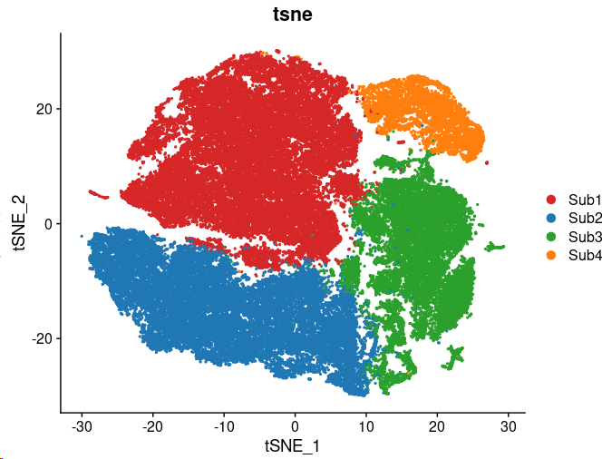

~~~R
Only_ACC_harmony$sample <- factor(Only_ACC_harmony$sample,levels=c("ACC1_RNA","ACC2_RNA","ACC3_RNA","ACC4_RNA","ACC5_RNA","ACC6_RNA","ACC7_RNA","ACC8_RNA","ACC9_RNA","ACC10_RNA"))
pal <- jdb_palette("corona")
pal.ACC.sam <- pal[c(5:8,1:4,9:10)]
names(pal.ACC.sam) <- levels(Only_ACC_harmony$sample)
plot <- DimPlot(object = Only_ACC_harmony, reduction = "tsne",label=FALSE,group.by="sample",pt.size=.5,cols= pal.ACC.sam) +labs(title="tsne")
~~~

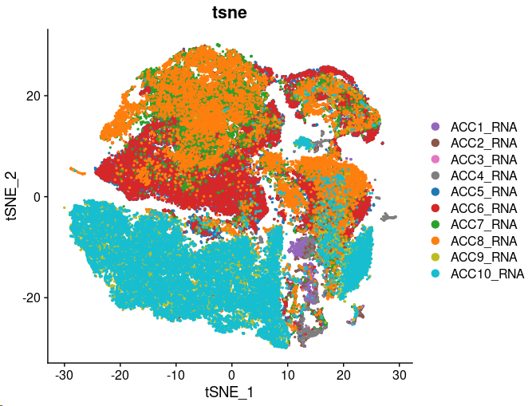

~~~R
library(Nebulosa)
aa <- jdb_palette("brewer_spectra")
p1 <- plot_density(Only_ACC_harmony, c("LDLR"), slot = NULL, joint = FALSE, reduction = "tsne",
 dims = c(1, 2), method = c("ks"), adjust = 1, size = .5, shape = 1, combine = TRUE) + scale_colour_gradientn(colours = colorRampPalette(aa)(100))
p2 <- plot_density(Only_ACC_harmony, c("VIM"), slot = NULL, joint = FALSE, reduction = "tsne",
 dims = c(1, 2), method = c("ks"), adjust = 1, size = .5, shape = 1, combine = TRUE) + scale_colour_gradientn(colours = colorRampPalette(aa)(100))
p3 <- plot_density(Only_ACC_harmony, c("HLA-B"), slot = NULL, joint = FALSE, reduction = "tsne",
 dims = c(1, 2), method = c("ks"), adjust = 1, size = .5, shape = 1, combine = TRUE) + scale_colour_gradientn(colours = colorRampPalette(aa)(100))
p4 <- plot_density(Only_ACC_harmony, c("MKI67"), slot = NULL, joint = FALSE, reduction = "tsne",
 dims = c(1, 2), method = c("ks"), adjust = 1, size = .5, shape = 1, combine = TRUE) + scale_colour_gradientn(colours = colorRampPalette(aa)(100))
p5 <- plot_density(Only_ACC_harmony, c("PSMB6"), slot = NULL, joint = FALSE, reduction = "tsne",
 dims = c(1, 2), method = c("ks"), adjust = 1, size = .5, shape = 1, combine = TRUE) + scale_colour_gradientn(colours = colorRampPalette(aa)(100))
plot <- plot_grid(p1,p2,p3,p4,p5,ncol=5)
~~~

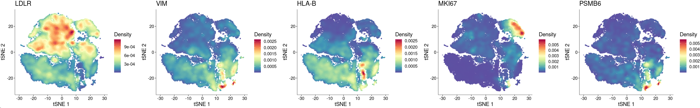

~~~R
p0 <- plot_density(Only_ACC_harmony, c("CYP11B2"), slot = NULL, joint = FALSE, reduction = "tsne",
 dims = c(1, 2), method = c("ks"), adjust = 1, size = .5, shape = 1, combine = TRUE) + scale_colour_gradientn(colours = colorRampPalette(aa)(100))
p1 <- plot_density(Only_ACC_harmony, c("TP53"), slot = NULL, joint = FALSE, reduction = "tsne",
 dims = c(1, 2), method = c("ks"), adjust = 1, size = .5, shape = 1, combine = TRUE) + scale_colour_gradientn(colours = colorRampPalette(aa)(100))
p2 <- plot_density(Only_ACC_harmony, c("ZNRF3"), slot = NULL, joint = FALSE, reduction = "tsne",
 dims = c(1, 2), method = c("ks"), adjust = 1, size = .5, shape = 1, combine = TRUE) + scale_colour_gradientn(colours = colorRampPalette(aa)(100))
p3 <- plot_density(Only_ACC_harmony, c("CTNNB1"), slot = NULL, joint = FALSE, reduction = "tsne",
 dims = c(1, 2), method = c("ks"), adjust = 1, size = .5, shape = 1, combine = TRUE) + scale_colour_gradientn(colours = colorRampPalette(aa)(100))
p4 <- plot_density(Only_ACC_harmony, c("IGF2"), slot = NULL, joint = FALSE, reduction = "tsne",
 dims = c(1, 2), method = c("ks"), adjust = 1, size = .5, shape = 1, combine = TRUE) + scale_colour_gradientn(colours = colorRampPalette(aa)(100))
p5 <- plot_density(Only_ACC_harmony, c("CDKN2A"), slot = NULL, joint = FALSE, reduction = "tsne",
 dims = c(1, 2), method = c("ks"), adjust = 1, size = .5, shape = 1, combine = TRUE) + scale_colour_gradientn(colours = colorRampPalette(aa)(100))
p6 <- plot_density(Only_ACC_harmony, c("RB1"), slot = NULL, joint = FALSE, reduction = "tsne",
 dims = c(1, 2), method = c("ks"), adjust = 1, size = .5, shape = 1, combine = TRUE) + scale_colour_gradientn(colours = colorRampPalette(aa)(100))
p7 <- plot_density(Only_ACC_harmony, c("MEN1"), slot = NULL, joint = FALSE, reduction = "tsne",
 dims = c(1, 2), method = c("ks"), adjust = 1, size = .5, shape = 1, combine = TRUE) + scale_colour_gradientn(colours = colorRampPalette(aa)(100))
p8 <- plot_density(Only_ACC_harmony, c("DAXX"), slot = NULL, joint = FALSE, reduction = "tsne",
 dims = c(1, 2), method = c("ks"), adjust = 1, size = .5, shape = 1, combine = TRUE) + scale_colour_gradientn(colours = colorRampPalette(aa)(100))
p9 <- plot_density(Only_ACC_harmony, c("GATA4"), slot = NULL, joint = FALSE, reduction = "tsne",
 dims = c(1, 2), method = c("ks"), adjust = 1, size = .5, shape = 1, combine = TRUE) + scale_colour_gradientn(colours = colorRampPalette(aa)(100))
plot <- plot_grid(p0,p1,p2,p3,p4,p5,p6,p7,p8,p9,ncol=5)
~~~

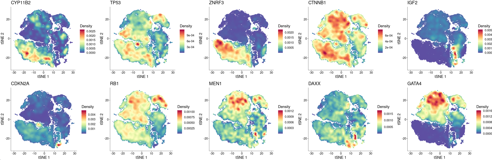

~~~R
XY_FeaturePlot(object = Only_ACC_harmony, features = c("CYP11B2","TP53","ZNRF3","CTNNB1","IGF2","CDKN2A","RB1","MEN1","DAXX","GATA4"),
  pt.size=1,reduction="tsne",label=T,cols = CustomPalette(low ="#007BBF", mid = "#FFF485",high = "#FF0000"),ncol=5)
~~~

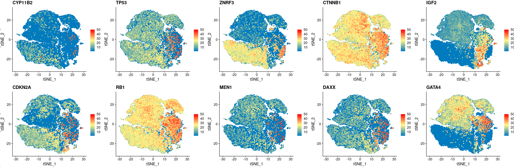

~~~R
aa <- as.data.frame(table(Only_ACC_harmony$v2_Cell_annotation,Only_ACC_harmony$sample))
aa <- aa[order(aa$Var2),]
aa$Var1 <- as.character(aa$Var1)
aa_all <- c()
for (i in unique(aa$Var1)){
  group_sel <- subset(aa,Var1==i)   
  group_sel$sum_number <- sum(group_sel$Freq)
  group_sel$normal_ratio <- (group_sel$Freq/sum(group_sel$sum_number))*100
  group_sel$normal_ratio <- round(group_sel$normal_ratio,2)
  aa_all <- rbind(aa_all,group_sel)
}
aa_all$Var1 <- factor(aa_all$Var1,levels=c("Sub1","Sub2","Sub3","Sub4","Sub5"))
aa_all <- aa_all[order(aa_all$Var1),]
library(ggalluvial)
p1 <- ggplot(aa_all, aes(x = Var1, y = normal_ratio, fill = Var2, stratum = Var2, alluvium = Var2)) + geom_stratum(width = 0.75) + geom_flow(alpha = 0.5) + theme_classic() + 
theme(axis.text.x  = element_text(angle=45, vjust=1,size=8,hjust = 1)) +labs(x = '', y = 'Relative Abundance(%)',title="percentage of subpop")+ scale_fill_manual(values = pal.ACC.sam)
aa <- as.data.frame(table(Only_ACC_harmony$sample,Only_ACC_harmony$v2_Cell_annotation))
aa <- aa[order(aa$Var2),]
aa$Var1 <- as.character(aa$Var1)
aa_all <- c()
for (i in unique(aa$Var1)){
  group_sel <- subset(aa,Var1==i)   
  group_sel$sum_number <- sum(group_sel$Freq)
  group_sel$normal_ratio <- (group_sel$Freq/group_sel$sum_number)*100
  group_sel$normal_ratio <- round(group_sel$normal_ratio,2)
  aa_all <- rbind(aa_all,group_sel)
}
aa_all$Var1 <- factor(aa_all$Var1,levels=c("ACC1_RNA","ACC2_RNA","ACC3_RNA","ACC4_RNA","ACC5_RNA","ACC6_RNA","ACC7_RNA","ACC8_RNA","ACC9_RNA","ACC10_RNA"))
aa_all <- aa_all[order(aa_all$Var1),]
library(ggalluvial)
p2 <- ggplot(aa_all, aes(x = Var1, y = normal_ratio, fill = Var2, stratum = Var2, alluvium = Var2)) + geom_stratum(width = 0.75) + geom_flow(alpha = 0.5) + theme_classic() + 
theme(axis.text.x  = element_text(angle=45, vjust=1,size=8,hjust = 1)) +labs(x = '', y = 'Relative Abundance(%)',title="percentage of subpop")+ scale_fill_manual(values = pal.ACC.cellType)
plot <- plot_grid(p1,p2)
~~~

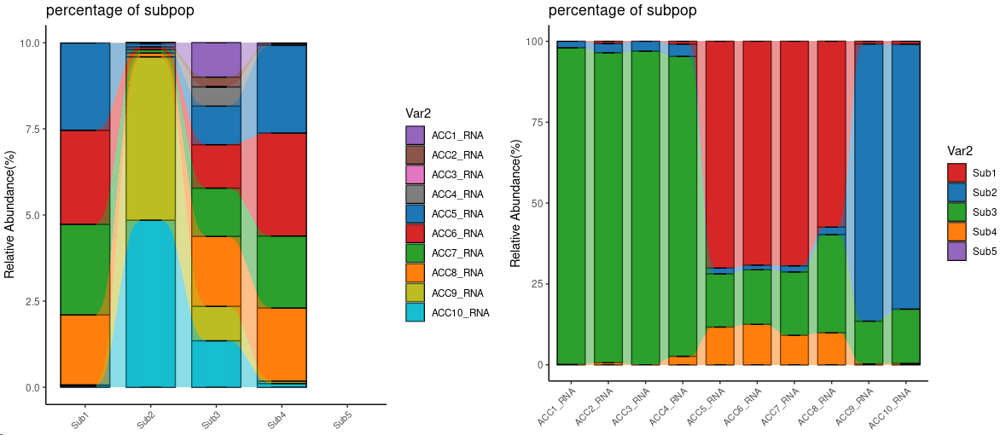

~~~R
HLH_T1_OFF_HIGH_KEGG <- mcreadRDS("/mnt/d/xiangyu.ubuntu/projects/ACC_res/RDS.all/RDS.final/scRNA.ACC.only.Cortex_KEGG.rds", mc.cores = 20)
plot <- clusterProfiler::dotplot(HLH_T1_OFF_HIGH_KEGG,showCategory=10,includeAll=FALSE,label_format=100) + theme(axis.text.x  = element_text(angle=45, vjust=1,size=8,hjust = 1)) + labs(title = "KEGG")
~~~

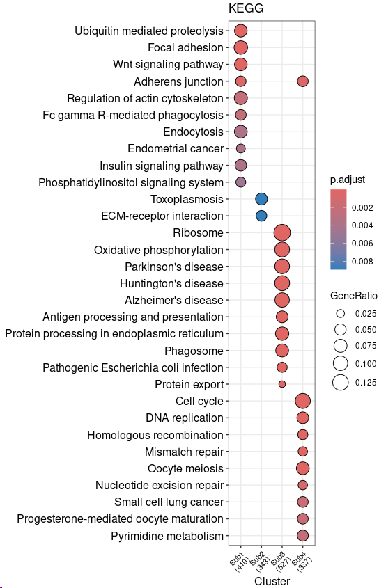

~~~R
ACC.Sel <- mcreadRDS("/mnt/d/xiangyu.ubuntu/projects/ACC_res/RDS.all/RDS.final/scSpatial.ACC.seurat.rds", mc.cores = 20)
names(ACC.Sel) <- c("Spatial1","Spatial2","Spatial3","Spatial4")
pal.ACC.spatial <- c("#007175","#ee7959","#ecd452")
names(pal.ACC.spatial) <- c("type1","type2","type3")
Plots <- lapply(1:length(ACC.Sel),function(i) {
  TMP1.coordinates <- GetTissueCoordinates(object = ACC.Sel[[i]])
  TMP1.coordinates <- TMP1.coordinates[rownames(ACC.Sel[[i]][[]]),]
  TMP1.coordinates <- as.data.frame(cbind(TMP1.coordinates,ACC.Sel[[i]][[]]))
  TMP1.coordinates <- TMP1.coordinates[order(TMP1.coordinates$molecular.Type,decreasing=TRUE),]
  col_sel <- hue_pal()(length(levels(TMP1.coordinates$molecular.Type)))
  col <- col_sel[1:length(levels(TMP1.coordinates$molecular.Type))]
  names(col) <- levels(TMP1.coordinates$molecular.Type)
  col <- c(col,"#efefef")
  names(col)[length(col)] <- "OTS"
  TMP1.coordinates <- TMP1.coordinates[order(TMP1.coordinates$molecular.Type,decreasing=TRUE),]
  plot <- ggplot(TMP1.coordinates, aes(x = max(imagerow)-imagerow, y = imagecol))+ coord_flip()+scale_color_manual(values = col)+ 
  geom_point(alpha = 0.8, size = .5, aes(color = molecular.Type))+theme_classic()+labs(title=paste0("RCTD.",unique(TMP1.coordinates$sample)))+ scale_color_manual(values = pal.ACC.spatial)
  return(plot)
  })
plot <- CombinePlots(Plots,nrow=2)
~~~

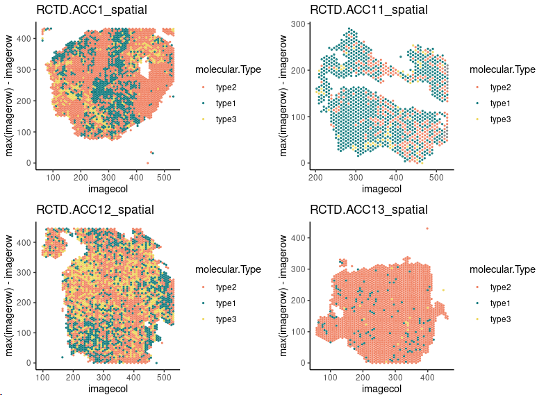

~~~r
pal <- jdb_palette("corona")
Only_ACC_harmony$v2_Cell_annotation <- factor(Only_ACC_harmony$v2_Cell_annotation,levels=c("Sub1","Sub2","Sub3","Sub4"))
pal.ACC.cellType <- pal[c(2,1,3:length(levels(Only_ACC_harmony$v2_Cell_annotation)))]
names(pal.ACC.cellType) <- levels(Only_ACC_harmony$v2_Cell_annotation)
Plots <- lapply(1:length(ACC.Sel),function(i) {
  TMP1.coordinates <- GetTissueCoordinates(object = ACC.Sel[[i]])
  TMP1.coordinates <- TMP1.coordinates[rownames(ACC.Sel[[i]][[]]),]
  TMP1.coordinates <- as.data.frame(cbind(TMP1.coordinates,ACC.Sel[[i]][[]]))
  col_sel <- hue_pal()(length(levels(TMP1.coordinates$second_type)))
  col <- col_sel[1:length(levels(TMP1.coordinates$second_type))]
  names(col) <- levels(TMP1.coordinates$second_type)
  col <- c(col,"#efefef")
  names(col)[length(col)] <- "OTS"
  TMP1.coordinates <- TMP1.coordinates[order(TMP1.coordinates$second_type,decreasing=TRUE),]
  plot <- ggplot(TMP1.coordinates, aes(x = max(imagerow)-imagerow, y = imagecol))+ coord_flip()+scale_color_manual(values = col)+ 
  geom_point(alpha = 0.8, size = .5, aes(color = second_type))+theme_classic()+labs(title=paste0("RCTD.",unique(TMP1.coordinates$sample)))+ scale_color_manual(values = pal.ACC.cellType)
  return(plot)
  })
plot <- CombinePlots(Plots,nrow=2)
~~~

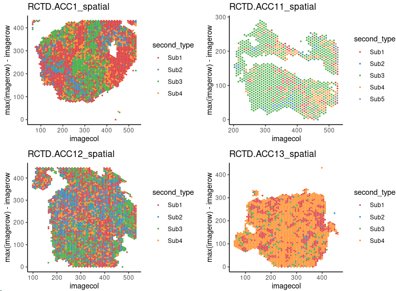

~~~R
All.meta_ <- lapply(1:length(ACC.Sel),function(i) {
  TMP <- ACC.Sel[[i]][[]]
  TMP$second_type <- factor(TMP$second_type,levels=c("Sub1","Sub2","Sub3","Sub4"))
  return(TMP)
  })
All.meta <- do.call(rbind,All.meta_)
aa <- as.data.frame(table(All.meta$sample,All.meta$second_type))
aa <- aa[order(aa$Var2),]
aa$Var1 <- as.character(aa$Var1)
aa_all <- c()
for (i in unique(aa$Var1)){
  group_sel <- subset(aa,Var1==i)
  group_sel$sum_number <- sum(group_sel$Freq)
  group_sel$normal_ratio <- (group_sel$Freq/group_sel$sum_number)*100
  group_sel$normal_ratio <- round(group_sel$normal_ratio,2)
  aa_all <- rbind(aa_all,group_sel)
}
sub_group=c("ACC1_spatial","ACC11_spatial","ACC12_spatial","ACC13_spatial")
All_plot <- lapply(1:length(sub_group),function(x) {
    data <- subset(aa_all,Var1==sub_group[x])
    data$fraction = data$normal_ratio
    data$ymax = cumsum(data$fraction)
    data$ymin = c(0, head(data$ymax, n=-1))
    data$labelPosition <- (data$ymax + data$ymin) / 2
    data$label <- paste0(data$Var2, "\n ", data$fraction)
    plot <- ggplot(data, aes(x=Var2, y=fraction, fill=Var2)) +
     geom_bar(stat="identity") +
     geom_text(aes(x=Var2, y=fraction, label=fraction), size=3, vjust=1,fontface="bold")+
     theme_bw()+theme(legend.position ="none") +
     coord_polar()+labs(x = "", y = "", title = sub_group[x]) + 
     theme(axis.text.y = element_blank()) +     
     theme(axis.ticks = element_blank()) +     
     theme(panel.border = element_blank()) + 
     theme(axis.text.x=element_text(size=12,face="bold"))
    return(plot)
    })
plot <- CombinePlots(All_plot,ncol=4)
~~~

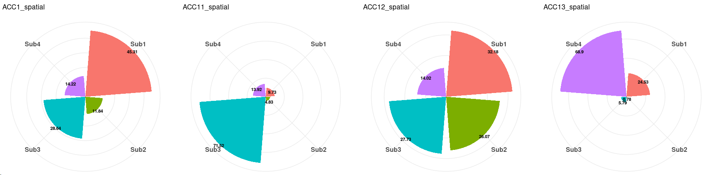

~~~R
All_plot <- lapply(1:length(ACC.Sel),function(x) {
    sel_d <- ACC.Sel[[x]]
    plot <- SpatialDimPlot(sel_d, label=FALSE,group.by="Spatial_snn_res.1",pt.size=0) +NoLegend()
    return(plot)
    })
plot <- CombinePlots(All_plot,nrow=1)
~~~

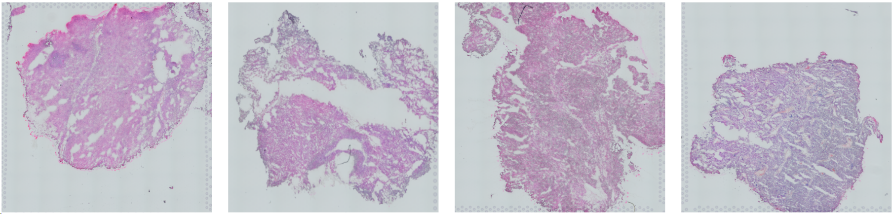

~~~R
All_plot <- lapply(1:3,function(x) {
    sel_d <- ACC.Sel[[x]]
    plot <- SpatialFeaturePlot(sel_d, features = c("LDLR","PCDH15","HLA-B","MKI67","PSMB6"),ncol=5)
    return(plot)
    })
plot <- CombinePlots(All_plot,nrow=3)
~~~

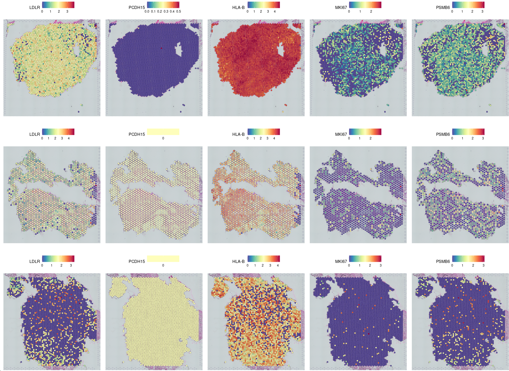

~~~R
All_normal_sig <- mcreadRDS("/mnt/d/xiangyu.ubuntu/projects/ACC_res/RDS.all/RDS.final/scRNA.Normal.adrenal.only.Cortex_signatures.rds", mc.cores = 20)
Normal_sig_all <- mcreadRDS("/mnt/d/xiangyu.ubuntu/projects/ACC_res/RDS.all/RDS.final/scRNA.Normal.adrenal.only.Cortex.and.Medulla_signatures.rds", mc.cores = 20)
Fas.sig <- intersect(subset(All_normal_sig,cluster=="Zona.Fasc")$gene,rownames(All_gsva_seura))
Ret.sig <- intersect(subset(All_normal_sig,cluster=="Zona.Reti")$gene,rownames(All_gsva_seura))
Glo.sig <- intersect(subset(All_normal_sig,cluster=="Zona.Glom")$gene,rownames(All_gsva_seura))
Cap.sig <- intersect(subset(All_normal_sig,cluster=="Capsule")$gene,rownames(All_gsva_seura))
Med.sig <- intersect(subset(Normal_sig_all,cluster=="Medulla")$gene,rownames(All_gsva_seura))
All_sig <- c(Fas.sig,Ret.sig,Glo.sig,Cap.sig,Med.sig)
Capsule <- c("RSPO3","GLI1","WT1","TCF21","GATA4")
Zona.Glom <- c("SHH","DAB2","WNT4","CYP11B2","BMP4")
Zona.Fasc <- c("STAR","CYP11A1","CYP21A2","CYP17A1")
Zona.Reti <- c("TSPAN12","SLC27A2")
Sel_g <- c(Capsule,Zona.Glom,Zona.Fasc,Zona.Reti)
Only_ACC_harmony_markers <- mcreadRDS("/mnt/d/xiangyu.ubuntu/projects/ACC_res/RDS.all/RDS.final/scRNA.ACC.only.Cortex_DEGs.rds", mc.cores = 20)
Only_ACC_harmony_markers_sig <- subset(Only_ACC_harmony_markers,avg_logFC > 0.2 & p_val < 0.05)
table(Only_ACC_harmony_markers_sig$cluster)
top500 <- Only_ACC_harmony_markers %>% group_by(cluster) %>% top_n(n = 500, wt = avg_logFC)
top500 <- as.data.frame(top500)
mark_gene <- intersect(top500$gene,Sel_g)
All_gsva_seura <- mcreadRDS("/mnt/d/xiangyu.ubuntu/projects/ACC_res/RDS.all/RDS.final/scRNA.ACC.only.Cortex_downsamples.rds", mc.cores = 20)
XY_heatmap(seurat_obj=All_gsva_seura,group="cell_type",genes=top500$gene,all_num=FALSE,new_names=NULL,labels_rot=90,
  assay_sel="RNA",color=colorRampPalette(brewer.pal(10, "RdBu"))(101),min_and_max_cut=2,show_row_names=FALSE,mark_gene=mark_gene,label_size=0,scale=TRUE)
~~~

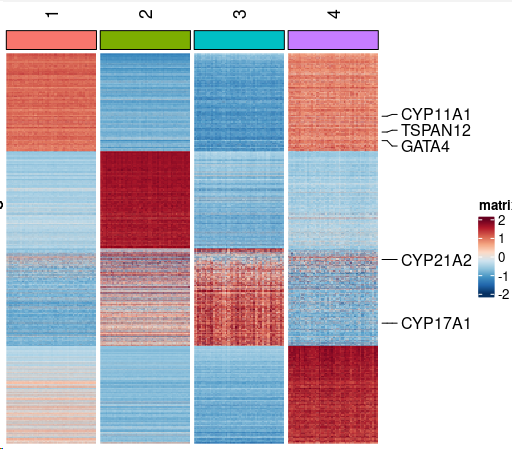

~~~R
Sel_g <- c("CytoTRACE","CNV_score")
All_sum <- as.data.frame(FetchData(object = Only_ACC_harmony, vars = c(Sel_g,"v2_Cell_annotation","v3_Cell_annotation"),slot="data"))
All_sum$new_group <- "OTS"
All_sum$new_group[All_sum$v2_Cell_annotation %in% c("Sub1","Sub4")] <- "type2"
All_sum$new_group[All_sum$v2_Cell_annotation %in% c("Sub5","Sub3")] <- "type1"
All_sum$new_group[All_sum$v2_Cell_annotation %in% c("Sub2")] <- "type3"
All_sum$new_group <- factor(All_sum$new_group,levels=c("type1","type2","type3"))
All_sum$CNV_score <- -log(All_sum$CNV_score,10)
require(ggridges)
my_pal <- jdb_palette("corona")
plot <- list()
for (i in 1:length(Sel_g)){
    tmp <- All_sum
    plot[[i]] <- ggplot(tmp, aes_string(x = "new_group", y = Sel_g[i], color = "new_group", fill = "new_group")) +
      geom_boxplot(width = .5, fill = "white",size = 1, outlier.shape = NA) + ggdist::stat_halfeye(adjust = 1,width = 0.3, color = NA,position = position_nudge(x = .15)) +
      scale_color_manual(values = my_pal, guide = "none") + scale_fill_manual(values = my_pal, guide = "none")+ theme_classic()+
      labs(title=paste0(Sel_g[i],".ACC"))+stat_summary(fun.y = median, geom="point",colour="darkred", size=3) +stat_summary(fun = median, geom = "line",aes(group = 1),col = "red",size=1)+NoLegend()
}
plot <- CombinePlots(plot,nrow=1)
~~~

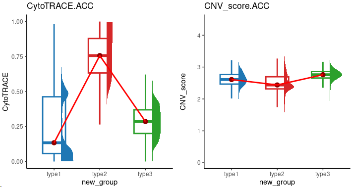

~~~R
plot <- list()
for (i in 1:length(Sel_g)){
    tmp <- All_sum
    plot[[i]] <- ggplot(tmp, aes_string(x = "v2_Cell_annotation", y = Sel_g[i], color = "v2_Cell_annotation", fill = "v2_Cell_annotation")) +
      geom_boxplot(width = .5, fill = "white",size = 1, outlier.shape = NA) + ggdist::stat_halfeye(adjust = 1,width = 0.3, color = NA,position = position_nudge(x = .15)) +
      scale_color_manual(values = my_pal, guide = "none") + scale_fill_manual(values = my_pal, guide = "none")+ theme_classic()+
      stat_summary(fun.y = median, geom="point",colour="darkred", size=3) +stat_summary(fun = median, geom = "line",aes(group = 1),col = "red",size=1)+NoLegend()
}
CombinePlots(plot,nrow=1)
~~~

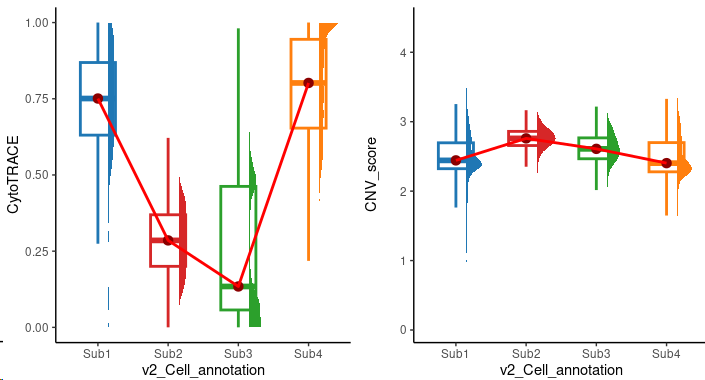

~~~R
Only_ACC_harmony <- mcreadRDS("/mnt/d/xiangyu.ubuntu/projects/ACC_res/RDS.all/RDS.final/scRNA.ACC.only.Cortex_harmony.rds", mc.cores = 20)
AD.sig <- read.csv("/mnt/d/xiangyu.ubuntu/projects/ACC_res/RDS.all/adrenal.differentiation.score.gene.csv")
AD.sig <- intersect(AD.sig$Symbol,rownames(Only_ACC_harmony))
speci_raw <- FetchData(object = Only_ACC_harmony, vars = AD.sig,slot="data")
Only_ACC_harmony[["AD.sig"]] <- (rowSums(speci_raw))/length(AD.sig)

C1A.C1B <- read.csv("/mnt/d/xiangyu.ubuntu/projects/ACC_res/RDS.all/ACC.C1A.C1B.gene.csv")
C1A.sig <- subset(C1A.C1B,UP.regulation=="up in C1A")
C1B.sig <- subset(C1A.C1B,UP.regulation=="up in C1B")
C1A.sig <- intersect(C1A.sig$Gene.Symbol,rownames(Only_ACC_harmony))
speci_raw <- FetchData(object = Only_ACC_harmony, vars = C1A.sig,slot="data")
Only_ACC_harmony[["C1A.sig"]] <- (rowSums(speci_raw))/length(C1A.sig)
C1B.sig <- intersect(C1B.sig$Gene.Symbol,rownames(Only_ACC_harmony))
speci_raw <- FetchData(object = Only_ACC_harmony, vars = C1B.sig,slot="data")
Only_ACC_harmony[["C1B.sig"]] <- (rowSums(speci_raw))/length(C1B.sig)

ALL_GSEA_GMT <- read.gmt("/mnt/d/xiangyu.ubuntu/workshop/database/msigdb.v7.1.symbols.gmt")
colnames(ALL_GSEA_GMT)[1] <- "ont"
ALL_GSEA_GMT$ont <- as.character(ALL_GSEA_GMT$ont)
grep("DNA_METHY",unique(ALL_GSEA_GMT$ont),value=TRUE)
DNA_METHY.sig <- intersect(subset(ALL_GSEA_GMT,ont=="GO_DNA_METHYLATION")$gene,rownames(Only_ACC_harmony))
speci_raw <- FetchData(object = Only_ACC_harmony, vars = DNA_METHY.sig,slot="data")
Only_ACC_harmony[["DNA_METHY.sig"]] <- (rowSums(speci_raw))/length(DNA_METHY.sig)
~~~

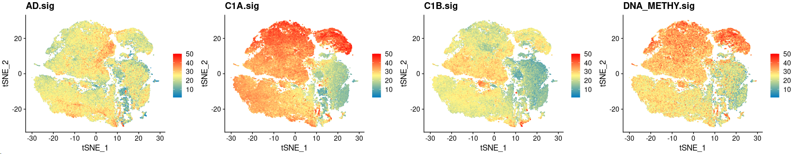

~~~R
XY_FeaturePlot(object = Only_ACC_harmony, features = c("DNMT3A","DNMT1","DNMT3B","DNMT3L"),pt.size=1,reduction="tsne",label=T,cols = CustomPalette(low ="#007BBF", mid = "#FFF485",high = "#FF0000"),ncol=4)
~~~

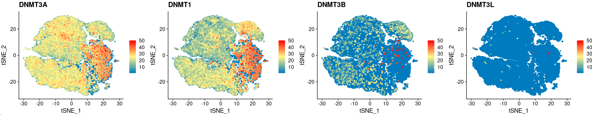

~~~R
plot <- XY_FeaturePlot(object = Only_ACC_harmony, features = c("ZNRF3","CTNNB1","IGF2","CDKN2A","RB1","MEN1","DAXX","GATA4","GATA6","BUB1B","PINK1","DLGAP5"),
  pt.size=1,reduction="tsne",label=T,cols = CustomPalette(low ="#007BBF", mid = "#FFF485",high = "#FF0000"),ncol=6)
~~~

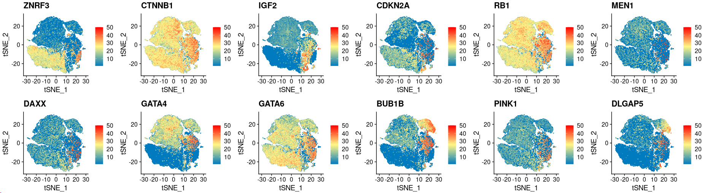

~~~R
library(Nebulosa)
aa <- jdb_palette("brewer_spectra")
p1 <- plot_density(Only_ACC_harmony, c("AD.sig"), slot = NULL, joint = FALSE, reduction = "tsne",
 dims = c(1, 2), method = c("ks"), adjust = 1, size = .5, shape = 1, combine = TRUE) + scale_colour_gradientn(colours = colorRampPalette(aa)(100))
p2 <- plot_density(Only_ACC_harmony, c("C1A.sig"), slot = NULL, joint = FALSE, reduction = "tsne",
 dims = c(1, 2), method = c("ks"), adjust = 1, size = .5, shape = 1, combine = TRUE) + scale_colour_gradientn(colours = colorRampPalette(aa)(100))
p3 <- plot_density(Only_ACC_harmony, c("C1B.sig"), slot = NULL, joint = FALSE, reduction = "tsne",
 dims = c(1, 2), method = c("ks"), adjust = 1, size = .5, shape = 1, combine = TRUE) + scale_colour_gradientn(colours = colorRampPalette(aa)(100))
p4 <- plot_density(Only_ACC_harmony, c("DNA_METHY.sig"), slot = NULL, joint = FALSE, reduction = "tsne",
 dims = c(1, 2), method = c("ks"), adjust = 1, size = .5, shape = 1, combine = TRUE) + scale_colour_gradientn(colours = colorRampPalette(aa)(100))
plot_grid(p1,p2,p3,p4,ncol=4)
~~~

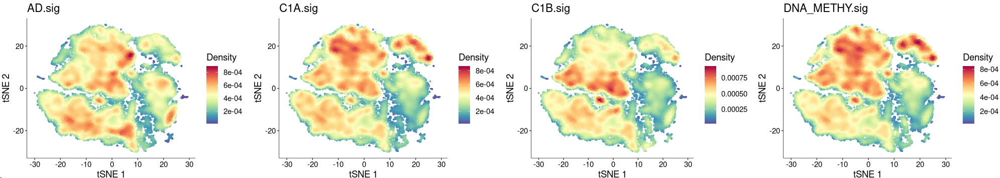

~~~R
Sel_g <- c("AD.sig","C1A.sig","C1B.sig","DNA_METHY.sig")
All_sum <- as.data.frame(FetchData(object = Only_ACC_harmony, vars = c(Sel_g,"v2_Cell_annotation","v3_Cell_annotation"),slot="data"))
All_sum$new_group <- "OTS"
All_sum$new_group[All_sum$v2_Cell_annotation %in% c("Sub1","Sub4")] <- "type2"
All_sum$new_group[All_sum$v2_Cell_annotation %in% c("Sub5","Sub3")] <- "type1"
All_sum$new_group[All_sum$v2_Cell_annotation %in% c("Sub2")] <- "type3"
All_sum$new_group <- factor(All_sum$new_group,levels=c("type1","type2","type3"))
require(ggridges)
my_pal <- jdb_palette("corona")
plot <- list()
for (i in 1:length(Sel_g)){
    tmp <- All_sum
    plot[[i]] <- ggplot(tmp, aes_string(x = "new_group", y = Sel_g[i], color = "new_group", fill = "new_group")) +
      geom_boxplot(width = .5, fill = "white",size = 1, outlier.shape = NA) + ggdist::stat_halfeye(adjust = 1,width = 0.3, color = NA,position = position_nudge(x = .15)) +
      scale_color_manual(values = my_pal, guide = "none") + scale_fill_manual(values = my_pal, guide = "none")+ theme_classic()+
      labs(title=paste0(Sel_g[i],".ACC"))+ stat_compare_means(comparisons =list(c("type1","type2"),c("type1","type3"),c("type2","type3")),label = "p.signif", method = "t.test")+
      stat_summary(fun.y = median, geom="point",colour="darkred", size=3) +stat_summary(fun = median, geom = "line",aes(group = 1),col = "red",size=1)+NoLegend()
}
plot <- CombinePlots(plot,nrow=1)
~~~

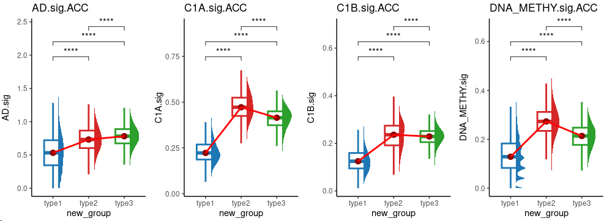

~~~R
Sel_g <- c("AD.sig","C1A.sig","C1B.sig","DNA_METHY.sig")
All_sum <- as.data.frame(FetchData(object = Only_ACC_harmony, vars = c(Sel_g,"v2_Cell_annotation","v3_Cell_annotation","sample"),slot="data"))
All_sum$sample <- factor(All_sum$sample,levels=c("ACC1_RNA","ACC2_RNA","ACC3_RNA","ACC4_RNA","ACC5_RNA","ACC6_RNA","ACC7_RNA","ACC8_RNA","ACC9_RNA","ACC10_RNA"))
require(ggridges)
my_pal <- jdb_palette("corona")
plot <- list()
for (i in 1:length(Sel_g)){
    tmp <- All_sum
    plot[[i]] <- ggplot(tmp, aes_string(x = "sample", y = Sel_g[i], color = "sample", fill = "sample")) +
      geom_boxplot(width = .5, fill = "white",size = 1, outlier.shape = NA) + ggdist::stat_halfeye(adjust = 1,width = 0.3, color = NA,position = position_nudge(x = .15)) +
      scale_color_manual(values = my_pal, guide = "none") + scale_fill_manual(values = my_pal, guide = "none")+ theme_classic()+ rotate_x_text(angle = 45)+
      labs(title=paste0(Sel_g[i],".ACC"))+stat_summary(fun.y = median, geom="point",colour="darkred", size=3) +stat_summary(fun = median, geom = "line",aes(group = 1),col = "red",size=1)+NoLegend()
}
plot <- CombinePlots(plot,nrow=1)
~~~

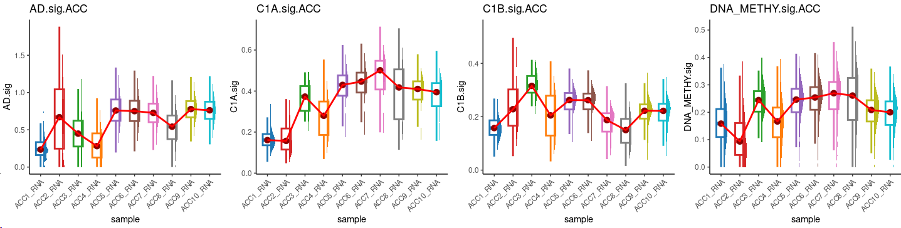