## 5. Molecular Classification of ACC.

**Classification, deconvolution and survival analysis in TCGA-ACC.** The transcriptome data and clinical information of 79 ACC patients were collected from TCGA. Three molecular subtypes of 79 ACC patients were identified by distincted expression levels of the signatures of LDLR+Tumor, PCDH15+Tumor, HLA-B+Tumor and MKI67+Tumor. Each signatures activity scores were calculated by previous reported with average values of signature genes and be standard scaled in all patients. Therefore, all patients can be divided into 4 groups with significantly up-regulated specific tumor subpopulation’s signatures. Then, the patients with up-regulated signatures of HLA-B+Tumor were regarded as Group I patients, the patients with up-regulated signatures of LDLR+Tumor and MKI67+Tumor were regarded as Group II patients and finally, the patients with up-regulated signatures of PCDH15+Tumor were regarded as Group III patients.
 The ENIGMA (v0.1.5) was used to deconvolute and estimate the cell population proportion in bulk RNA-seq samples with the parameter of n_pseudo_bulk=100. The RLR method implemented in get_cell_proportion was used to summarize the cell proportion results. 
 The survival (v3.1.11) and survminer (v0.4.9) were jointly used to measure the Kaplan-Meier overall survival in different groups, including three molecular subtypes or lower-/higher- expression specific genes39,46-48. All the p-value of overall survival was calculated by log-rank test. The optimal cut-points of numerical variables for dividing a lower-or a higher-expression group were calculated with the maxstate (maximally selectedrank statistics) package, which also was integrated into the survminer (v0.4.9) package. 

Code for categorizing ACC into different molecular subtypes based on single-cell data.

~~~R
library("survival")
library("survminer")
TCGA_ACC <- mcreadRDS("/mnt/d/xiangyu.ubuntu/projects/ACC_res/RDS.all/RDS.final/TCGA.ACC_exp.rds", mc.cores = 20)
TCGA_ACC_clinical <- mcreadRDS("/mnt/d/xiangyu.ubuntu/projects/ACC_res/RDS.all/RDS.final/TCGA.ACC_clinical.classify.rds", mc.cores = 20)
Only_ACC_harmony_markers <- mcreadRDS("/mnt/d/xiangyu.ubuntu/projects/ACC_res/RDS.all/RDS.final/scRNA.ACC.only.Cortex_DEGs.rds", mc.cores = 20)
Only_ACC_harmony_markers_sig <- subset(Only_ACC_harmony_markers,avg_logFC > 0.5 & p_val < 0.05)
table(Only_ACC_harmony_markers_sig$cluster)
TCGA_ACC_Sel_ <- future_lapply(1:length(unique(Only_ACC_harmony_markers_sig$cluster)),function(x){
  tmp_clu <- subset(Only_ACC_harmony_markers_sig,cluster==unique(Only_ACC_harmony_markers_sig$cluster)[x])
  TCGA_ACC_tmp <- data.frame(tmp=as.character(apply(TCGA_ACC[,intersect(colnames(TCGA_ACC),unique(tmp_clu$gene))],1,mean)),
    tmp2=as.character(apply(TCGA_ACC[,intersect(colnames(TCGA_ACC),unique(tmp_clu$gene))],1,mean)),
    row.names=rownames(TCGA_ACC))
  TCGA_ACC_tmp$tmp <- as.numeric(as.character(scale((as.numeric(as.character(TCGA_ACC_tmp$tmp))))))
  colnames(TCGA_ACC_tmp) <- c(unique(Only_ACC_harmony_markers_sig$cluster)[x],"tmp2")
  return(TCGA_ACC_tmp[,1])
  })
TCGA_ACC_Sel <- do.call(cbind,TCGA_ACC_Sel_)
TCGA_ACC_Sel <- as.data.frame(TCGA_ACC_Sel)
colnames(TCGA_ACC_Sel) <- unique(Only_ACC_harmony_markers_sig$cluster)
rownames(TCGA_ACC_Sel) <- rownames(TCGA_ACC)
meta <- cbind(TCGA_ACC_clinical,TCGA_ACC)
meta$days_to_death[is.na(meta$days_to_death)] <- "HHH"
meta$days_to_death[which(meta$days_to_death=="HHH")] <- meta$days_to_last_follow_up[which(meta$days_to_death=="HHH")]
all_merge <- subset(meta,days_to_death != "HHH")
all_merge$vital_status <- as.character(all_merge$vital_status)
all_merge$status <- ifelse(all_merge$vital_status=="Alive",0,1)
all_merge$days_to_death <- as.numeric(all_merge$days_to_death)
all_case_and_info <- cbind(TCGA_ACC_Sel,TCGA_ACC_clinical[rownames(TCGA_ACC_Sel),])
all_case_and_info$days_to_death[is.na(all_case_and_info$days_to_death)] <- "HHH"
all_case_and_info$days_to_death[which(all_case_and_info$days_to_death=="HHH")] <- all_case_and_info$days_to_last_follow_up[which(all_case_and_info$days_to_death=="HHH")]
all_merge <- subset(all_case_and_info,days_to_death != "HHH")
all_merge$vital_status <- as.character(all_merge$vital_status)
all_merge$status <- ifelse(all_merge$vital_status=="Alive",0,1)
all_merge$days_to_death <- as.numeric(all_merge$days_to_death)
TCGA_ACC_Sel <- TCGA_ACC_Sel[,c("Sub1","Sub2","Sub3","Sub4")]
TCGA_ACC_Sel$group <- unlist(future_lapply(1:nrow(TCGA_ACC_Sel),function(x){
    sel_tmp <- TCGA_ACC_Sel[x,]
    group_n <- colnames(sel_tmp)[which(sel_tmp==max(sel_tmp))]
    return(group_n)
    }))
all_case_and_info <- cbind(TCGA_ACC_Sel,TCGA_ACC_clinical[rownames(TCGA_ACC_Sel),])
all_case_and_info$days_to_death[is.na(all_case_and_info$days_to_death)] <- "HHH"
all_case_and_info$days_to_death[which(all_case_and_info$days_to_death=="HHH")] <- all_case_and_info$days_to_last_follow_up[which(all_case_and_info$days_to_death=="HHH")]
all_merge <- subset(all_case_and_info,days_to_death != "HHH")
all_merge$vital_status <- as.character(all_merge$vital_status)
all_merge$status <- ifelse(all_merge$vital_status=="Alive",0,1)
all_merge$days_to_death <- as.numeric(all_merge$days_to_death)
all_merge$group <- factor(all_merge$group,levels=c("Sub1","Sub2","Sub3","Sub4"))
all_merge$group.v2 <- as.character(all_merge$group)
all_merge$group.v2[all_merge$group.v2 %in% c("Sub1","Sub4")] <- "type2"
all_merge$group.v2[all_merge$group.v2 %in% c("Sub3")] <- "type1"
all_merge$group.v2[all_merge$group.v2 %in% c("Sub2")] <- "type3"
all_merge$group.v2 <- factor(all_merge$group.v2,levels=c("type1","type2","type3"))
fit <- survfit(Surv(days_to_death, status) ~ group.v2, data = all_merge)
ggsurvplot(fit, data = all_merge,surv.median.line = "hv",pval = TRUE,ggtheme = theme_bw(),risk.table=TRUE)
~~~

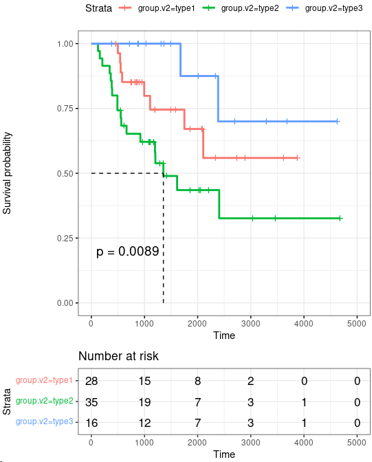

~~~R
subtypes.cancer.cells <- read.csv("/mnt/d/xiangyu.ubuntu/projects/ACC_res/RDS.all/subtypes.cancer.cells.csv")
subtypes.cancer.cells$SAMPLE <- gsub("-",".",subtypes.cancer.cells$SAMPLE)
rownames(subtypes.cancer.cells) <- subtypes.cancer.cells$SAMPLE
all_merge1 <- as.data.frame(cbind(all_merge,subtypes.cancer.cells[rownames(all_merge),]))
sel_p <- subset(all_merge1,group.v2!="NA")
TCGA_ACC_Sel1 <- data.frame(type1=sel_p$Sub3,type2=sel_p$Sub1+sel_p$Sub4,type3=sel_p$Sub2, group.v2=sel_p$group.v2,row.names=rownames(sel_p))
chonglai_zscore_1 <- t(apply(TCGA_ACC_Sel1[rownames(sel_p),-ncol(TCGA_ACC_Sel1)], 1, function(x) (x-mean(x))/sd(x)))
chonglai_zscore_1[chonglai_zscore_1>1] <- 1
chonglai_zscore_1[chonglai_zscore_1< -1] <- -1
bks <- seq(-1, 1, by = 0.1)
library(scales)
library(BuenColors)
aa <- jdb_palette("solar_extra",, type = c("continuous"))[1:length(jdb_palette("solar_extra",, type = c("continuous")))]
hmcols <- colorRampPalette(aa)(length(bks) - 1)
annotation_col <- data.frame(primary_diagnosis=sel_p$primary_diagnosis,tumor_stage=sel_p$tumor_stage,age_at_diagnosis=sel_p$age_at_diagnosis,days_to_death=sel_p$days_to_death,vital_status=sel_p$vital_status,
  days_to_last_follow_up=sel_p$days_to_last_follow_up,group.v2=sel_p$group.v2,row.names=rownames(sel_p),C1A.C1B=sel_p$C1A.C1B,MethyLevel=sel_p$MethyLevel, mRNA_K4=sel_p$mRNA_K4,
  miRNA.cluster=sel_p$miRNA.cluster,SCNA.cluster=sel_p$SCNA.cluster,COC=sel_p$COC,OncoSign=sel_p$OncoSign,purity=sel_p$purity,ploidy=sel_p$ploidy,genome_doublings=sel_p$genome_doublings,ADS=sel_p$ADS)
annotation_col1 <- annotation_col[order(annotation_col$group.v2,annotation_col$C1A.C1B,annotation_col$MethyLevel),]
order <- as.data.frame(table(annotation_col1$group.v2))
chonglai_zscore_1 <- chonglai_zscore_1[rownames(annotation_col1),]
ph_res <- pheatmap(t(chonglai_zscore_1), useRaster = T, cluster_cols = F,cluster_rows = F, show_rownames = TRUE,show_colnames = FALSE,clustering_method = NULL, cutree_rows = 0,gaps_col =c(order$Freq[1],(order$Freq[1]+order$Freq[2]),(order$Freq[1]+order$Freq[2]+order$Freq[3])),annotation_col = annotation_col1, treeheight_row = 20, breaks = bks, color = hmcols,border_color = NA, silent = TRUE, filename = NA)
ph_res
~~~

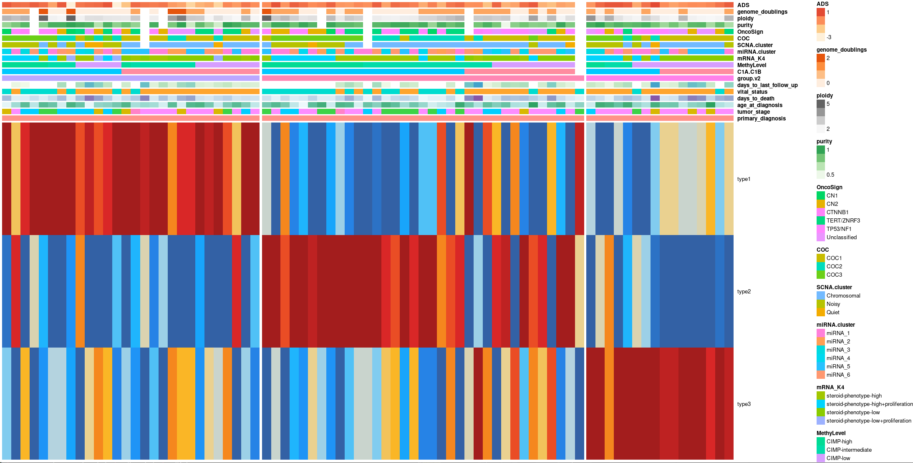

~~~R
library(ggalluvial)
summar_group <- as.data.frame(table(annotation_col1$group.v2,annotation_col1$vital_status))
summar_group <- do.call(rbind,lapply(unique(summar_group$Var1),function(x){
  tmp_s <- subset(summar_group,Var1==x)
  tmp_s$normalized_Freq <- round(100*(tmp_s$Freq)/sum(tmp_s$Freq),2)
  return(tmp_s)
  }))
summar_group$Var1 <- factor(summar_group$Var1,levels=c("type1","type2","type3"))
p1 <- ggplot(summar_group, aes(x = Var1, y = normalized_Freq, fill = Var2, 
    stratum = Var2, alluvium = Var2)) +
geom_stratum(width = 0.75) +  #代替 geom_col() 绘制堆叠柱形图
geom_flow(alpha = 0.5) +  #绘制同类别之间的连接线
labs(x = '', y = 'Relative Abundance(%)',title="dead & alive")+ theme_classic() 
summar_group <- as.data.frame(table(annotation_col1$group.v2,annotation_col1$tumor_stage))
summar_group <- subset(summar_group,Var2!="not reported")
summar_group <- do.call(rbind,lapply(unique(summar_group$Var1),function(x){
  tmp_s <- subset(summar_group,Var1==x)
  tmp_s$normalized_Freq <- round(100*(tmp_s$Freq)/sum(tmp_s$Freq),2)
  return(tmp_s)
  }))
summar_group$Var1 <- factor(summar_group$Var1,levels=c("type1","type2","type3"))
p2 <- ggplot(summar_group, aes(x = Var1, y = normalized_Freq, fill = Var2, 
    stratum = Var2, alluvium = Var2)) +
geom_stratum(width = 0.75) +  #代替 geom_col() 绘制堆叠柱形图
geom_flow(alpha = 0.5) +  #绘制同类别之间的连接线
labs(x = '', y = 'Relative Abundance(%)',title="tumor_stage")+ theme_classic() 
plot <- plot_grid(p1,p2)
~~~

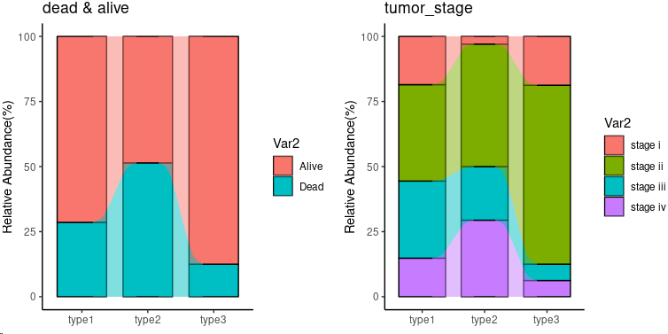

~~~R
aa <- as.data.frame(table(annotation_col1$tumor_stage,annotation_col1$group.v2))
aa <- subset(aa,Var1!="not reported")
aa$Var1 <- as.character(aa$Var1)
aa$Var2 <- factor(aa$Var2,levels=c("type3","type2","type1"))
aa_all <- c()
for (i in unique(aa$Var1)){
  group_sel <- subset(aa,Var1==i)
  group_sel$sum_number <- sum(group_sel$Freq)
  group_sel$normal_ratio <- (group_sel$Freq/group_sel$sum_number)*100
  group_sel$normal_ratio <- round(group_sel$normal_ratio,2)
  aa_all <- rbind(aa_all,group_sel)
}
sub_group <- c("stage i","stage ii","stage iii","stage iv")
All_plot <- lapply(1:length(sub_group),function(x) {
    data <- subset(aa_all,Var1==sub_group[x])
    data$fraction = data$normal_ratio
    data$ymax = cumsum(data$fraction)
    data$ymin = c(0, head(data$ymax, n=-1))
    data$labelPosition <- (data$ymax + data$ymin) / 2
    data$label <- paste0(data$Var2, "\n ", data$fraction)
    plot <- ggplot(data, aes(x=Var2, y=fraction, fill=Var2)) +
     geom_bar(stat="identity") +
     geom_text(aes(x=Var2, y=fraction, label=fraction), size=3, vjust=1,fontface="bold")+
     theme_bw()+theme(legend.position ="none") +
     coord_polar()+labs(x = "", y = "", title = sub_group[x]) + 
     theme(axis.text.y = element_blank()) +     
     theme(axis.ticks = element_blank()) +     
     theme(panel.border = element_blank()) + 
     theme(axis.text.x=element_text(size=12,face="bold"))
    return(plot)
    })
plot <- CombinePlots(All_plot,ncol=4)
~~~

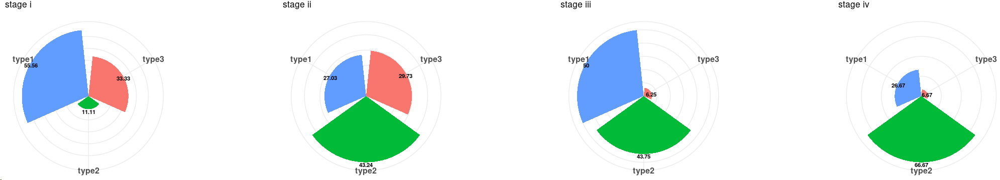

~~~R
aa <- as.data.frame(table(annotation_col1$vital_status,annotation_col1$group.v2))
aa <- subset(aa,Var1!="not reported")
aa$Var1 <- as.character(aa$Var1)
aa$Var2 <- factor(aa$Var2,levels=c("type3","type2","type1"))
aa_all <- c()
for (i in unique(aa$Var1)){
  group_sel <- subset(aa,Var1==i)
  group_sel$sum_number <- sum(group_sel$Freq)
  group_sel$normal_ratio <- (group_sel$Freq/group_sel$sum_number)*100
  group_sel$normal_ratio <- round(group_sel$normal_ratio,2)
  aa_all <- rbind(aa_all,group_sel)
}
sub_group <- c("Alive","Dead")
All_plot <- lapply(1:length(sub_group),function(x) {
    data <- subset(aa_all,Var1==sub_group[x])
    data$fraction = data$normal_ratio
    data$ymax = cumsum(data$fraction)
    data$ymin = c(0, head(data$ymax, n=-1))
    data$labelPosition <- (data$ymax + data$ymin) / 2
    data$label <- paste0(data$Var2, "\n ", data$fraction)
    plot <- ggplot(data, aes(x=Var2, y=fraction, fill=Var2)) +
     geom_bar(stat="identity") +
     geom_text(aes(x=Var2, y=fraction, label=fraction), size=3, vjust=1,fontface="bold")+
     theme_bw()+theme(legend.position ="none") +
     coord_polar()+labs(x = "", y = "", title = sub_group[x]) + 
     theme(axis.text.y = element_blank()) +     
     theme(axis.ticks = element_blank()) +     
     theme(panel.border = element_blank()) + 
     theme(axis.text.x=element_text(size=12,face="bold"))
    return(plot)
    })
plot <- CombinePlots(All_plot,ncol=4)
~~~

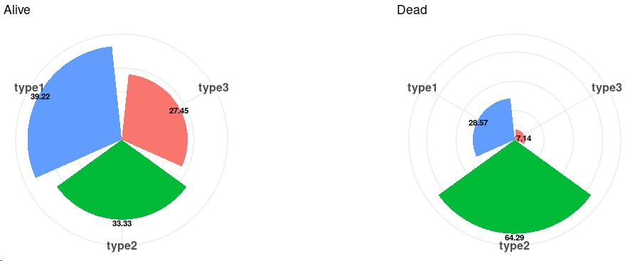

~~~R
TCGA_ACC <- mcreadRDS("/mnt/d/xiangyu.ubuntu/projects/ACC_res/RDS.all/RDS.final/TCGA.ACC_exp.rds", mc.cores = 20)
TCGA_ACC_clinical <- mcreadRDS("/mnt/d/xiangyu.ubuntu/projects/ACC_res/RDS.all/RDS.final/TCGA.ACC_clinical.classify.rds", mc.cores = 20)
Only_ACC_harmony_markers <- mcreadRDS("/mnt/d/xiangyu.ubuntu/projects/ACC_res/RDS.all/RDS.final/scRNA.ACC.only.Cortex_DEGs.rds", mc.cores = 20)
Only_ACC_harmony_markers_sig <- subset(Only_ACC_harmony_markers,avg_logFC > 0.5 & p_val < 0.05)
write.csv(Only_ACC_harmony_markers_sig,"/mnt/d/xiangyu.ubuntu/projects/ACC_res/RDS.all/Only_ACC_harmony_markers_with_anno.csv")
table(Only_ACC_harmony_markers_sig$cluster)
TCGA_ACC_Sel_ <- future_lapply(1:length(unique(Only_ACC_harmony_markers_sig$cluster)),function(x){
  tmp_clu <- subset(Only_ACC_harmony_markers_sig,cluster==unique(Only_ACC_harmony_markers_sig$cluster)[x])
  TCGA_ACC_tmp <- data.frame(tmp=as.character(apply(TCGA_ACC[,intersect(colnames(TCGA_ACC),unique(tmp_clu$gene))],1,mean)),
    tmp2=as.character(apply(TCGA_ACC[,intersect(colnames(TCGA_ACC),unique(tmp_clu$gene))],1,mean)),
    row.names=rownames(TCGA_ACC))
  TCGA_ACC_tmp$tmp <- as.numeric(as.character(scale((as.numeric(as.character(TCGA_ACC_tmp$tmp))))))
  colnames(TCGA_ACC_tmp) <- c(unique(Only_ACC_harmony_markers_sig$cluster)[x],"tmp2")
  return(TCGA_ACC_tmp[,1])
  })
TCGA_ACC_Sel <- do.call(cbind,TCGA_ACC_Sel_)
TCGA_ACC_Sel <- as.data.frame(TCGA_ACC_Sel)
colnames(TCGA_ACC_Sel) <- unique(Only_ACC_harmony_markers_sig$cluster)
rownames(TCGA_ACC_Sel) <- rownames(TCGA_ACC)
TCGA_ACC_Sel <- TCGA_ACC_Sel[,c("Sub1","Sub2","Sub3","Sub4")]
TCGA_ACC_Sel$group <- unlist(future_lapply(1:nrow(TCGA_ACC_Sel),function(x){
    sel_tmp <- TCGA_ACC_Sel[x,]
    group_n <- colnames(sel_tmp)[which(sel_tmp==max(sel_tmp))]
    return(group_n)
    }))
all_case_and_info <- cbind(TCGA_ACC_Sel,TCGA_ACC_clinical[rownames(TCGA_ACC_Sel),])
all_case_and_info$days_to_death[is.na(all_case_and_info$days_to_death)] <- "HHH"
all_case_and_info$days_to_death[which(all_case_and_info$days_to_death=="HHH")] <- all_case_and_info$days_to_last_follow_up[which(all_case_and_info$days_to_death=="HHH")]
all_merge <- subset(all_case_and_info,days_to_death != "HHH")
all_merge$vital_status <- as.character(all_merge$vital_status)
all_merge$status <- ifelse(all_merge$vital_status=="Alive",0,1)
all_merge$days_to_death <- as.numeric(all_merge$days_to_death)
all_merge$group <- factor(all_merge$group,levels=c("Sub1","Sub2","Sub3","Sub4"))
all_merge$group.v2 <- as.character(all_merge$group)
all_merge$group.v2[all_merge$group.v2 %in% c("Sub1","Sub4")] <- "type2"
all_merge$group.v2[all_merge$group.v2 %in% c("Sub3")] <- "type1"
all_merge$group.v2[all_merge$group.v2 %in% c("Sub2")] <- "type3"
all_merge$group.v2 <- factor(all_merge$group.v2,levels=c("type1","type2","type3"))
Sel_num <- c("Sub1","Sub2","Sub3","Sub4")
All_plot_merge <- lapply(1:length(Sel_num),function(x) {
  tmp <- all_merge
  tmp[,Sel_num[x]] <- (tmp[,Sel_num[x]]-min(tmp[,Sel_num[x]]))/(max(tmp[,Sel_num[x]])-min(tmp[,Sel_num[x]]))
  plot <- ggboxplot(tmp, x = "group.v2", y = Sel_num[x], fill="group.v2",add = "jitter",
      title=paste0(Sel_num[x],".ACC"), legend = "none",notch = FALSE) + rotate_x_text(angle = 45)+ 
      stat_compare_means(comparisons =list(c("type1","type2"),c("type2","type3"),c("type1","type3")),label = "p.signif", method = "wilcox.test")
    return(plot)
    })
plot <- CombinePlots(All_plot_merge,nrow=1)
~~~

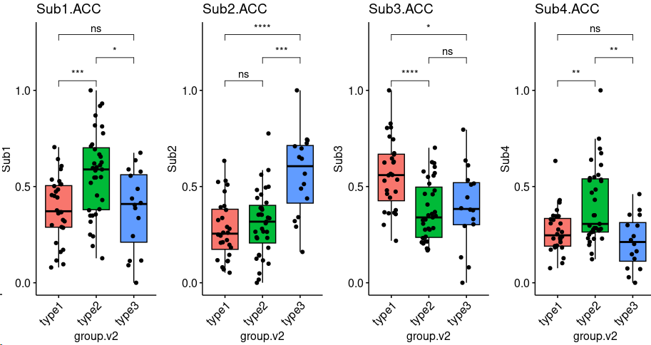

~~~R
Sel_num <- c("LDLR","PCDH15","HLA-B","MKI67")
all_merge1 <- as.data.frame(cbind(all_merge,TCGA_ACC[rownames(all_merge),Sel_num]))
colnames(all_merge1) <- gsub("-","_",colnames(all_merge1))
Sel_num <- c("LDLR","PCDH15","HLA_B","MKI67")
All_plot_merge <- lapply(1:length(Sel_num),function(x) {
  tmp <- all_merge1
  tmp[,Sel_num[x]] <- (tmp[,Sel_num[x]]-min(tmp[,Sel_num[x]]))/(max(tmp[,Sel_num[x]])-min(tmp[,Sel_num[x]]))
  plot <- ggboxplot(tmp, x = "group.v2", y = Sel_num[x], fill="group.v2",add = "jitter",
      title=paste0(Sel_num[x],".ACC"), legend = "none",notch = FALSE) + rotate_x_text(angle = 45)+ 
      stat_compare_means(comparisons =list(c("type1","type2"),c("type2","type3"),c("type1","type3")),label = "p.signif", method = "wilcox.test")
    return(plot)
    })
CombinePlots(All_plot_merge,nrow=1)
~~~

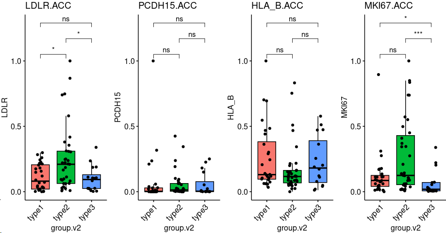

~~~R
TCGA_ACC_clinical <- mcreadRDS("/mnt/d/xiangyu.ubuntu/projects/ACC_res/RDS.all/RDS.final/TCGA.ACC_clinical.classify.rds", mc.cores = 20)
TCGA_ACC_GSEA <- mcreadRDS("/mnt/d/xiangyu.ubuntu/projects/ACC_res/RDS.all/RDS.final/TCGA.ACC_GSVA.scores.rds", mc.cores = 20)
both_id <- intersect(rownames(TCGA_ACC_clinical),colnames(TCGA_ACC_GSEA))
TCGA_ACC_clinical1 <- TCGA_ACC_clinical[both_id,]
TCGA_ACC_GSEA1 <- TCGA_ACC_GSEA[,both_id]
minus_FC.All <- mcreadRDS("/mnt/d/xiangyu.ubuntu/projects/ACC_res/RDS.all/RDS.final/TCGA.ACC_GSVA.Differences.rds", mc.cores = 20)
Sel_num <- c("GO_REGULATION_OF_ANTIGEN_PROCESSING_AND_PRESENTATION_OF_PEPTIDE_OR_POLYSACCHARIDE_ANTIGEN_VIA_MHC_CLASS_II","GO_RECEPTOR_MEDIATED_ENDOCYTOSIS_INVOLVED_IN_CHOLESTEROL_TRANSPORT","KEGG_CELL_CYCLE","GO_ANTIFUNGAL_INNATE_IMMUNE_RESPONSE","KEGG_ECM_RECEPTOR_INTERACTION")
TCGA_ACC_GSEA1.SEL <- TCGA_ACC_GSEA1[Sel_num,]
TCGA_ACC_GSEA1.SEL <- as.data.frame(t(TCGA_ACC_GSEA1.SEL))
Sel_num <- c("ANTIGEN_PROCESSING","ENDOCYTOSIS","CELL_CYCLE","IMMUNE_RESPONSE","ECM")
colnames(TCGA_ACC_GSEA1.SEL) <- Sel_num
TCGA_ACC_GSEA1.SEL$group.v2 <- TCGA_ACC_clinical$group.v2
TCGA_ACC_GSEA1.SEL$group.v2 <- factor(TCGA_ACC_GSEA1.SEL$group.v2,levels=c("type1","type2","type3"))
Sel_num <- c("ANTIGEN_PROCESSING","IMMUNE_RESPONSE","ENDOCYTOSIS","CELL_CYCLE","ECM")
library(BuenColors)
my_pal <- jdb_palette("corona")
All_plot_merge <- lapply(1:length(Sel_num),function(x) {
    plot <- ggplot(TCGA_ACC_GSEA1.SEL, aes_string(x = "group.v2", y = Sel_num[x], color = "group.v2", fill = "group.v2")) +
      geom_boxplot(width = .2, fill = "white",size = 1, outlier.shape = NA) +
      ggdist::stat_halfeye(adjust = 1,width = .3, color = NA,position = position_nudge(x = .15)) +
      gghalves::geom_half_point(side = "l", range_scale = .3, alpha = .5, size = 0.5) + scale_x_discrete(expand = c(.07, .07)) +
      scale_color_manual(values = my_pal, guide = "none") +
      scale_fill_manual(values = my_pal, guide = "none")+ theme_classic() +labs(title=paste0(Sel_num[x],".ACC"))+ 
      stat_compare_means(comparisons =list(c("type1","type2"),c("type2","type3"),c("type1","type3")),label = "p.signif", method = "t.test")
    return(plot)
    })
plot <- CombinePlots(All_plot_merge,nrow=1)
~~~

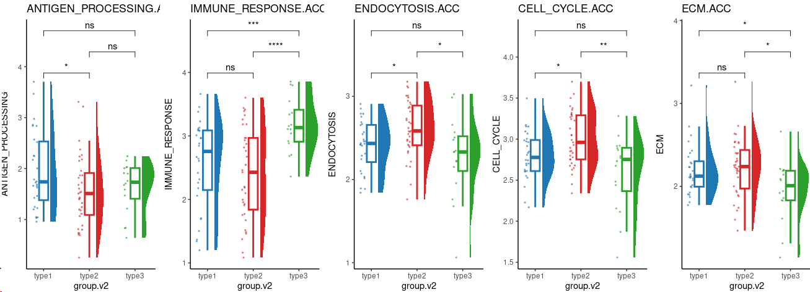

~~~R
library(ggalluvial)
summar_group <- as.data.frame(table(annotation_col1$group.v2,annotation_col1$C1A.C1B))
summar_group <- do.call(rbind,lapply(unique(summar_group$Var1),function(x){
  tmp_s <- subset(summar_group,Var1==x)
  tmp_s$normalized_Freq <- round(100*(tmp_s$Freq)/sum(tmp_s$Freq),2)
  return(tmp_s)
  }))
summar_group$Var2 <- factor(summar_group$Var2,levels=c("C1A","C1B"))
p1 <- ggplot(summar_group, aes(x = Var1, y = normalized_Freq, fill = Var2, stratum = Var2, alluvium = Var2)) +
geom_stratum(width = 0.75) +  #代替 geom_col() 绘制堆叠柱形图
geom_flow(alpha = 0.5) +  #绘制同类别之间的连接线
labs(x = '', y = 'Relative Abundance(%)',title="C1A.C1B")+ theme_classic() 
summar_group <- as.data.frame(table(annotation_col1$group.v2,annotation_col1$MethyLevel))
summar_group <- subset(summar_group,Var2!="not reported")
summar_group <- do.call(rbind,lapply(unique(summar_group$Var1),function(x){
  tmp_s <- subset(summar_group,Var1==x)
  tmp_s$normalized_Freq <- round(100*(tmp_s$Freq)/sum(tmp_s$Freq),2)
  return(tmp_s)
  }))
summar_group$Var2 <- factor(summar_group$Var2,levels=c("CIMP-low","CIMP-intermediate","CIMP-high"))
p2 <- ggplot(summar_group, aes(x = Var1, y = normalized_Freq, fill = Var2, 
    stratum = Var2, alluvium = Var2)) +
geom_stratum(width = 0.75) +  #代替 geom_col() 绘制堆叠柱形图
geom_flow(alpha = 0.5) +  #绘制同类别之间的连接线
labs(x = '', y = 'Relative Abundance(%)',title="MethyLevel")+ theme_classic() 
summar_group <- as.data.frame(table(annotation_col1$group.v2,annotation_col1$mRNA_K4))
summar_group <- subset(summar_group,Var2!="not reported")
summar_group <- do.call(rbind,lapply(unique(summar_group$Var1),function(x){
  tmp_s <- subset(summar_group,Var1==x)
  tmp_s$normalized_Freq <- round(100*(tmp_s$Freq)/sum(tmp_s$Freq),2)
  return(tmp_s)
  }))
summar_group$Var2 <- factor(summar_group$Var2,levels=c("steroid-phenotype-low ","steroid-phenotype-high","steroid-phenotype-low+proliferation","steroid-phenotype-high+proliferation"))
p3 <- ggplot(summar_group, aes(x = Var1, y = normalized_Freq, fill = Var2, 
    stratum = Var2, alluvium = Var2)) +
geom_stratum(width = 0.75) +  #代替 geom_col() 绘制堆叠柱形图
geom_flow(alpha = 0.5) +  #绘制同类别之间的连接线
labs(x = '', y = 'Relative Abundance(%)',title="mRNA_K4")+ theme_classic() 
summar_group <- as.data.frame(table(annotation_col1$group.v2,annotation_col1$miRNA.cluster))
summar_group <- subset(summar_group,Var2!="not reported")
summar_group <- do.call(rbind,lapply(unique(summar_group$Var1),function(x){
  tmp_s <- subset(summar_group,Var1==x)
  tmp_s$normalized_Freq <- round(100*(tmp_s$Freq)/sum(tmp_s$Freq),2)
  return(tmp_s)
  }))
summar_group$Var2 <- factor(summar_group$Var2,levels=c("miRNA_1","miRNA_2","miRNA_3","miRNA_4","miRNA_5","miRNA_6"))
p4 <- ggplot(summar_group, aes(x = Var1, y = normalized_Freq, fill = Var2, 
    stratum = Var2, alluvium = Var2)) +
geom_stratum(width = 0.75) +  #代替 geom_col() 绘制堆叠柱形图
geom_flow(alpha = 0.5) +  #绘制同类别之间的连接线
labs(x = '', y = 'Relative Abundance(%)',title="miRNA.cluster")+ theme_classic() 
summar_group <- as.data.frame(table(annotation_col1$group.v2,annotation_col1$SCNA.cluster))
summar_group <- subset(summar_group,Var2!="not reported")
summar_group <- do.call(rbind,lapply(unique(summar_group$Var1),function(x){
  tmp_s <- subset(summar_group,Var1==x)
  tmp_s$normalized_Freq <- round(100*(tmp_s$Freq)/sum(tmp_s$Freq),2)
  return(tmp_s)
  }))
summar_group$Var2 <- factor(summar_group$Var2,levels=c("Quiet","Noisy","Chromosomal"))
p5 <- ggplot(summar_group, aes(x = Var1, y = normalized_Freq, fill = Var2, 
    stratum = Var2, alluvium = Var2)) +
geom_stratum(width = 0.75) +  #代替 geom_col() 绘制堆叠柱形图
geom_flow(alpha = 0.5) +  #绘制同类别之间的连接线
labs(x = '', y = 'Relative Abundance(%)',title="SCNA.cluster")+ theme_classic() 
summar_group <- as.data.frame(table(annotation_col1$group.v2,annotation_col1$COC))
summar_group <- subset(summar_group,Var2!="not reported")
summar_group <- do.call(rbind,lapply(unique(summar_group$Var1),function(x){
  tmp_s <- subset(summar_group,Var1==x)
  tmp_s$normalized_Freq <- round(100*(tmp_s$Freq)/sum(tmp_s$Freq),2)
  return(tmp_s)
  }))
summar_group$Var2 <- factor(summar_group$Var2,levels=c("COC1","COC2","COC3"))
p6 <- ggplot(summar_group, aes(x = Var1, y = normalized_Freq, fill = Var2, 
    stratum = Var2, alluvium = Var2)) +
geom_stratum(width = 0.75) +  #代替 geom_col() 绘制堆叠柱形图
geom_flow(alpha = 0.5) +  #绘制同类别之间的连接线
labs(x = '', y = 'Relative Abundance(%)',title="COC")+ theme_classic()
plot <- plot_grid(p1,p2,p3,p4,p5,p6,nrow=2)
~~~

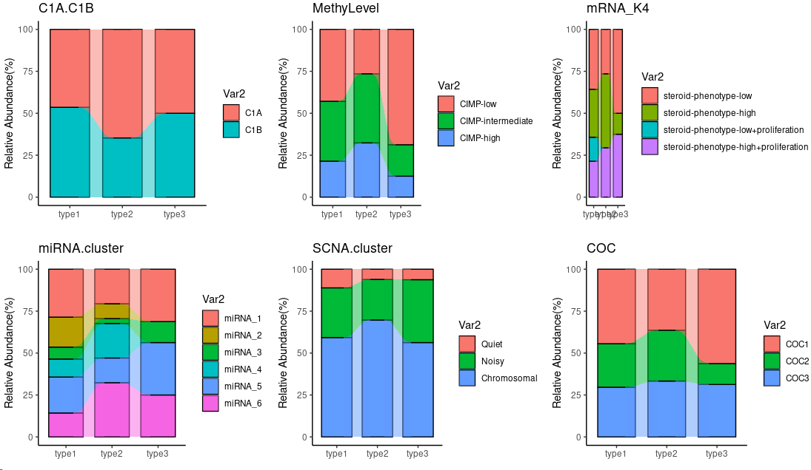

~~~r
Sel_num <- c("purity","ploidy","genome_doublings","ADS")
All_plot_merge <- lapply(1:length(Sel_num),function(x) {
  tmp <- sel_p
  plot <- ggboxplot(tmp, x = "group.v2", y = Sel_num[x], fill="group.v2",add = "jitter",
      title=paste0(Sel_num[x],".ACC"), legend = "none",notch = FALSE) + rotate_x_text(angle = 45)+ 
      stat_compare_means(comparisons =list(c("type1","type2"),c("type2","type3"),c("type1","type3")),label = "p.signif", method = "wilcox.test")
    return(plot)
    })
plot <- CombinePlots(All_plot_merge,nrow=1)
~~~

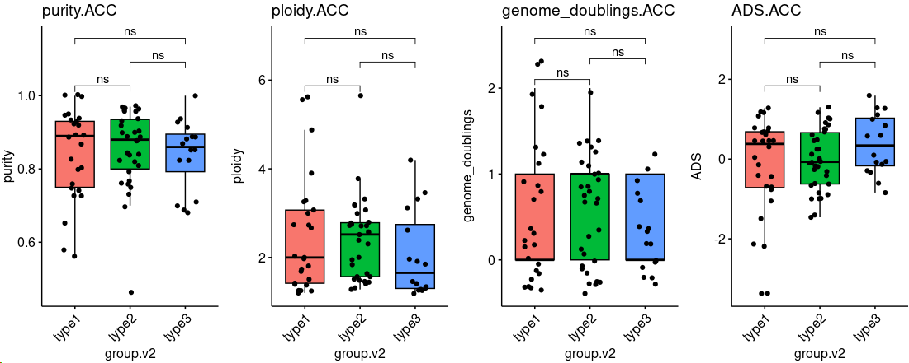

~~~R
aa <- as.data.frame(table(annotation_col1$C1A.C1B,annotation_col1$group.v2))
aa <- subset(aa,Var1!="not reported")
aa$Var1 <- as.character(aa$Var1)
aa$Var2 <- factor(aa$Var2,levels=c("type3","type2","type1"))
aa_all <- c()
for (i in unique(aa$Var1)){
  group_sel <- subset(aa,Var1==i)
  group_sel$sum_number <- sum(group_sel$Freq)
  group_sel$normal_ratio <- (group_sel$Freq/group_sel$sum_number)*100
  group_sel$normal_ratio <- round(group_sel$normal_ratio,2)
  aa_all <- rbind(aa_all,group_sel)
}
sub_group <- c("C1A","C1B")
All_plot <- lapply(1:length(sub_group),function(x) {
    data <- subset(aa_all,Var1==sub_group[x])
    data$fraction = data$normal_ratio
    data$ymax = cumsum(data$fraction)
    data$ymin = c(0, head(data$ymax, n=-1))
    data$labelPosition <- (data$ymax + data$ymin) / 2
    data$label <- paste0(data$Var2, "\n ", data$fraction)
    plot <- ggplot(data, aes(x=Var2, y=fraction, fill=Var2)) +
     geom_bar(stat="identity") +
     geom_text(aes(x=Var2, y=fraction, label=fraction), size=3, vjust=1,fontface="bold")+
     theme_bw()+theme(legend.position ="none") +
     coord_polar()+labs(x = "", y = "", title = sub_group[x]) + 
     theme(axis.text.y = element_blank()) +     
     theme(axis.ticks = element_blank()) +     
     theme(panel.border = element_blank()) + 
     theme(axis.text.x=element_text(size=12,face="bold"))
    return(plot)
    })
plot <- CombinePlots(All_plot,ncol=4)
~~~

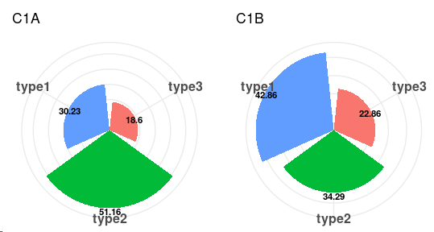

~~~r
aa <- as.data.frame(table(annotation_col1$MethyLevel,annotation_col1$group.v2))
aa <- subset(aa,Var1!="not reported")
aa$Var1 <- as.character(aa$Var1)
aa$Var2 <- factor(aa$Var2,levels=c("type3","type2","type1"))
aa_all <- c()
for (i in unique(aa$Var1)){
  group_sel <- subset(aa,Var1==i)
  group_sel$sum_number <- sum(group_sel$Freq)
  group_sel$normal_ratio <- (group_sel$Freq/group_sel$sum_number)*100
  group_sel$normal_ratio <- round(group_sel$normal_ratio,2)
  aa_all <- rbind(aa_all,group_sel)
}
sub_group <- c("CIMP-low","CIMP-intermediate","CIMP-high")
All_plot <- lapply(1:length(sub_group),function(x) {
    data <- subset(aa_all,Var1==sub_group[x])
    data$fraction = data$normal_ratio
    data$ymax = cumsum(data$fraction)
    data$ymin = c(0, head(data$ymax, n=-1))
    data$labelPosition <- (data$ymax + data$ymin) / 2
    data$label <- paste0(data$Var2, "\n ", data$fraction)
    plot <- ggplot(data, aes(x=Var2, y=fraction, fill=Var2)) +
     geom_bar(stat="identity") +
     geom_text(aes(x=Var2, y=fraction, label=fraction), size=3, vjust=1,fontface="bold")+
     theme_bw()+theme(legend.position ="none") +
     coord_polar()+labs(x = "", y = "", title = sub_group[x]) + 
     theme(axis.text.y = element_blank()) +     
     theme(axis.ticks = element_blank()) +     
     theme(panel.border = element_blank()) + 
     theme(axis.text.x=element_text(size=12,face="bold"))
    return(plot)
    })
plot <- CombinePlots(All_plot,ncol=4)
~~~

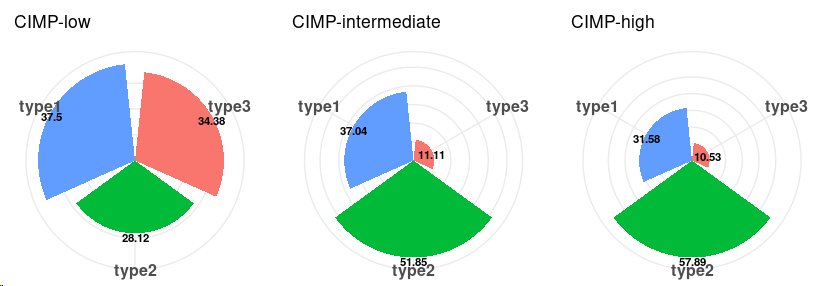

~~~~r
aa <- as.data.frame(table(annotation_col1$mRNA_K4,annotation_col1$group.v2))
aa <- subset(aa,Var1!="not reported")
aa$Var1 <- as.character(aa$Var1)
aa$Var2 <- factor(aa$Var2,levels=c("type3","type2","type1"))
aa_all <- c()
for (i in unique(aa$Var1)){
  group_sel <- subset(aa,Var1==i)
  group_sel$sum_number <- sum(group_sel$Freq)
  group_sel$normal_ratio <- (group_sel$Freq/group_sel$sum_number)*100
  group_sel$normal_ratio <- round(group_sel$normal_ratio,2)
  aa_all <- rbind(aa_all,group_sel)
}
sub_group <- c("steroid-phenotype-low ","steroid-phenotype-high","steroid-phenotype-low+proliferation","steroid-phenotype-high+proliferation")
All_plot <- lapply(1:length(sub_group),function(x) {
    data <- subset(aa_all,Var1==sub_group[x])
    data$fraction = data$normal_ratio
    data$ymax = cumsum(data$fraction)
    data$ymin = c(0, head(data$ymax, n=-1))
    data$labelPosition <- (data$ymax + data$ymin) / 2
    data$label <- paste0(data$Var2, "\n ", data$fraction)
    plot <- ggplot(data, aes(x=Var2, y=fraction, fill=Var2)) +
     geom_bar(stat="identity") +
     geom_text(aes(x=Var2, y=fraction, label=fraction), size=3, vjust=1,fontface="bold")+
     theme_bw()+theme(legend.position ="none") +
     coord_polar()+labs(x = "", y = "", title = sub_group[x]) + 
     theme(axis.text.y = element_blank()) +     
     theme(axis.ticks = element_blank()) +     
     theme(panel.border = element_blank()) + 
     theme(axis.text.x=element_text(size=12,face="bold"))
    return(plot)
    })
plot <- CombinePlots(All_plot,ncol=4)
~~~~

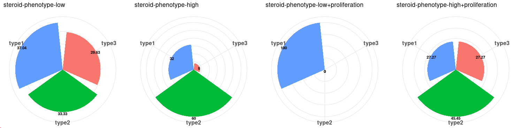

~~~R
aa <- as.data.frame(table(annotation_col1$miRNA.cluster,annotation_col1$group.v2))
aa <- subset(aa,Var1!="not reported")
aa$Var1 <- as.character(aa$Var1)
aa$Var2 <- factor(aa$Var2,levels=c("type3","type2","type1"))
aa_all <- c()
for (i in unique(aa$Var1)){
  group_sel <- subset(aa,Var1==i)
  group_sel$sum_number <- sum(group_sel$Freq)
  group_sel$normal_ratio <- (group_sel$Freq/group_sel$sum_number)*100
  group_sel$normal_ratio <- round(group_sel$normal_ratio,2)
  aa_all <- rbind(aa_all,group_sel)
}
sub_group <- c("miRNA_1","miRNA_2","miRNA_3","miRNA_4","miRNA_5","miRNA_6")
All_plot <- lapply(1:length(sub_group),function(x) {
    data <- subset(aa_all,Var1==sub_group[x])
    data$fraction = data$normal_ratio
    data$ymax = cumsum(data$fraction)
    data$ymin = c(0, head(data$ymax, n=-1))
    data$labelPosition <- (data$ymax + data$ymin) / 2
    data$label <- paste0(data$Var2, "\n ", data$fraction)
    plot <- ggplot(data, aes(x=Var2, y=fraction, fill=Var2)) +
     geom_bar(stat="identity") +
     geom_text(aes(x=Var2, y=fraction, label=fraction), size=3, vjust=1,fontface="bold")+
     theme_bw()+theme(legend.position ="none") +
     coord_polar()+labs(x = "", y = "", title = sub_group[x]) + 
     theme(axis.text.y = element_blank()) +     
     theme(axis.ticks = element_blank()) +     
     theme(panel.border = element_blank()) + 
     theme(axis.text.x=element_text(size=12,face="bold"))
    return(plot)
    })
plot <- CombinePlots(All_plot,ncol=4)
~~~

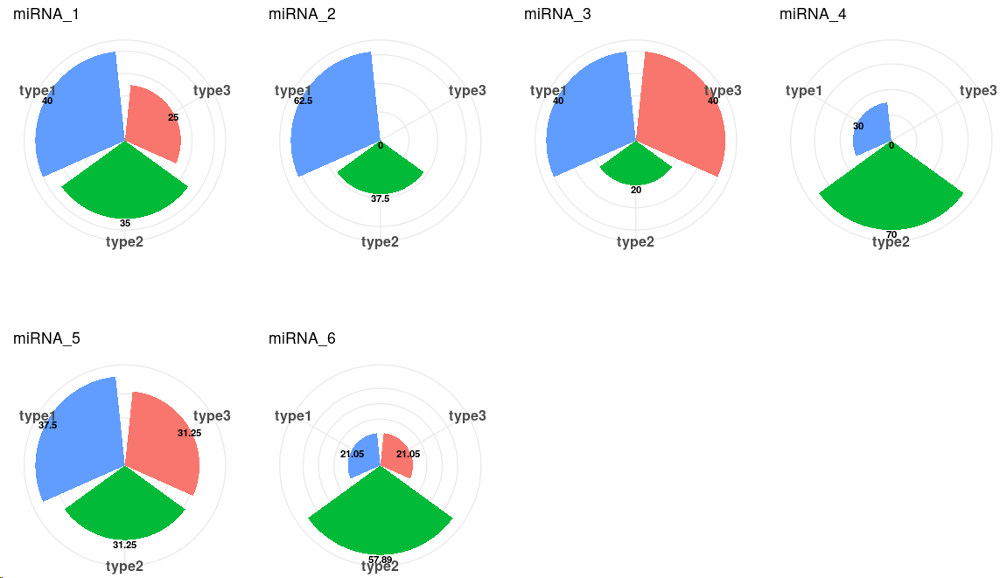

~~~R
aa <- as.data.frame(table(annotation_col1$SCNA.cluster,annotation_col1$group.v2))
aa <- subset(aa,Var1!="not reported")
aa$Var1 <- as.character(aa$Var1)
aa$Var2 <- factor(aa$Var2,levels=c("type3","type2","type1"))
aa_all <- c()
for (i in unique(aa$Var1)){
  group_sel <- subset(aa,Var1==i)
  group_sel$sum_number <- sum(group_sel$Freq)
  group_sel$normal_ratio <- (group_sel$Freq/group_sel$sum_number)*100
  group_sel$normal_ratio <- round(group_sel$normal_ratio,2)
  aa_all <- rbind(aa_all,group_sel)
}
sub_group <- c("Quiet","Noisy","Chromosomal")
All_plot <- lapply(1:length(sub_group),function(x) {
    data <- subset(aa_all,Var1==sub_group[x])
    data$fraction = data$normal_ratio
    data$ymax = cumsum(data$fraction)
    data$ymin = c(0, head(data$ymax, n=-1))
    data$labelPosition <- (data$ymax + data$ymin) / 2
    data$label <- paste0(data$Var2, "\n ", data$fraction)
    plot <- ggplot(data, aes(x=Var2, y=fraction, fill=Var2)) +
     geom_bar(stat="identity") +
     geom_text(aes(x=Var2, y=fraction, label=fraction), size=3, vjust=1,fontface="bold")+
     theme_bw()+theme(legend.position ="none") +
     coord_polar()+labs(x = "", y = "", title = sub_group[x]) + 
     theme(axis.text.y = element_blank()) +     
     theme(axis.ticks = element_blank()) +     
     theme(panel.border = element_blank()) + 
     theme(axis.text.x=element_text(size=12,face="bold"))
    return(plot)
    })
plot <- CombinePlots(All_plot,ncol=4)
~~~

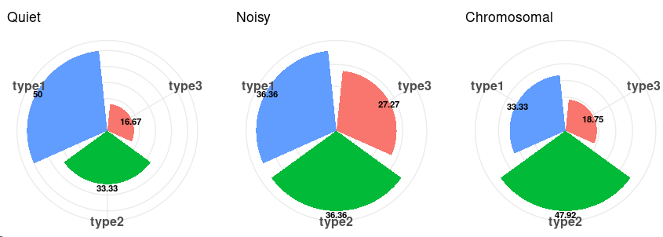

~~~r
aa <- as.data.frame(table(annotation_col1$COC,annotation_col1$group.v2))
aa <- subset(aa,Var1!="not reported")
aa$Var1 <- as.character(aa$Var1)
aa$Var2 <- factor(aa$Var2,levels=c("type3","type2","type1"))
aa_all <- c()
for (i in unique(aa$Var1)){
  group_sel <- subset(aa,Var1==i)
  group_sel$sum_number <- sum(group_sel$Freq)
  group_sel$normal_ratio <- (group_sel$Freq/group_sel$sum_number)*100
  group_sel$normal_ratio <- round(group_sel$normal_ratio,2)
  aa_all <- rbind(aa_all,group_sel)
}
sub_group <- c("COC1","COC2","COC3")
All_plot <- lapply(1:length(sub_group),function(x) {
    data <- subset(aa_all,Var1==sub_group[x])
    data$fraction = data$normal_ratio
    data$ymax = cumsum(data$fraction)
    data$ymin = c(0, head(data$ymax, n=-1))
    data$labelPosition <- (data$ymax + data$ymin) / 2
    data$label <- paste0(data$Var2, "\n ", data$fraction)
    plot <- ggplot(data, aes(x=Var2, y=fraction, fill=Var2)) +
     geom_bar(stat="identity") +
     geom_text(aes(x=Var2, y=fraction, label=fraction), size=3, vjust=1,fontface="bold")+
     theme_bw()+theme(legend.position ="none") +
     coord_polar()+labs(x = "", y = "", title = sub_group[x]) + 
     theme(axis.text.y = element_blank()) +     
     theme(axis.ticks = element_blank()) +     
     theme(panel.border = element_blank()) + 
     theme(axis.text.x=element_text(size=12,face="bold"))
    return(plot)
    })
plot <- CombinePlots(All_plot,ncol=4)
~~~

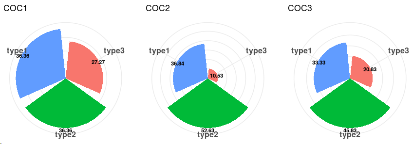
