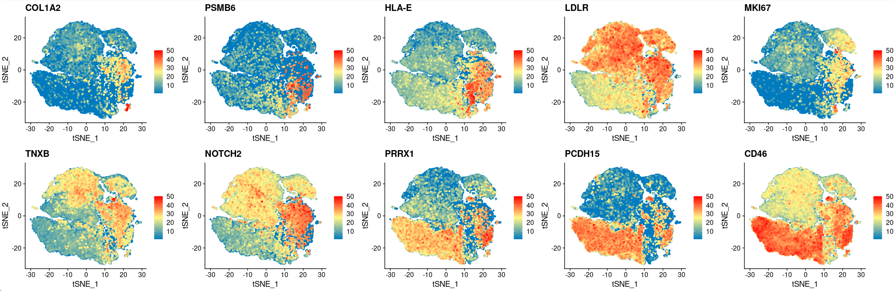

## 6. Intra-tumoral Cell-Cell Interaction Analysis.

**Cell-cell interaction in tumor and tumor microenvironment cells.** The CellChat (v1.6.1) and patchwork (v 1.1.1) was used to detect and visualize the intrinsic and extrinsic cellular signaling interaction based on quantifying the reported ligand-receptors networks. The normalized data in seurat object was inputted into CellChat pipeline. The database of CellChatDB.human was integrated into analysis. The default parameters were used in subsetData to filter the low-quality cells and low-enriched interaction signaling. And the parameter of min.cells in filterCommunication is 10. The centrality of each network signaling was computed and stored into netP model. The global intensity of cellular interaction in netP model should be more than 30 for subsequent analysis. The probability of each network signaling was projected into the width in circle plots and chord diagrams. The circle model was used in netVisual_aggregate function. The net model was used in netVisual_chord_gene function. 

Computational methods for exploring cell-cell interactions within ACC tumors.

~~~R
library(trqwe)
library(CellChat)
library(patchwork)
cellchat_ACC.v3 <- mcreadRDS("/mnt/d/xiangyu.ubuntu/projects/ACC_res/RDS.all/RDS.final/scRNA.ACC.cellchat.rds", mc.cores = 20)
cellchat_ACC.v3 <- netAnalysis_computeCentrality(cellchat_ACC.v3, slot.name = "netP")
net.diff <- cellchat_ACC.v3@net[["count"]]
net.diff.merge <- reshape2::melt(net.diff)
net.diff.merge$interact <- paste0(net.diff.merge$Var1,"->",net.diff.merge$Var2)
net.diff.merge1 <- subset(net.diff.merge,value > 30)
sel_C <- c("Sub1","Sub2","Sub3","Sub4")
ACC_interact_ <- lapply(1:length(sel_C),function(x) {
    sel_tmp <- subset(net.diff.merge1,Var1==sel_C[x] | Var2==sel_C[x])
    return(sel_tmp)
    })
ACC_interact <- do.call(rbind,ACC_interact_)
ACC_interact <- ACC_interact[!duplicated(ACC_interact$interact),]
ACC_interact1 <- subset(ACC_interact,value > 30)
ACC_interact1 <- ACC_interact1[order(ACC_interact1$value,decreasing=FALSE),]
ACC_interact1$interact <- factor(ACC_interact1$interact,levels=as.character(ACC_interact1$interact))
aa <- jdb_palette("brewer_celsius")
hmcols <- colorRampPalette(aa)(length(levels(ACC_interact1$interact)))
names(hmcols) <- levels(ACC_interact1$interact)
plot <- ggbarplot(ACC_interact1, x = "interact", y = "value", fill="interact",title="interact intensity", outlier.shape = NA,rotate = TRUE, legend = "none",lab.size=1)+rotate_x_text(angle = 90)+scale_fill_manual(values = hmcols, guide = "none")
~~~

~~~R
Cell_type <- c("Sub1","Sub2","Sub3","Sub4","B_CELL","Endothelial","Fibroblast","Macrophage","Neutrophil","Medulla","NKT","T_CELL")
Cell_type <- intersect(cellchat_ACC.v3@idents,Cell_type)
netVisual_heatmap(cellchat_ACC.v3,title.name="ACC.v3", row.show=Cell_type, col.show=Cell_type,color.heatmap = "OrRd")
~~~

~~~R
netVisual_chord_gene(cellchat_ACC.v3, sources.use = c(7:11), targets.use = c(7:11), signaling = c("TENASCIN"))
~~~

~~~R
netVisual_chord_gene(cellchat_ACC.v3, sources.use = c(7:11), targets.use = c(7:11), signaling = c("CADM"))
~~~

~~~R
sel_C <- c("Sub1","Sub2","Sub3","Sub4")
pathway.comm <- cellchat_ACC.v3@netP$pathways
All_paths <- lapply(1:length(pathway.comm), function(x) {
    tmp <- cellchat_ACC.v3@netP$prob[,,pathway.comm[x]][sel_C,sel_C]
    if(length((colnames(tmp)[colSums(tmp)==0]))>3 | length((rownames(tmp)[rowSums(tmp)==0]))>3) {path <- "NA"} else {path <- pathway.comm[x]}
    return(path)
    })
All_paths1 <- unlist(All_paths)
All_paths2 <- All_paths1[!All_paths1=="NA"]
pathway.comm <- cellchat_ACC.v3@netP$pathways
All_paths_TME <- lapply(1:length(pathway.comm), function(x) {
    tmp <- cellchat_ACC.v3@netP$prob[,,pathway.comm[x]]
    tmp <- tmp[setdiff(rownames(tmp),sel_C),setdiff(colnames(tmp),sel_C)]
    if(length((colnames(tmp)[colSums(tmp)==0]))>5 | length((rownames(tmp)[rowSums(tmp)==0]))>5) {path <- "NA"} else {path <- pathway.comm[x]}
    return(path)
    })
All_paths_TME1 <- unlist(All_paths_TME)
All_paths_TME2 <- All_paths_TME1[!All_paths_TME1=="NA"]
All_paths_TME2
ACC_spe <- setdiff(All_paths2,All_paths_TME2)
library(CellChat)
par(mfrow = c(2,3), xpd=TRUE)
for (i in 1:length(ACC_spe)) {
  netVisual_aggregate(cellchat_ACC.v3, signaling = ACC_spe[i], layout = "circle")
}
~~~

~~~R
plot <- XY_FeaturePlot(object = Only_ACC_harmony, features = c("COL1A2", "PSMB6", "HLA-E", "LDLR", "MKI67", "TNXB", "NOTCH2", "PRRX1", "PCDH15", "CD46"),
  pt.size=1,reduction="tsne",label=T,cols = CustomPalette(low ="#007BBF", mid = "#FFF485",high = "#FF0000"),ncol=5)
~~~

~~~R
TCGA_ACC <- mcreadRDS("/mnt/d/xiangyu.ubuntu/projects/ACC_res/RDS.all/RDS.final/TCGA.ACC_exp_log.rds", mc.cores = 20)
TCGA_ACC_clinical <- mcreadRDS("/mnt/d/xiangyu.ubuntu/projects/ACC_res/RDS.all/RDS.final/TCGA.ACC_clinical.classify.rds", mc.cores = 20)
library("survival")
library("survminer")
TCGA_ACC_clinical_sel <- TCGA_ACC_clinical[rownames(TCGA_ACC),]
Escc_clinical_ <- cbind(TCGA_ACC_clinical_sel,TCGA_ACC)
meta <- Escc_clinical_
meta$days_to_death[is.na(meta$days_to_death)] <- "HHH"
meta$days_to_death[which(meta$days_to_death=="HHH")] <- meta$days_to_last_follow_up[which(meta$days_to_death=="HHH")]
all_merge <- subset(meta,days_to_death != "HHH")
all_merge$vital_status <- as.character(all_merge$vital_status)
all_merge$status <- ifelse(all_merge$vital_status=="Alive",0,1)
all_merge$days_to_death <- as.numeric(all_merge$days_to_death)
colnames(all_merge) <- gsub("-","_",colnames(all_merge))
all_merge.cut <- surv_cutpoint(all_merge,time = "days_to_death",event = "status",variables = c("TNXB"),progressbar=TRUE,minprop=0.3)
all_merge.cut.cat <- surv_categorize(all_merge.cut) 
fit <- survfit(Surv(days_to_death, status) ~ TNXB, data = all_merge.cut.cat)
ggsurvplot(fit, data = all_merge.cut.cat,surv.median.line = "hv",pval = TRUE,ggtheme = theme_bw(),risk.table=TRUE)
~~~

~~~R
all_merge.cut <- surv_cutpoint(all_merge,time = "days_to_death",event = "status",variables = c("NECTIN3"),progressbar=TRUE,minprop=0.3)
all_merge.cut.cat <- surv_categorize(all_merge.cut) 
fit <- survfit(Surv(days_to_death, status) ~ NECTIN3, data = all_merge.cut.cat)
ggsurvplot(fit, data = all_merge.cut.cat,surv.median.line = "hv",pval = TRUE,ggtheme = theme_bw(),risk.table=TRUE)
~~~

~~~R
all_merge.cut <- surv_cutpoint(all_merge,time = "days_to_death",event = "status",variables = c("NOTCH2"),progressbar=TRUE,minprop=0.3)
all_merge.cut.cat <- surv_categorize(all_merge.cut) 
fit <- survfit(Surv(days_to_death, status) ~ NOTCH2, data = all_merge.cut.cat)
ggsurvplot(fit, data = all_merge.cut.cat,surv.median.line = "hv",pval = TRUE,ggtheme = theme_bw(),risk.table=TRUE)
~~~

~~~R
all_merge.cut <- surv_cutpoint(all_merge,time = "days_to_death",event = "status",variables = c("CADM1"),progressbar=TRUE,minprop=0.3)
all_merge.cut.cat <- surv_categorize(all_merge.cut) 
fit <- survfit(Surv(days_to_death, status) ~ CADM1, data = all_merge.cut.cat)
ggsurvplot(fit, data = all_merge.cut.cat,surv.median.line = "hv",pval = TRUE,ggtheme = theme_bw(),risk.table=TRUE)
~~~

~~~R
all_merge.cut <- surv_cutpoint(all_merge,time = "days_to_death",event = "status",variables = c("NECTIN2"),progressbar=TRUE,minprop=0.3)
all_merge.cut.cat <- surv_categorize(all_merge.cut) 
fit <- survfit(Surv(days_to_death, status) ~ NECTIN2, data = all_merge.cut.cat)
ggsurvplot(fit, data = all_merge.cut.cat,surv.median.line = "hv",pval = TRUE,ggtheme = theme_bw(),risk.table=TRUE)
~~~

~~~R
all_merge.cut <- surv_cutpoint(all_merge,time = "days_to_death",event = "status",variables = c("PVR"),progressbar=TRUE,minprop=0.3)
all_merge.cut.cat <- surv_categorize(all_merge.cut) 
fit <- survfit(Surv(days_to_death, status) ~ PVR, data = all_merge.cut.cat)
ggsurvplot(fit, data = all_merge.cut.cat,surv.median.line = "hv",pval = TRUE,ggtheme = theme_bw(),risk.table=TRUE)
~~~

~~~R
all_merge.cut <- surv_cutpoint(all_merge,time = "days_to_death",event = "status",variables = c("JAG1"),progressbar=TRUE,minprop=0.3)
all_merge.cut.cat <- surv_categorize(all_merge.cut) 
fit <- survfit(Surv(days_to_death, status) ~ JAG1, data = all_merge.cut.cat)
ggsurvplot(fit, data = all_merge.cut.cat,surv.median.line = "hv",pval = TRUE,ggtheme = theme_bw(),risk.table=TRUE)
~~~

~~~R
TCGA_ACC <- mcreadRDS("/mnt/d/xiangyu.ubuntu/projects/ACC_res/RDS.all/RDS.final/TCGA.ACC_exp_log.rds", mc.cores = 20)
TCGA_ACC_clinical <- mcreadRDS("/mnt/d/xiangyu.ubuntu/projects/ACC_res/RDS.all/RDS.final/TCGA.ACC_clinical.classify.rds", mc.cores = 20)
both_id <- intersect(rownames(TCGA_ACC),rownames(TCGA_ACC_clinical))
Escc_clinical_ <- cbind(TCGA_ACC_clinical[both_id,],TCGA_ACC[both_id,])
meta <- Escc_clinical_
meta$days_to_death[is.na(meta$days_to_death)] <- "HHH"
meta$days_to_death[which(meta$days_to_death=="HHH")] <- meta$days_to_last_follow_up[which(meta$days_to_death=="HHH")]
all_merge <- subset(meta,days_to_death != "HHH")
all_merge$vital_status <- as.character(all_merge$vital_status)
all_merge$status <- ifelse(all_merge$vital_status=="Alive",0,1)
all_merge$days_to_death <- as.numeric(all_merge$days_to_death)
colnames(all_merge) <- gsub("[+]","_",colnames(all_merge))
all_merge$group.v2 <- factor(all_merge$group.v2,levels=c("type1","type2","type3"))
Sel_num <- c("TNXB","CADM1","NECTIN2","NECTIN3","PVR","JAG1","NOTCH2","IGF1R","IGF2R")
All_plot_merge <- lapply(1:length(Sel_num),function(x) {
  plot <- ggboxplot(all_merge, x = "group.v2", y = Sel_num[x], fill="group.v2",add = "jitter",
      title=paste0(Sel_num[x],".ACC"), legend = "none",notch = FALSE) + rotate_x_text(angle = 45)+ 
      stat_compare_means(comparisons =list(c("type1","type2"),c("type2","type3"),c("type1","type3")),label = "p.signif", method = "wilcox.test")
    return(plot)
    })
plot <- CombinePlots(All_plot_merge,ncol=5)
~~~

~~~R
SEL_G <- c("TNXB","CADM1","NECTIN2","NECTIN3","PVR","JAG1","NOTCH2","IGF1R","IGF2R")
All_sum <- as.data.frame(FetchData(object = Only_ACC_harmony, vars = c(SEL_G,"Cell_annotation","v2_Cell_annotation","v3_Cell_annotation"),slot="data"))
All_sum <- All_sum[All_sum$v2_Cell_annotation %in% c("Sub1","Sub2","Sub3","Sub4"),]
All_sum$v2_Cell_annotation <- factor(All_sum$v2_Cell_annotation,levels=c("Sub1","Sub2","Sub3","Sub4"))
require(ggridges)
plot <- list()
for (i in 1:length(SEL_G)){
    tmp <- All_sum
    plot[[i]] <- ggboxplot(tmp, x = "v2_Cell_annotation", y = SEL_G[i], fill="v2_Cell_annotation",
        title=paste0(SEL_G[i],".ACC"), legend = "none",outlier.shape = NA,notch = FALSE) +theme_classic()+
        stat_summary(fun.y = median, geom="point",colour="darkred", size=3) +
        stat_summary(fun = median, geom = "line",aes(group = 1),col = "red",size=1)+
        rotate_x_text(angle = 45)+NoLegend()
}
plot <- CombinePlots(plot,nrow=2)
~~~

~~~R
plot <- XY_FeaturePlot(object = Only_ACC_harmony, features = c("NECTIN3"),
  pt.size=1,reduction="tsne",label=T,cols = CustomPalette(low ="#007BBF", mid = "#FFF485",high = "#FF0000"),ncol=2)
~~~

