## 7. Tumor-Endothelial Cell Interaction in ACC.

Scripts focused on the interactions between tumor cells and endothelial cells in the ACC microenvironment.

~~~R
HLH_T1_OFF_HIGH_GO <- mcreadRDS("/mnt/d/xiangyu.ubuntu/projects/ACC_res/RDS.all/RDS.final/scRNA.ACC.and.Normal.adrenal.merge.only_Endo.PVR.pos_vs_OTS_GO.rds", mc.cores = 20)
clusterProfiler::dotplot(HLH_T1_OFF_HIGH_GO,showCategory=5,includeAll=FALSE) + theme(axis.text.x  = element_text(angle=45, vjust=1,size=8,hjust = 1)) + labs(title = "GO BP")
~~~

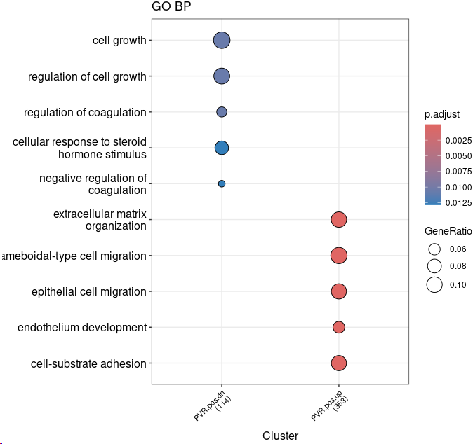

~~~R
all_df <- as.data.frame(HLH_T1_OFF_HIGH_GO)
PVR.pos.up <- subset(all_df,Cluster=="PVR.pos.up")
Sel_g <- unique(unlist(strsplit(PVR.pos.up[PVR.pos.up$Description %in% c("endothelium development"),]$geneID,split="/")))
Sel_g <- unique(c(Sel_g,"JAG1","JAG2","DLL4","DLK1"))
PVR.pos_vs_OTS <- mcreadRDS("/mnt/d/xiangyu.ubuntu/projects/ACC_res/RDS.all/RDS.final/scRNA.ACC.and.Normal.adrenal.merge.only_Endo.PVR.pos_vs_OTS.genes.rds", mc.cores = 20)
PVR.pos_vs_OTS[PVR.pos_vs_OTS$gene %in% Sel_g,]
library("ggplot2")
library("ggrepel")
only_Endo.fil_seurat <- mcreadRDS("/mnt/d/xiangyu.ubuntu/projects/ACC_res/RDS.all/RDS.final/scRNA.ACC.and.Normal.adrenal.merge.only_Endo.rds", mc.cores = 20)
data_tmp <- as_matrix(GetAssayData(object = only_Endo.fil_seurat, slot = "data",assay="RNA"))
rowMeans <- log(rowMeans(data_tmp)+1,2)
PVR.pos_vs_OTS$baseMeans <- rowMeans[as.character(PVR.pos_vs_OTS$gene)]
PVR.pos_vs_OTS[which(PVR.pos_vs_OTS$p_val < 0.05 & PVR.pos_vs_OTS$avg_logFC <= -0.1),'threshold'] <- 'Down'
PVR.pos_vs_OTS[which(PVR.pos_vs_OTS$p_val < 0.05 & PVR.pos_vs_OTS$avg_logFC >= 0.1),'threshold'] <- 'Up'
PVR.pos_vs_OTS[which(PVR.pos_vs_OTS$p_val >= 0.05 | abs(PVR.pos_vs_OTS$avg_logFC) < 0.1),'threshold'] <- 'None'
PVR.pos_vs_OTS$avg_logFC[PVR.pos_vs_OTS$avg_logFC > 0.5] <- 0.5
PVR.pos_vs_OTS$avg_logFC[PVR.pos_vs_OTS$avg_logFC < -0.5] <- -0.5
PVR.pos_vs_OTS$log10p <- -log10(PVR.pos_vs_OTS$p_val)
PVR.pos_vs_OTS$log10p[PVR.pos_vs_OTS$log10p > 50] <- 50
PVR.pos_vs_OTS$baseMeans[PVR.pos_vs_OTS$baseMeans > 2] <- 2
PVR.pos_vs_OTS.sig <- subset(PVR.pos_vs_OTS,avg_logFC > 0.1 & p_val < 0.05)
PVR.pos_vs_OTS.sig1 <- PVR.pos_vs_OTS.sig[PVR.pos_vs_OTS.sig$gene %in% Sel_g,]
PVR.pos_vs_OTS$threshold <- factor(PVR.pos_vs_OTS$threshold,levels=c("Up","Down","None"))
PVR.pos_vs_OTS <- PVR.pos_vs_OTS[order(PVR.pos_vs_OTS$threshold,decreasing=TRUE),]
plot <- ggplot(PVR.pos_vs_OTS, aes(x = baseMeans, y = avg_logFC, color = threshold)) +geom_point(alpha = 0.6, size = 2) +
scale_colour_manual(values  = c(jdb_palette("ocean_brick")[length(jdb_palette("ocean_brick")):1][1],jdb_palette("ocean_brick")[length(jdb_palette("ocean_brick")):1][8],"lightgrey"), limits = c('Up', 'Down', 'None')) +
theme(panel.grid = element_blank(), panel.background = element_rect(color = 'black', fill = 'transparent'), plot.title = element_text(hjust = 0.5)) +
theme(legend.key = element_rect(fill = 'transparent'), legend.background = element_rect(fill = 'transparent'), legend.position = c(0.9, 0.93)) +
geom_hline(yintercept = c(-0.1, 0.1), color = 'gray', size = 0.3) +
xlim(0, 2) + ylim(-0.5, 0.5) + labs(title=paste0("PVR.pos_vs_OTS \n",
  "UP.", nrow(subset(PVR.pos_vs_OTS,threshold=="Up"))," ",
    "DN.", nrow(subset(PVR.pos_vs_OTS,threshold=="Down"))))+
geom_label_repel(data = PVR.pos_vs_OTS.sig1, aes(x = baseMeans, y = avg_logFC, label = gene),
    box.padding = unit(0.1, 'lines'), type = "closed", ends = "first",max.overlaps=50,
    force = 10, segment.color = 'black', show.legend = FALSE)
~~~

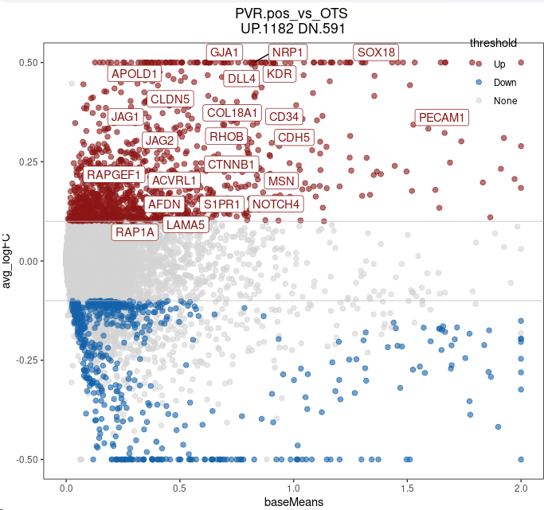

~~~R
only_Endo.fil_seurat <- mcreadRDS("/mnt/d/xiangyu.ubuntu/projects/ACC_res/RDS.all/RDS.final/scRNA.ACC.and.Normal.adrenal.merge.only_Endo.rds", mc.cores = 20)
Sel_M <- c("PDPN", "MMRN1","CCL14","VCAM1","CD93","BTNL9","EDNRB","ENPP2","PGF","FABP4","AMIGO2", "VEGFC","IGFBP5","IGF2")
plot <- DotPlot(only_Endo.fil_seurat, features = Sel_M, cols=c("#ffffff", "#B30000"),scale = TRUE,col.min = 0,col.max = 5,group.by="v2_Cell_annotation") + RotatedAxis() + labs(title="only_Endo")
~~~

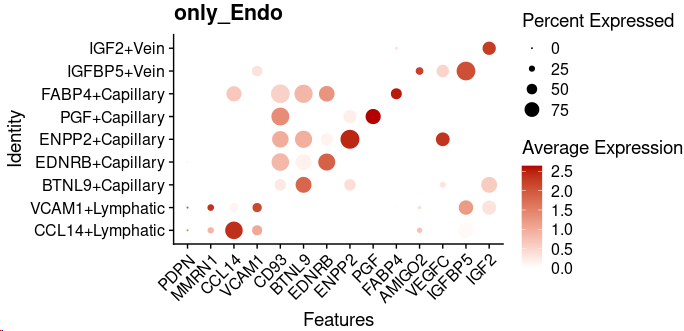

~~~R
library(paletteer)
library(ggsci)
pal <- jdb_palette("corona")
cor <- length(levels(only_Endo.fil_seurat$v2_Cell_annotation))
pal.Endo <- pal[c(2:(cor-2),1,(cor-1):cor)]
names(pal.Endo) <- levels(only_Endo.fil_seurat$v2_Cell_annotation)
plot <- DimPlot(object = only_Endo.fil_seurat, reduction = "umap",label=FALSE,repel=TRUE,group.by="v2_Cell_annotation",cols=pal.Endo) +labs(title="only_Endo")
~~~

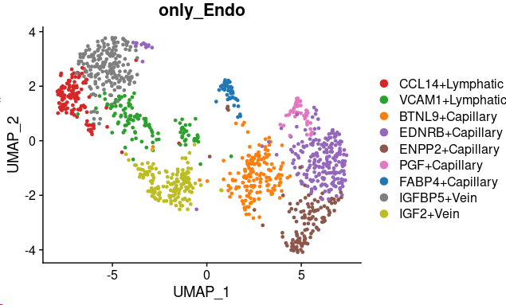

~~~R
library(Nebulosa)
aa <- jdb_palette("brewer_yes")
plot <- plot_density(only_Endo.fil_seurat, c("PVR"), slot = NULL, joint = FALSE, reduction = "umap",dims = c(1, 2), method = c("ks"), adjust = 1, size = 1, shape = 16, combine = TRUE) + 
scale_colour_gradientn(colours = colorRampPalette(aa)(100))
~~~

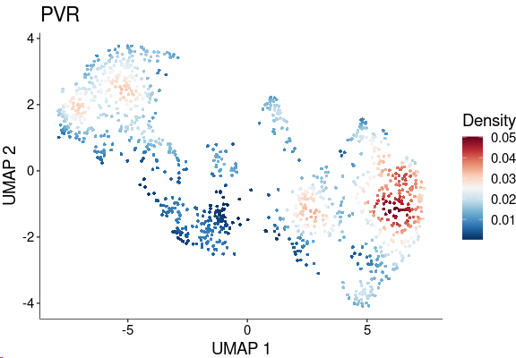

~~~R
All_sum <- as.data.frame(FetchData(object = only_Endo.fil_seurat, vars = c("NECTIN2","Cell_annotation","v2_Cell_annotation","v3_Cell_annotation"),slot="data"))
All_sum <- All_sum[All_sum$v2_Cell_annotation %in% c("CCL14+Lymphatic","VCAM1+Lymphatic","BTNL9+Capillary","EDNRB+Capillary","ENPP2+Capillary","PGF+Capillary","FABP4+Capillary","IGFBP5+Vein","IGF2+Vein"),]
All_sum$v2_Cell_annotation <- factor(All_sum$v2_Cell_annotation,levels=c("CCL14+Lymphatic","VCAM1+Lymphatic","BTNL9+Capillary","EDNRB+Capillary","ENPP2+Capillary","PGF+Capillary","FABP4+Capillary","IGFBP5+Vein","IGF2+Vein"))
require(ggridges)
plot <- list()
for (i in 1:length("NECTIN2")){
    tmp <- All_sum
    plot[[i]] <- ggboxplot(tmp, x = "v2_Cell_annotation", y = "NECTIN2"[i], fill="v2_Cell_annotation",
        title=paste0("NECTIN2"[i],".in.Endo"), legend = "none",outlier.shape = NA,notch = FALSE) +theme_classic()+
        rotate_x_text(angle = 45)+NoLegend()
}
plot <- CombinePlots(plot,nrow=2)
~~~

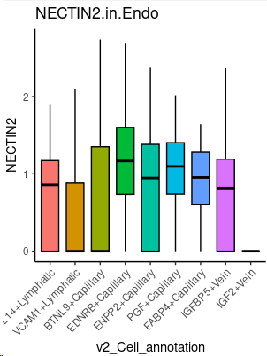

~~~R
plot <- XY_FeaturePlot(object = only_Endo.fil_seurat, features = c("JAG1","JAG2","DLL4","DLK1"),pt.size=.5, ncol=4,
    reduction="umap",label=T,cols = CustomPalette(low ="#007BBF", mid = "#FFF485",high = "#FF0000"))
~~~

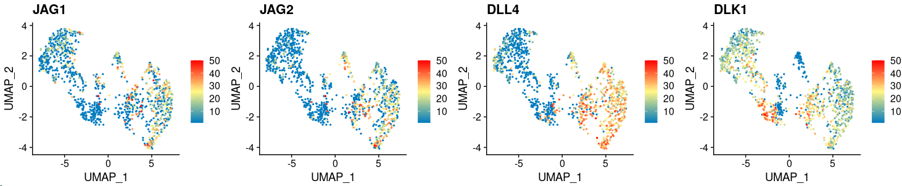

~~~R
XY_netAnalysis_signalingRole_network(cellchat_ACC.v3, signaling = "NECTIN", width = 6, height = 2.5, font.size = 10)
~~~

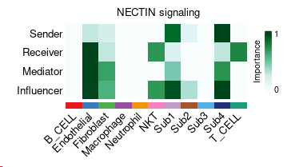

~~~R
XY_ACC.ENDO.netVisual_chord_gene(cellchat_ACC.v3, sources.use = c(7,10), targets.use = c(2), signaling = c("NECTIN"),slot.name = "net")
~~~

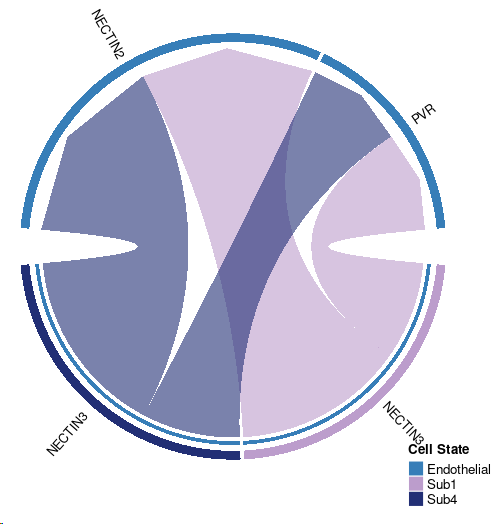

~~~R
netVisual_aggregate(cellchat_ACC.v3, signaling = "NECTIN", layout = "circle")
~~~

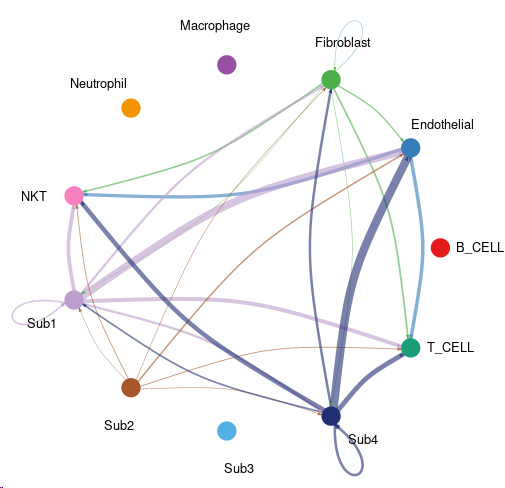

~~~R
XY_netAnalysis_signalingRole_network(cellchat_ACC.v3, signaling = "NOTCH", width = 6, height = 2.5, font.size = 10)
~~~

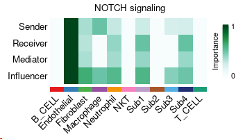

~~~R
XY_netVisual_chord_gene(cellchat_ACC.v3, sources.use = c(2), targets.use = c(7:11), signaling = c("NOTCH"),slot.name = "net")
~~~

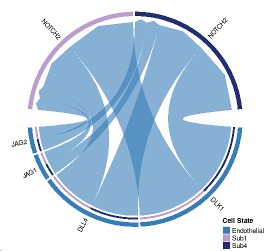

~~~R	
netVisual_aggregate(cellchat_ACC.v3, signaling = "NOTCH", layout = "circle")
~~~

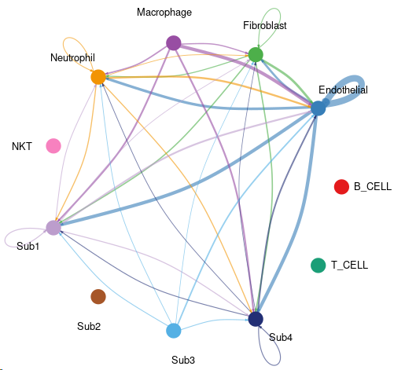