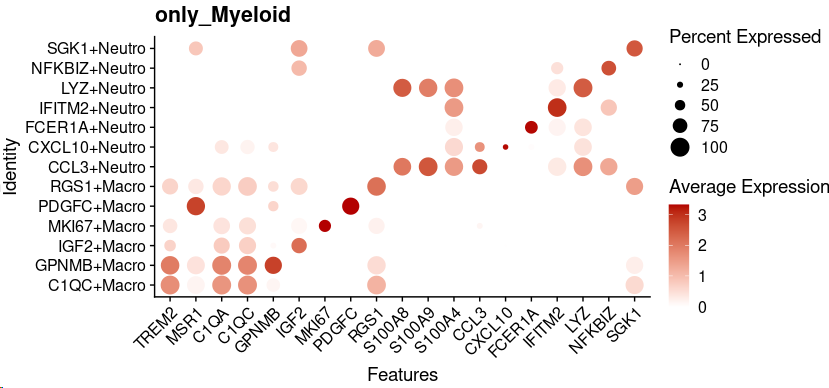

## 8. Tumor-Myeloid Cell Interaction in ACC.

Analysis code for studying the interactions between tumor cells and myeloid cells in ACC.

~~~~R
XY_netAnalysis_signalingRole_network(cellchat_ACC.v3, signaling = "IGF", width = 6, height = 2.5, font.size = 10)
~~~~

~~~R
XY_netVisual_chord_gene(cellchat_ACC.v3, sources.use = c(4), targets.use = c(7:10), signaling = c("IGF"))
~~~

~~~R
netVisual_aggregate(cellchat_ACC.v3, signaling = "IGF", layout = "circle")
~~~

~~~R
plot <- XY_FeaturePlot(object = Only_ACC_harmony, features = c("IGF1R","IGF2R"),
  pt.size=1,reduction="tsne",label=T,cols = CustomPalette(low ="#007BBF", mid = "#FFF485",high = "#FF0000"),ncol=2)
~~~

~~~R
SEL_G <- c("IGF1R","IGF2R")
All_sum <- as.data.frame(FetchData(object = Only_ACC_harmony, vars = c(SEL_G,"Cell_annotation","v2_Cell_annotation","v3_Cell_annotation"),slot="data"))
All_sum <- All_sum[All_sum$v2_Cell_annotation %in% c("Sub1","Sub2","Sub3","Sub4"),]
All_sum$v2_Cell_annotation <- factor(All_sum$v2_Cell_annotation,levels=c("Sub1","Sub2","Sub3","Sub4"))
require(ggridges)
plot <- list()
for (i in 1:length(SEL_G)){
    tmp <- All_sum
    plot[[i]] <- ggboxplot(tmp, x = "v2_Cell_annotation", y = SEL_G[i], fill="v2_Cell_annotation",
        title=paste0(SEL_G[i],".ACC"), legend = "none",outlier.shape = NA,notch = FALSE) +theme_classic()+
        stat_summary(fun.y = median, geom="point",colour="darkred", size=3) +
        stat_summary(fun = median, geom = "line",aes(group = 1),col = "red",size=1)+
        rotate_x_text(angle = 45)+NoLegend()
}
plot <- CombinePlots(plot,nrow=1)
~~~

~~~R
only_Myeloid.fil3_seurat <- mcreadRDS("/mnt/d/xiangyu.ubuntu/projects/ACC_res/RDS.all/RDS.final/scRNA.ACC.and.Normal.adrenal.merge.only_Myeloid.rds", mc.cores = 20)
Sel_M <- c("TREM2","MSR1","C1QA", "C1QC","GPNMB","IGF2","MKI67","PDGFC","RGS1", 
    "S100A8","S100A9","S100A4","CCL3","CXCL10","FCER1A","IFITM2","LYZ","NFKBIZ","SGK1")
plot <- DotPlot(only_Myeloid.fil3_seurat, features = unique(Sel_M), cols=c("#ffffff", "#B30000"),scale = TRUE,col.min = 0,col.max = 5,group.by="v2_Cell_annotation") + RotatedAxis() + labs(title="only_Myeloid")
~~~

~~~R
pal <- jdb_palette("corona")
cor <- length(levels(only_Myeloid.fil3_seurat$v2_Cell_annotation))
pal.Mye <- pal[c(2:(cor-2),1,(cor-1):cor)]
names(pal.Mye) <- levels(only_Myeloid.fil3_seurat$v2_Cell_annotation)
plot <- DimPlot(object = only_Myeloid.fil3_seurat, reduction = "umap",label=FALSE,repel=TRUE,group.by="v2_Cell_annotation",cols=pal.Mye) +labs(title="only_Myeloid")
~~~

~~~R
Inflammatory_and_cytokine <- read.csv("/mnt/d/xiangyu.ubuntu/workshop/database/Inflammatory_and_cytokine_genes..csv")
Inflammatory_and_cytokine$X.Inflammatory_and_cytokine_genes <- as.character(Inflammatory_and_cytokine$X.Inflammatory_and_cytokine_genes)
Lineage_marker <- intersect(rownames(GetAssayData(object = only_Myeloid.fil3_seurat, slot = "data",assay="RNA")),Inflammatory_and_cytokine$X.Inflammatory_and_cytokine_genes)
speci_raw <- FetchData(object = only_Myeloid.fil3_seurat, vars = Lineage_marker,slot="data")
only_Myeloid.fil3_seurat[["Inflammatory_and_cytokine"]] <- (rowSums(speci_raw))/length(Lineage_marker)
plot <- XY_FeaturePlot(object = only_Myeloid.fil3_seurat, features = c("Inflammatory_and_cytokine"),
  ncol=2,pt.size=.3,reduction="umap",label=T,cols = CustomPalette(low ="#007BBF", mid = "#FFF485",high = "#FF0000"))
~~~

~~~R
Sel_g <- "Inflammatory_and_cytokine"
All_sum <- as.data.frame(FetchData(object = only_Myeloid.fil3_seurat, vars = c(Sel_g,"Cell_annotation","v2_Cell_annotation","v3_Cell_annotation"),slot="data"))
datamean=as.data.frame(group_by(All_sum,v2_Cell_annotation) %>% summarize_each(funs(mean)))
datamean$Cell_annotation <- "B_CELL"
datamean$Cell_annotation[grep("Neutro",datamean$v2_Cell_annotation,value=FALSE)] <- "Neutrophil"
datamean$Cell_annotation[grep("Macro",datamean$v2_Cell_annotation,value=FALSE)] <- "Macrophage"
order <- datamean[,c("Cell_annotation","v2_Cell_annotation","Inflammatory_and_cytokine")]
order$Cell_annotation <- factor(order$Cell_annotation,levels=c("Macrophage","Neutrophil"))
order <- order[order(order$Cell_annotation,-(order$Inflammatory_and_cytokine)),]
require(ggridges)
plot <- list()
for (i in 1:length(Sel_g)){
    tmp <- All_sum
    plot[[i]] <- ggboxplot(tmp, x = "v2_Cell_annotation", y = Sel_g[i], fill="v2_Cell_annotation",
        title=paste0(Sel_g[i],".Myeloid"), legend = "none",outlier.shape = NA,notch = FALSE) +theme_classic()+
        stat_summary(fun.y = median, geom="point",colour="darkred", size=3) +
        stat_summary(fun = median, geom = "line",aes(group = 1),col = "red",size=1)+
        rotate_x_text(angle = 45)+NoLegend()+scale_fill_manual(values = pal.Mye)
}
plot <- CombinePlots(plot,nrow=1)
~~~

