## 9. Tumor-T Cell Interaction in ACC.

Scripts to investigate the interactions between tumor cells and T cells within the ACC context.

~~~R
cellchat_ACC.v3 <- mcreadRDS("/mnt/d/xiangyu.ubuntu/projects/ACC_res/RDS.all/RDS.final/scRNA.ACC.cellchat.rds", mc.cores = 20)
library(trqwe)
library(CellChat)
library(patchwork)
cellchat_ACC.v3 <- netAnalysis_computeCentrality(cellchat_ACC.v3, slot.name = "netP")
XY_netAnalysis_signalingRole_network(cellchat_ACC.v3, signaling = "MHC-I", width = 6, height = 2.5, font.size = 10)
~~~

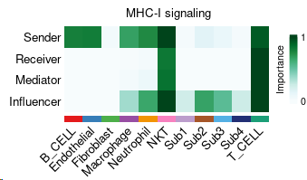

~~~R
XY_netVisual_chord_gene(cellchat_ACC.v3, sources.use = c(7:10), targets.use = c(11), signaling = c("MHC-I"))
~~~

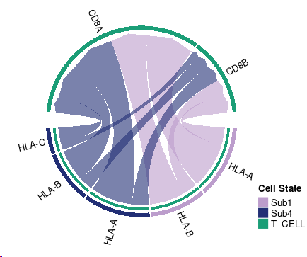

~~~R
plot <- XY_FeaturePlot(object = Only_ACC_harmony, features = c("HLA-A","HLA-B","HLA-C","HLA-E"),
  pt.size=1,reduction="tsne",label=T,cols = CustomPalette(low ="#007BBF", mid = "#FFF485",high = "#FF0000"),ncol=2)
~~~

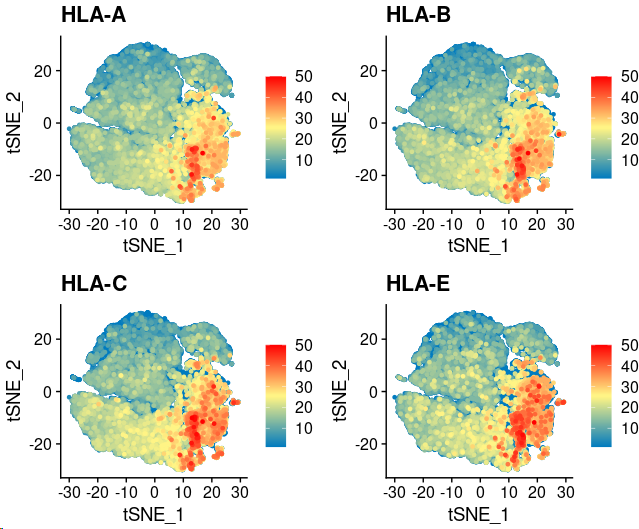

~~~R
TCGA_ACC_clinical <- mcreadRDS("/mnt/d/xiangyu.ubuntu/projects/ACC_res/RDS.all/RDS.final/TCGA.ACC_clinical.classify.rds", mc.cores = 20)
library("survival")
library("survminer")
TCGA_ACC_clinical_sel <- TCGA_ACC_clinical[rownames(TCGA_ACC),]
Escc_clinical_ <- cbind(TCGA_ACC_clinical_sel,TCGA_ACC)
meta <- Escc_clinical_
meta$days_to_death[is.na(meta$days_to_death)] <- "HHH"
meta$days_to_death[which(meta$days_to_death=="HHH")] <- meta$days_to_last_follow_up[which(meta$days_to_death=="HHH")]
all_merge <- subset(meta,days_to_death != "HHH")
all_merge$vital_status <- as.character(all_merge$vital_status)
all_merge$status <- ifelse(all_merge$vital_status=="Alive",0,1)
all_merge$days_to_death <- as.numeric(all_merge$days_to_death)
colnames(all_merge) <- gsub("-","_",colnames(all_merge))
all_merge.cut <- surv_cutpoint(all_merge,time = "days_to_death",event = "status",variables = c("HLA_A"),progressbar=TRUE,minprop=0.3)
all_merge.cut.cat <- surv_categorize(all_merge.cut) 
fit <- survfit(Surv(days_to_death, status) ~ HLA_A, data = all_merge.cut.cat)
ggsurvplot(fit, data = all_merge.cut.cat,surv.median.line = "hv",pval = TRUE,ggtheme = theme_bw(),risk.table=TRUE)
~~~

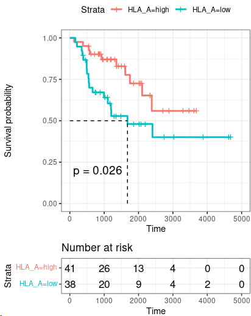

~~~R
ll_merge.cut <- surv_cutpoint(all_merge,time = "days_to_death",event = "status",variables = c("HLA_E"),progressbar=TRUE,minprop=0.3)
all_merge.cut.cat <- surv_categorize(all_merge.cut) 
fit <- survfit(Surv(days_to_death, status) ~ HLA_E, data = all_merge.cut.cat)
ggsurvplot(fit, data = all_merge.cut.cat,surv.median.line = "hv",pval = TRUE,ggtheme = theme_bw(),risk.table=TRUE)
~~~

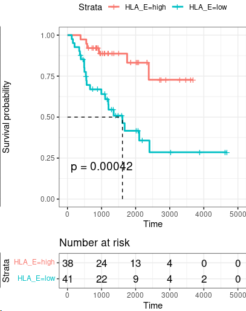

~~~R
only_NKT_T.fil2_seurat <- mcreadRDS("/mnt/d/xiangyu.ubuntu/projects/ACC_res/RDS.all/RDS.final/scRNA.ACC.and.Normal.adrenal.merge.only_NKT_T.rds", mc.cores = 20)
only_NKT_T.fil2_seurat$v2_Cell_annotation <- factor(only_NKT_T.fil2_seurat$v2_Cell_annotation,levels=c("Naive.T","Th1","Treg","Tgd","CD8Tact","CD8Tm","CD8Tem","CD8Tex","NK"))
pal <- jdb_palette("corona")
cor <- length(unique(only_NKT_T.fil2_seurat$v2_Cell_annotation))
pal.NKT <- pal[c(2:(cor-2),1,(cor-1):cor)]
names(pal.NKT) <- unique(only_NKT_T.fil2_seurat$v2_Cell_annotation)
plot <- DimPlot(object = only_NKT_T.fil2_seurat, reduction = "fa2",label=FALSE,repel=TRUE,group.by="v2_Cell_annotation",cols=pal.NKT) +labs(title="fa2")
~~~

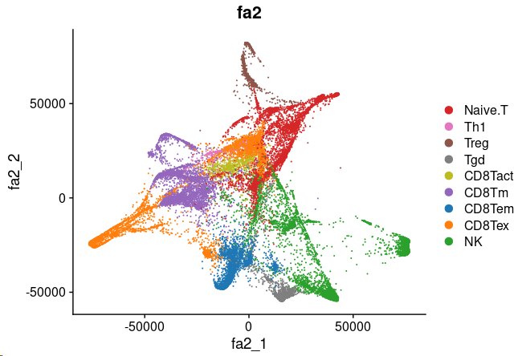

~~~R
cor <- length(levels(only_NKT_T.fil2_seurat$v3_Cell_annotation))
pal.NKT <- pal[c(2:(cor-2),1,(cor-1):cor)]
names(pal.NKT) <- levels(only_NKT_T.fil2_seurat$v3_Cell_annotation)
plot <- DimPlot(object = only_NKT_T.fil2_seurat, reduction = "fa2",label=FALSE,repel=TRUE,group.by="v3_Cell_annotation",cols=pal.NKT) +labs(title="fa2")
~~~

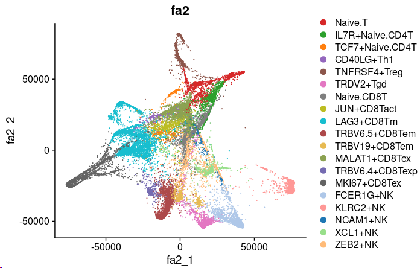

~~~R
plot <- XY_FeaturePlot(object = only_NKT_T.fil2_seurat, features = c("Naive","EarlyActiv","EffectorMemory","Exhuasted"),pt.size=.1, ncol=2,
    reduction="fa2",label=T,cols = CustomPalette(low ="#007BBF", mid = "#FFF485",high = "#FF0000"))
~~~

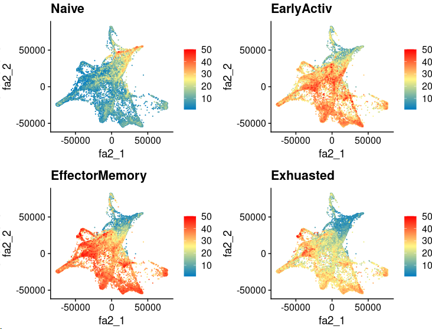

~~~R
XY_FeaturePlot(object = only_NKT_T.fil2_seurat, features = c("PDCD1","LAG3","TIGIT","HAVCR2"),pt.size=.1, ncol=2,
    reduction="fa2",label=T,cols = CustomPalette(low ="#007BBF", mid = "#FFF485",high = "#FF0000"))
~~~

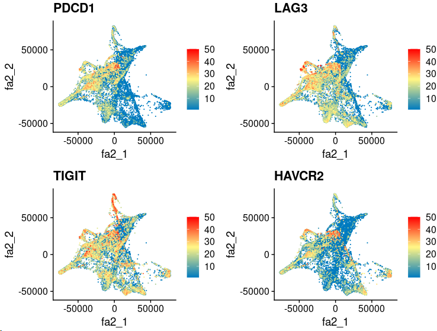

~~~R
sel_type <- c("Naive.T","IL7R+Naive.CD4T","TCF7+Naive.CD4T","CD40LG+Th1","TNFRSF4+Treg","TRDV2+Tgd",
    "Naive.CD8T","JUN+CD8Tact","LAG3+CD8Tm","TRBV6.5+CD8Tem","TRBV19+CD8Tem","MALAT1+CD8Tex","TRBV6.4+CD8Texp","MKI67+CD8Tex",
    "FCER1G+NK","KLRC2+NK","NCAM1+NK","XCL1+NK","ZEB2+NK")
col_sel <- hue_pal()(length(sel_type))
names(col_sel) <- sel_type
Subtype_pro <- as.data.frame(table(only_NKT_T.fil2_seurat$v3_Cell_annotation))
Subtype_pro$fraction = Subtype_pro$Freq
Subtype_pro <- Subtype_pro[order(Subtype_pro$fraction,decreasing=TRUE),]
Subtype_pro$Var1 <- factor(Subtype_pro$Var1,levels=as.character(Subtype_pro$Var1))
Subtype_pro_T <- Subtype_pro[Subtype_pro$Var1 %in% c("Naive.T","IL7R+Naive.CD4T","TCF7+Naive.CD4T","CD40LG+Th1","TNFRSF4+Treg","TRDV2+Tgd",
    "Naive.CD8T","JUN+CD8Tact","LAG3+CD8Tm","TRBV6.5+CD8Tem","TRBV19+CD8Tem","MALAT1+CD8Tex","TRBV6.4+CD8Texp","MKI67+CD8Tex"),]
TCR_anno <- FetchData(object = only_NKT_T.fil2_seurat, vars = c("v2_Cell_annotation","v3_Cell_annotation","group","sample","tcr_clonotype_id"),slot="data")
TCR_anno <- subset(TCR_anno,tcr_clonotype_id!="OTS")
sel_type1 <- unique(as.character(TCR_anno$v3_Cell_annotation))
tcr_clonotype_all <- lapply(1:length(sel_type1), function(x) {
    sel_data <- subset(TCR_anno,v3_Cell_annotation==sel_type1[x])
    tcr_clonotype <- as.data.frame(table(sel_data$tcr_clonotype_id))
    tcr_clonotype$v3_Cell_annotation <- sel_type1[x]
    message(x, " is done")
    return(tcr_clonotype)
    })
tcr_clonotype_all <- do.call(rbind,tcr_clonotype_all)
tcr_clonotype_T <- tcr_clonotype_all[tcr_clonotype_all$v3_Cell_annotation %in% c("Naive.T","IL7R+Naive.CD4T","TCF7+Naive.CD4T","CD40LG+Th1","TNFRSF4+Treg","TRDV2+Tgd",
    "Naive.CD8T","JUN+CD8Tact","LAG3+CD8Tm","TRBV6.5+CD8Tem","TRBV19+CD8Tem","MALAT1+CD8Tex","TRBV6.4+CD8Texp","MKI67+CD8Tex"),]
TCR_pro <- as.data.frame(table(tcr_clonotype_T$v3_Cell_annotation))
TCR_pro$fraction = TCR_pro$Freq
TCR_pro <- TCR_pro[order(TCR_pro$fraction,decreasing=TRUE),]
TCR_pro$Var1 <- factor(TCR_pro$Var1,levels=as.character(TCR_pro$Var1))
rownames(Subtype_pro_T) <- Subtype_pro_T$Var1
rownames(TCR_pro) <- TCR_pro$Var1
col_sel <- hue_pal()(length(sel_type))
names(col_sel) <- sel_type
All_info <- data.frame(proportion=Subtype_pro_T$Freq,diversity=TCR_pro[rownames(Subtype_pro_T),]$Freq,cell.type=rownames(Subtype_pro_T))
All_info1 <- as.data.frame(reshape::melt(All_info))
All_info1$value[All_info1$variable=="proportion"] <- (-1)*All_info1$value[All_info1$variable=="proportion"]
Subtype_pro_T <- Subtype_pro_T[order(Subtype_pro_T$Freq,decreasing=FALSE),]
All_info1$cell.type <- factor(All_info1$cell.type,levels=as.character(Subtype_pro_T$Var1))
plot <- ggplot(All_info1, aes(x=cell.type, y=value, fill=variable)) + geom_bar(stat="identity")+
geom_line(aes(x=cell.type, y=value, group = variable),size = 0.5) + geom_point(aes(x=cell.type, y=value),size = 1.5)+theme_bw()+coord_flip()
~~~

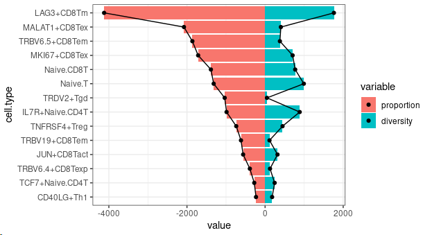

~~~R
Reserves <- c("CD40LG+Th1","TCF7+Naive.CD4T","JUN+CD8Tact","TNFRSF4+Treg","IL7R+Naive.CD4T","Naive.T","Naive.CD8T","LAG3+CD8Tm")
Reactive <- c("TRBV6.4+CD8Texp","TRBV19+CD8Tem","TRDV2+Tgd","TRBV6.5+CD8Tem","MALAT1+CD8Tex","MKI67+CD8Tex")
Sel_g <- c("LAG3","HAVCR2","PDCD1","ENTPD1","ITGAE","TIGIT")
All_sum <- as.data.frame(FetchData(object = only_NKT_T.fil2_seurat, vars = c(Sel_g,"v2_Cell_annotation","v3_Cell_annotation","Naive","EarlyActiv","EffectorMemory","Exhuasted"),slot="data"))
All_sum <- All_sum[All_sum$v3_Cell_annotation %in% c(Reactive,Reserves),]
All_sum$v3_Cell_annotation <- factor(All_sum$v3_Cell_annotation,levels=c(Reactive,Reserves))
All_sum$new_group <- "Reserves"
All_sum$new_group[All_sum$v3_Cell_annotation %in% c(Reactive)] <- "Reactive"
sel_type <- c("Naive.T","IL7R+Naive.CD4T","TCF7+Naive.CD4T","CD40LG+Th1","TNFRSF4+Treg","TRDV2+Tgd","Naive.CD8T","JUN+CD8Tact","LAG3+CD8Tm","TRBV6.5+CD8Tem","TRBV19+CD8Tem","MALAT1+CD8Tex","TRBV6.4+CD8Texp","MKI67+CD8Tex","FCER1G+NK","KLRC2+NK","NCAM1+NK","XCL1+NK","ZEB2+NK")
col_sel <- hue_pal()(length(sel_type))
names(col_sel) <- sel_type
All_sum$new_group <- factor(All_sum$new_group,levels=c("Reactive","Reserves"))
require(ggridges)
Sel_g <- c("Naive","EarlyActiv","EffectorMemory","Exhuasted")
plot <- list()
for (i in 1:length(Sel_g)){
    tmp <- All_sum
    plot[[i]] <- ggboxplot(tmp, x = "new_group", y = Sel_g[i], fill="new_group",
        title=paste0(Sel_g[i],".All"), legend = "none",outlier.shape = NA,notch = FALSE) +
    rotate_x_text(angle = 45)+ stat_compare_means(comparisons =list(c("Reactive","Reserves")),
    label = "p.signif", method = "wilcox.test") +theme_classic()+
        stat_summary(fun.y = median, geom="point",colour="darkred", size=3) +
        stat_summary(fun = median, geom = "line",aes(group = 1),col = "red",size=1)+NoLegend()
}
plot <- CombinePlots(plot,nrow=1)
~~~

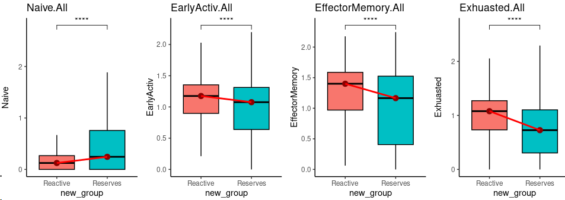

~~~R
Sel_g <- c("LAG3","HAVCR2","PDCD1","ENTPD1","ITGAE","TIGIT")
plot <- list()
for (i in 1:length(Sel_g)){
    tmp <- All_sum
    plot[[i]] <- ggboxplot(tmp, x = "new_group", y = Sel_g[i], fill="new_group",
        title=paste0(Sel_g[i],".All"), legend = "none",outlier.shape = NA,notch = FALSE) +
    rotate_x_text(angle = 45)+ stat_compare_means(comparisons =list(c("Reactive","Reserves")),
    label = "p.signif", method = "wilcox.test") +theme_classic()+
        stat_summary(fun.y = median, geom="point",colour="darkred", size=3) +
        stat_summary(fun = median, geom = "line",aes(group = 1),col = "red",size=1)+NoLegend()
}
plot <- CombinePlots(plot,nrow=1)
~~~

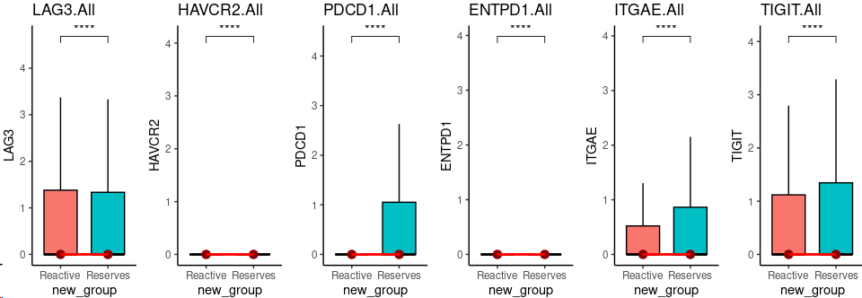

~~~R
TCR_anno <- FetchData(object = only_NKT_T.fil2_seurat, vars = c("v2_Cell_annotation","v3_Cell_annotation","group","sample","tcr_clonotype_id"),slot="data")
TCR_anno <- subset(TCR_anno,tcr_clonotype_id!="OTS")
TCR_anno <- TCR_anno[TCR_anno$v3_Cell_annotation %in% c("Naive.T","IL7R+Naive.CD4T","TCF7+Naive.CD4T","CD40LG+Th1","TNFRSF4+Treg","TRDV2+Tgd",
    "Naive.CD8T","JUN+CD8Tact","LAG3+CD8Tm","TRBV6.5+CD8Tem","TRBV19+CD8Tem","MALAT1+CD8Tex","TRBV6.4+CD8Texp","MKI67+CD8Tex"),]
aa <- as.data.frame(table(TCR_anno$tcr_clonotype_id))
aa <- aa[order(aa$Freq,decreasing=TRUE),]
aa$order <- 1:nrow(aa)
aa$TCR.Clone <- as.character(aa$Var1)
aa$TCR.Clone[aa$Freq<= 10] <- "OTS"
aa1 <- aa[aa$Freq>= 10,]
aa1 <- aa1[1:123,]
aa1$Freq[123] <- sum(aa$Freq[aa$Freq<= 10])
aa1$fraction <- aa1$Freq / sum(aa1$Freq)
col_sel <- hue_pal()(length(aa1$TCR.Clone[1:122]))
col_sel <- c(col_sel,"#e9ecef")
names(col_sel) <- c(aa1$TCR.Clone[1:122],"OTS")
aa1$TCR.Clone <- factor(aa1$TCR.Clone,levels=c(aa1$TCR.Clone[1:122],"OTS"))
aa1 <- aa1[order(aa1$TCR.Clone,decreasing=FALSE),]
sel_type <- c("Naive.T","IL7R+Naive.CD4T","TCF7+Naive.CD4T","CD40LG+Th1","TNFRSF4+Treg","TRDV2+Tgd","Naive.CD8T","JUN+CD8Tact","LAG3+CD8Tm","TRBV6.5+CD8Tem","TRBV19+CD8Tem","MALAT1+CD8Tex","TRBV6.4+CD8Texp","MKI67+CD8Tex","FCER1G+NK","KLRC2+NK","NCAM1+NK","XCL1+NK","ZEB2+NK")
cor <- length(levels(only_NKT_T.fil2_seurat$v3_Cell_annotation))
pal.NKT <- pal[c(2:(cor-2),1,(cor-1):cor)]
names(pal.NKT) <- levels(only_NKT_T.fil2_seurat$v3_Cell_annotation)
pal.NKT <- c(pal.NKT,"#efefef")
names(pal.NKT)[length(pal.NKT)] <- "OTS"
TCR_anno <- FetchData(object = only_NKT_T.fil2_seurat, vars = c("v2_Cell_annotation","v3_Cell_annotation","group","sample","tcr_clonotype_id"),slot="data")
TCR_anno <- subset(TCR_anno,tcr_clonotype_id!="OTS")
TCR_anno <- TCR_anno[TCR_anno$v3_Cell_annotation %in% c("Naive.T","IL7R+Naive.CD4T","TCF7+Naive.CD4T","CD40LG+Th1","TNFRSF4+Treg","TRDV2+Tgd",
    "Naive.CD8T","JUN+CD8Tact","LAG3+CD8Tm","TRBV6.5+CD8Tem","TRBV19+CD8Tem","MALAT1+CD8Tex","TRBV6.4+CD8Texp","MKI67+CD8Tex"),]
TOP_TCR <- subset(aa1,Freq > 100 & TCR.Clone!="OTS")$TCR.Clone
CT_all <- lapply(1:length(TOP_TCR),function(x) {
    tmp.data <- subset(TCR_anno,tcr_clonotype_id==TOP_TCR[x])
    CT <- as.data.frame(table(tmp.data$v3_Cell_annotation))
    CT <- subset(CT,Freq!=0)
    plot <- ggplot(CT, aes(x = 2, y = Freq, fill = Var1)) + geom_bar(stat = "identity") + 
        coord_polar(theta = "y", start = 0)+  xlim(0.5, 2.5)+
          scale_fill_manual(values = pal.NKT)+ theme_void()+labs(title=paste0("TCR.clono.in.",sum(CT$Freq)))
    return(plot)
    })
plot <- CombinePlots(plots = CT_all,ncol=4)
~~~

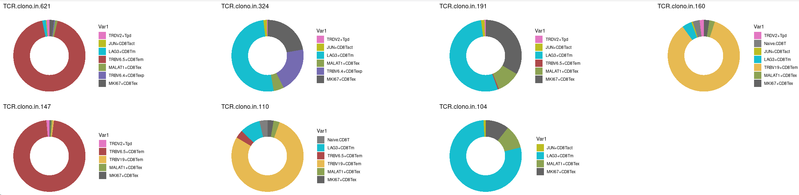

~~~R
CD8_Lin <- c("Naive.CD8T","JUN+CD8Tact","TRBV6.5+CD8Tem","TRBV19+CD8Tem","MALAT1+CD8Tex","TRBV6.4+CD8Texp","MKI67+CD8Tex")
LAG3_CD8Tm <- c("LAG3+CD8Tm")
Sel_g <- c("LAG3","HAVCR2","PDCD1","ENTPD1","ITGAE","GZMA","GZMB","GZMK","GZMH","PRF1","EOMES","CXCR3")
All_sum <- as.data.frame(FetchData(object = only_NKT_T.fil2_seurat, vars = c(Sel_g,"v2_Cell_annotation","v3_Cell_annotation","Naive","EarlyActiv","EffectorMemory","Exhuasted","CytoTRACE"),slot="data"))
All_sum <- All_sum[All_sum$v3_Cell_annotation %in% c(CD8_Lin,LAG3_CD8Tm),]
All_sum$new_group <- "OTS"
All_sum$new_group[All_sum$v3_Cell_annotation %in% c(LAG3_CD8Tm)] <- "LAG3_CD8Tm"
All_sum$new_group <- factor(All_sum$new_group,levels=c("OTS","LAG3_CD8Tm"))
require(ggridges)
Sel_g <- c("CytoTRACE")
my_pal <- jdb_palette("corona")
plot <- list()
for (i in 1:length(Sel_g)){
    tmp <- All_sum
    plot[[i]] <- ggplot(tmp, aes_string(x = "new_group", y = Sel_g[i], color = "new_group", fill = "new_group")) +
      geom_boxplot(width = .5, fill = "white",size = 1, outlier.shape = NA) + ggdist::stat_halfeye(adjust = 1,width = 0.5, color = NA,position = position_nudge(x = .15)) +
      scale_color_manual(values = my_pal, guide = "none") + scale_fill_manual(values = my_pal, guide = "none")+ theme_classic()+
      labs(title=paste0(Sel_g[i],".ACC"))+ stat_compare_means(comparisons =list(c("OTS","LAG3_CD8Tm")),label = "p.signif", method = "t.test")+
      stat_summary(fun.y = median, geom="point",colour="darkred", size=3) +stat_summary(fun = median, geom = "line",aes(group = 1),col = "red",size=1)+NoLegend()
}
plot <- CombinePlots(plot,nrow=1)
~~~

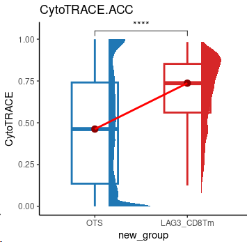

~~~R
LAG3.CD8Tm_vs_OTS <- mcreadRDS("/mnt/d/xiangyu.ubuntu/projects/ACC_res/RDS.all/RDS.final/scRNA.ACC.and.Normal.adrenal.merge.only_NKT_T.LAG3.CD8Tm_vs_OTS.T.genes.rds", mc.cores = 20)
LAG3.CD8Tm_vs_OTS <- LAG3.CD8Tm_vs_OTS[order(LAG3.CD8Tm_vs_OTS$avg_logFC,decreasing=TRUE),]
LAG3.CD8Tm_vs_OTS <- LAG3.CD8Tm_vs_OTS[!is.na(LAG3.CD8Tm_vs_OTS$avg_logFC),]
LAG3.CD8Tm_vs_OTS_genelist <- LAG3.CD8Tm_vs_OTS$avg_logFC
names(LAG3.CD8Tm_vs_OTS_genelist) <- LAG3.CD8Tm_vs_OTS$gene
GSEA_LAG3.CD8Tm_vs_OTS <- mcreadRDS("/mnt/d/xiangyu.ubuntu/projects/ACC_res/RDS.all/RDS.final/scRNA.ACC.and.Normal.adrenal.merge.only_NKT_T.LAG3.CD8Tm_vs_OTS.T.GSEA.rds", mc.cores = 20)
Sel_paths <- c("GOBP_T_CELL_CHEMOTAXIS","GOBP_POSITIVE_REGULATION_OF_T_CELL_MEDIATED_IMMUNITY","GOBP_T_CELL_ACTIVATION","GOBP_REGULATORY_T_CELL_DIFFERENTIATION","GOBP_POSITIVE_REGULATION_OF_T_CELL_MEDIATED_CYTOTOXICITY",
    "GOLDRATH_EFF_VS_MEMORY_CD8_TCELL_UP","GOLDRATH_NAIVE_VS_EFF_CD8_TCELL_DN","GOBP_NEGATIVE_REGULATION_OF_T_CELL_MEDIATED_CYTOTOXICITY")
df1 <- as.data.frame(GSEA_LAG3.CD8Tm_vs_OTS)
EMBRYONIC <- df1[df1$Description %in% Sel_paths,]
EMBRYONIC$ID <- 1:nrow(EMBRYONIC)
rownames(EMBRYONIC) <- EMBRYONIC$ID
geneSets <- as(EMBRYONIC[, "ID"], "list")
names(geneSets) <- EMBRYONIC[, "ID"]
rownames(EMBRYONIC) <- EMBRYONIC$ID
gsea_tmp <- new("gseaResult", result = EMBRYONIC, geneSets = geneSets, geneList = LAG3.CD8Tm_vs_OTS_genelist, readable = FALSE,params = list(pvalueCutoff = 1, nPerm = 1000,pAdjustMethod = "BH", exponent = 1, minGSSize = 5,maxGSSize = 500))
gsea_tmp@organism <- "UNKNOWN"
gsea_tmp@setType <- "UNKNOWN"
gsea_tmp@keytype <- "UNKNOWN"
require(viridis)
aa <- jdb_palette("brewer_celsius",type = "continuous")[1:length(jdb_palette("brewer_celsius",type = "continuous"))]
library(ggplot2)
tmp_files <- XY_ridgeplot.gseaResult(gsea_tmp,fill="NES", core_enrichment = TRUE)
plot <- ggplot(tmp_files, aes_string(x="value", y="category", fill="NES")) + ggridges ::geom_density_ridges() +
    scale_fill_gradientn(name = "NES", colors=aa, guide=guide_colorbar(reverse=FALSE)) + xlim(-1,1)+
    xlab(NULL) + ylab(NULL) +  theme_dose() + labs(title="GSEA LAG3.CD8Tm_vs_OTS")
~~~

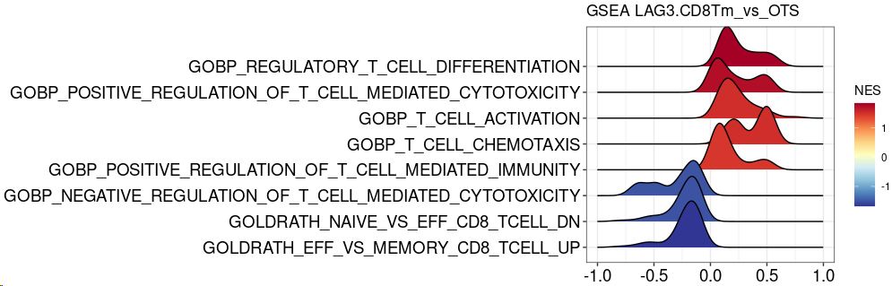

~~~R
CD8_Lin <- c("Naive.CD8T","JUN+CD8Tact","TRBV6.5+CD8Tem","TRBV19+CD8Tem","MALAT1+CD8Tex","TRBV6.4+CD8Texp","MKI67+CD8Tex")
LAG3_CD8Tm <- c("LAG3+CD8Tm")
Sel_g <- c("GZMA","GZMB","GZMK","GZMH","PRF1","EOMES","CXCR3")
All_sum <- as.data.frame(FetchData(object = only_NKT_T.fil2_seurat, vars = c(Sel_g,"v2_Cell_annotation","v3_Cell_annotation","Naive","EarlyActiv","EffectorMemory","Exhuasted","CytoTRACE"),slot="data"))
All_sum <- All_sum[All_sum$v3_Cell_annotation %in% c(CD8_Lin,LAG3_CD8Tm),]
All_sum$new_group <- "OTS"
All_sum$new_group[All_sum$v3_Cell_annotation %in% c(LAG3_CD8Tm)] <- "LAG3_CD8Tm"
All_sum$new_group <- factor(All_sum$new_group,levels=c("OTS","LAG3_CD8Tm"))
plot <- list()
for (i in 1:length(Sel_g)){
    tmp <- All_sum
    plot[[i]] <- ggboxplot(tmp, x = "new_group", y = Sel_g[i], fill="new_group",
  title=paste0(Sel_g[i],".All"), legend = "none",outlier.shape = NA,notch = FALSE) + 
    stat_compare_means(comparisons =list(c("OTS","LAG3_CD8Tm")),
    label = "p.signif", method = "wilcox.test",label.y=1) +theme_classic()+
        stat_summary(fun.y = median, geom="point",colour="darkred", size=3) +
        stat_summary(fun = median, geom = "line",aes(group = 1),col = "red",size=1)+
    rotate_x_text(angle = 45)+NoLegend()
}
plot <- CombinePlots(plot,nrow=1)
~~~

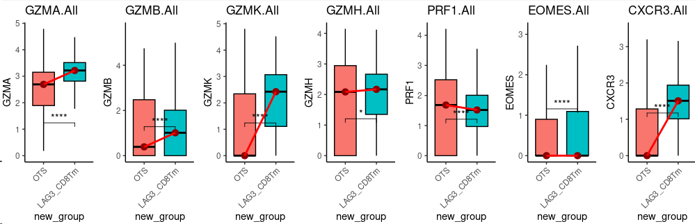

~~~R
egm_new_clu.v2.RLR <- mcreadRDS("/mnt/d/xiangyu.ubuntu/projects/ACC_res/RDS.all/RDS.final/TCGA.ACC_decon.egm.rds", mc.cores = 20)
decon_res <- egm_new_clu.v2.RLR@result_cell_proportion
TCGA_ACC_clinical <- mcreadRDS("/mnt/d/xiangyu.ubuntu/projects/ACC_res/RDS.all/RDS.final/TCGA.ACC_clinical.classify.rds", mc.cores = 20)
library("survival")
library("survminer")
TCGA_ACC_clinical_sel <- TCGA_ACC_clinical[rownames(decon_res),]
Escc_clinical_ <- cbind(TCGA_ACC_clinical_sel,decon_res)
meta <- Escc_clinical_
meta$days_to_death[is.na(meta$days_to_death)] <- "HHH"
meta$days_to_death[which(meta$days_to_death=="HHH")] <- meta$days_to_last_follow_up[which(meta$days_to_death=="HHH")]
all_merge <- subset(meta,days_to_death != "HHH")
all_merge$vital_status <- as.character(all_merge$vital_status)
all_merge$status <- ifelse(all_merge$vital_status=="Alive",0,1)
all_merge$days_to_death <- as.numeric(all_merge$days_to_death)
colnames(all_merge) <- gsub("[+]","_",colnames(all_merge))
all_merge.cut <- surv_cutpoint(all_merge,time = "days_to_death",event = "status",variables = c("LAG3_CD8Tm"),progressbar=TRUE,minprop=0.3)
summary(all_merge.cut)
plot(all_merge.cut, "LAG3_CD8Tm")
all_merge.cut.cat <- surv_categorize(all_merge.cut) 
fit <- survfit(Surv(days_to_death, status) ~ LAG3_CD8Tm, data = all_merge.cut.cat)
ggsurvplot(fit, data = all_merge.cut.cat,surv.median.line = "hv",pval = TRUE,ggtheme = theme_bw(),risk.table=TRUE)
~~~

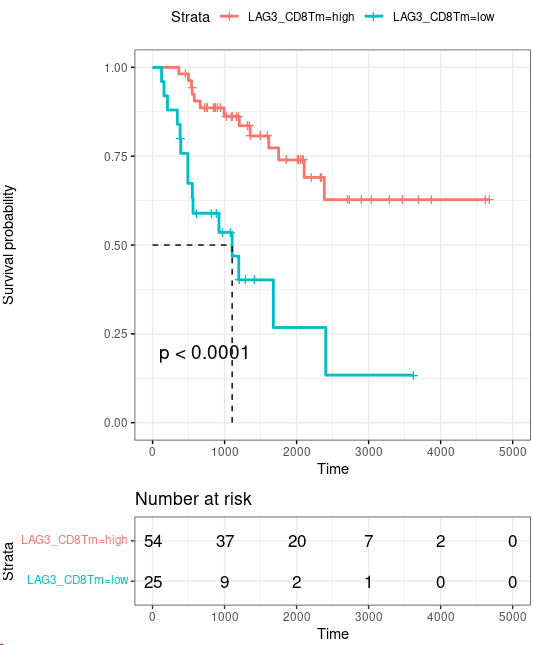

~~~R
order <- c("Naive.T","IL7R+Naive.CD4T","TCF7+Naive.CD4T","CD40LG+Th1","TNFRSF4+Treg","TRDV2+Tgd", "Naive.CD8T","JUN+CD8Tact","LAG3+CD8Tm","TRBV6.5+CD8Tem","TRBV19+CD8Tem","MALAT1+CD8Tex","TRBV6.4+CD8Texp","MKI67+CD8Tex",
    "FCER1G+NK","KLRC2+NK","NCAM1+NK","XCL1+NK","ZEB2+NK")
only_NKT_T.fil2_seurat$v3_Cell_annotation <- factor(only_NKT_T.fil2_seurat$v3_Cell_annotation,levels=order)
Global_T <- c("CD8A","CD4")
Naive <- c("IL7R","CCR7","TCF7","SELL","LEF1")
Th1 <- c("CD40LG","LMNA")
Tregs <- c("FOXP3","IL2RA","CTLA4")
Memory <- c("EOMES","GZMK","CXCR3")
Effector_Memory <- c("FGFBP2","KLRD1")
Exhausted_activated <- c("LAG3","HAVCR2","PDCD1")
Exhausted <- c("ENTPD1","ITGAE")
Tgd <- c("TRDV2","TRGV9","TRGV5")
Activated <- c("TNF","IFNG","FOS","JUN")
NK <- c("TYROBP","NCAM1","CD160", "NKG7")
Sel_G <- c(Global_T,Naive,Th1,Tregs,"TNFRSF4",Tgd,Activated,Memory,Effector_Memory,"TRBV6-5","TRBV19",Exhausted_activated,"MALAT1","TRBV6-4",Exhausted,"MKI67",
    NK,"FCER1G","KLRC2","NCAM1","XCL1","ZEB2")
plot <- DotPlot(only_NKT_T.fil2_seurat, features = unique(Sel_G), cols=c("#ffffff", "#B30000"),scale = TRUE,col.min = 0,col.max = 5,group.by="v3_Cell_annotation") + RotatedAxis()
~~~

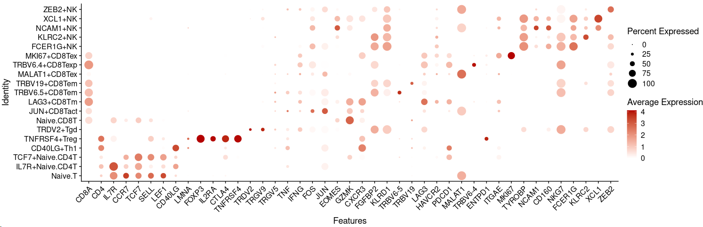

~~~R
only_NKT_T.fil2_seurat <- mcreadRDS("/mnt/d/xiangyu.ubuntu/projects/ACC_res/RDS.all/RDS.final/scRNA.ACC.and.Normal.adrenal.merge.only_NKT_T.rds", mc.cores = 20)
sel_type <- c("Naive.T","IL7R+Naive.CD4T","TCF7+Naive.CD4T","CD40LG+Th1","TNFRSF4+Treg","TRDV2+Tgd", "Naive.CD8T","JUN+CD8Tact","LAG3+CD8Tm","TRBV6.5+CD8Tem","TRBV19+CD8Tem","MALAT1+CD8Tex","TRBV6.4+CD8Texp","MKI67+CD8Tex",
  "FCER1G+NK","KLRC2+NK","NCAM1+NK","XCL1+NK","ZEB2+NK")
col_sel <- hue_pal()(length(sel_type))
names(col_sel) <- sel_type
col <- c(col_sel,"#efefef")
names(col)[length(col)] <- "OTS"
TCR_anno <- FetchData(object = only_NKT_T.fil2_seurat, vars = c("v2_Cell_annotation","v3_Cell_annotation","group","sample","tcr_clonotype_id"),slot="data")
TCR_anno <- subset(TCR_anno,tcr_clonotype_id!="OTS")
TCR_anno <- TCR_anno[TCR_anno$v3_Cell_annotation %in% c("Naive.T","IL7R+Naive.CD4T","TCF7+Naive.CD4T","CD40LG+Th1","TNFRSF4+Treg","TRDV2+Tgd", "Naive.CD8T","JUN+CD8Tact","LAG3+CD8Tm","TRBV6.5+CD8Tem","TRBV19+CD8Tem","MALAT1+CD8Tex","TRBV6.4+CD8Texp","MKI67+CD8Tex"),]
TOP_TCR <- subset(aa1,Freq > 100 & TCR.Clone!="OTS")$TCR.Clone
Sel_Group <- as.character(TOP_TCR)
All_plot <- lapply(1:length(Sel_Group),function(x) {
    only_NKT_T.fil2_seurat$new_anno5 <- as.character(only_NKT_T.fil2_seurat$v3_Cell_annotation)
    only_NKT_T.fil2_seurat$new_anno5[only_NKT_T.fil2_seurat$tcr_clonotype_id!=Sel_Group[x]] <- "OTS"
    only_NKT_T.fil2_seurat$new_anno5[only_NKT_T.fil2_seurat$v2_Cell_annotation=="NK"] <- "OTS"
    only_NKT_T.fil2_seurat$new_anno5 <- factor(only_NKT_T.fil2_seurat$new_anno5,levels=c("OTS",sel_type))
    plot <- XY_DimPlot(only_NKT_T.fil2_seurat, reduction = 'fa2', label = FALSE,repel=FALSE, pt.size =1,group.by="new_anno5",cols=pal.NKT[levels(only_NKT_T.fil2_seurat$new_anno5)])+NoLegend() +labs(title=Sel_Group[x])
    return(plot)
    })
plot <- CombinePlots(All_plot,ncol=4)
~~~

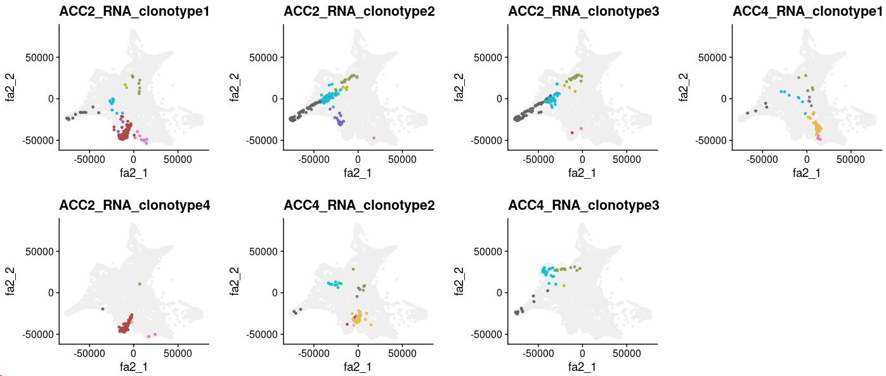

~~~r
egm_new_clu.v2.RLR <- mcreadRDS("/mnt/d/xiangyu.ubuntu/projects/ACC_res/RDS.all/egm_TCGA_ACC.v2_Anno.RLR.rds")
decon_res <- egm_new_clu.v2.RLR@result_cell_proportion
TCGA_ACC_clinical <- mcreadRDS("/mnt/d/xiangyu.ubuntu/projects/ACC_res/RDS.all/RDS.final/TCGA.ACC_clinical.classify.rds", mc.cores = 20)
library("survival")
library("survminer")
TCGA_ACC_clinical_sel <- TCGA_ACC_clinical[rownames(decon_res),]
Escc_clinical_ <- cbind(TCGA_ACC_clinical_sel,decon_res)
meta <- Escc_clinical_
meta$days_to_death[is.na(meta$days_to_death)] <- "HHH"
meta$days_to_death[which(meta$days_to_death=="HHH")] <- meta$days_to_last_follow_up[which(meta$days_to_death=="HHH")]
all_merge <- subset(meta,days_to_death != "HHH")
all_merge$vital_status <- as.character(all_merge$vital_status)
all_merge$status <- ifelse(all_merge$vital_status=="Alive",0,1)
all_merge$days_to_death <- as.numeric(all_merge$days_to_death)
colnames(all_merge) <- gsub("[+]","_",colnames(all_merge))
library(ggalluvial)
all_merge$group.v2 <- factor(all_merge$group.v2,levels=c("type1","type2","type3"))
plot <- ggboxplot(all_merge, x = "group.v2", y = "LAG3_CD8Tm", fill="group.v2",add = "jitter",
      title=paste0("LAG3_CD8Tm"), legend = "none",outlier.shape = NA,notch = FALSE) +theme_classic()+
        stat_summary(fun.y = median, geom="point",colour="darkred", size=3) +
        stat_summary(fun = median, geom = "line",aes(group = 1),col = "red",size=1)+
        rotate_x_text(angle = 45)+NoLegend()+ 
        stat_compare_means(comparisons =list(c("type1","type2"),c("type1","type3"),c("type2","type3")),label = "p.signif", method = "wilcox.test")
~~~

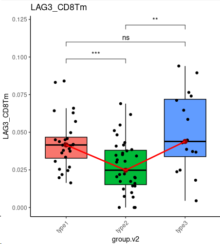